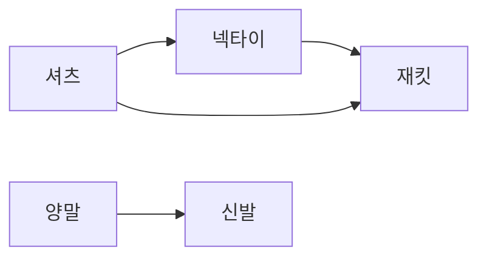

# 위상 정렬 (Topological Sort)

- Level: Intermediate
- Prerequisites: [Algorithms/BFS-DFS.md](BFS-DFS.md), [Data-Structures/Graph-Representation.md](../Data-Structures/Graph-Representation.md)
- Status: Draft
- Reviewed-by: -
- Depth: Deep-dive (자기완결)

---

## 개념 (Concept)

위상 정렬은 **DAG(방향 비순환 그래프)** 의 정점을, 모든 간선 `u→v` 에서 `u` 가 `v` 보다 앞에 오도록 일렬로 나열한다. "선행 작업을 먼저"라는 의존 제약을 한 줄 순서로 푼다.

## 직관 (Intuition)

수강 선수 과목, 옷 입는 순서(양말→신발), 빌드 의존성, 작업 스케줄이 모두 같은 구조. 위상 정렬은 "먼저/나중" 제약을 어기지 않는 순서를 찾는다. **사이클이 있으면**(서로가 서로의 선행) 그런 순서는 존재하지 않는다.



## 이론 (Theory)

위상 순서는 **DAG에서만** 존재하고 보통 여러 개다. 두 표준 알고리즘:

| 방법 | 아이디어 | 부가 |
|---|---|---|
| Kahn (BFS) | 진입 차수 0 정점을 큐에서 제거, 이웃 진입 차수 감소 | 사이클 탐지 겸함 |
| DFS post-order | DFS 종료(post-order) 역순이 위상 순서 | 한 번의 DFS |

**DFS 역순이 옳은 이유**: `u→v` 면 DFS에서 `v` 는 `u` 보다 먼저 종료된다(괄호 정리) → 역순에서 `u` 가 앞. **Kahn의 사이클 탐지**: 처리한 정점 수가 $V$ 미만이면, 진입 차수가 0이 안 되는 정점들이 서로를 가리키는 사이클이 있다는 뜻.

**DAG DP / 임계 경로**: 위상 순서대로 처리하면 "최장 경로(임계 경로)", "경로 수" 같은 DP를 한 번에 푼다 — 위상 순서가 DP 채우는 순서를 준다.

## 구현 (Implementation)

```python
from collections import deque

def topo_sort(graph, n):                 # graph[u] = 나가는 정점들
    indeg = [0] * n
    for u in range(n):
        for v in graph[u]:
            indeg[v] += 1
    q = deque(u for u in range(n) if indeg[u] == 0)
    order = []
    while q:
        u = q.popleft(); order.append(u)
        for v in graph[u]:
            indeg[v] -= 1
            if indeg[v] == 0:
                q.append(v)
    if len(order) != n:
        raise ValueError("사이클 존재 (DAG 아님)")
    return order

print(topo_sort({0:[1,2], 1:[3], 2:[3], 3:[]}, 4))   # [0, 1, 2, 3]
```

사전순으로 가장 빠른 순서가 필요하면 큐 대신 **최소 힙**을 쓴다(→ $O(V+E\log V)$).

## 복잡도 (Complexity)

| 표현 | 시간 | 공간 |
|---|---|---|
| 인접 리스트 | $O(V+E)$ | $O(V)$ |
| 인접 행렬 | $O(V^2)$ | $O(V)$ |
| 사전순 최소(힙) | $O(V+E\log V)$ | $O(V)$ |

각 정점·간선을 한 번 처리. **워크드 예제** `0→1, 0→2, 1→3, 2→3`: 진입차수 `[0,1,1,2]`. 큐=[0]→0 출력, 1·2 차수 0됨 → 1 출력(3은 1로), 2 출력(3 차수 0) → 3 출력. 결과 `0,1,2,3`.

## 응용 (Applications)

- 빌드 시스템(Make·패키지 의존성), 작업 스케줄링, 강의 선수 과목.
- 스프레드시트 셀 재계산 순서, DAG 상 DP(임계 경로·경로 수).
- 사이클(순환 의존) 탐지.

## 흔한 오해 (Common Misunderstandings)

- **결과는 유일하지 않다** — 제약을 만족하는 순서가 여럿.
- **무방향/사이클 방향 그래프엔 위상 순서가 없다** — DAG가 필수.
- **"정렬"이지만 값 정렬이 아니다** — 의존 순서를 정렬.
- **위상 순서의 개수 세기는 어렵다** — 일반적으로 #P-hard.

## TMI

- 빌드 도구의 "circular dependency detected" 오류가 바로 위상 정렬 실패다.
- DFS 기반은 재귀라 깊은 DAG에서 스택 한계 위험 — 큰 그래프엔 Kahn이 안전.
- 임계 경로법(CPM)은 프로젝트 관리에서 위상 정렬 + DAG 최장 경로로 일정의 병목을 찾는다.

## 연습 / 확인 문제 (Exercises)

- DFS post-order 기반 위상 정렬을 구현하고 Kahn 결과와 비교하라.
- 방향 그래프의 사이클 여부를 위상 정렬로 판별하라.
- 선수 과목 목록에서 수강 순서를 출력하라(불가능하면 보고).
- DAG에서 위상 순서를 이용해 최장 경로(임계 경로)를 구하라.

## 이어서 읽기 (Reading Path)

- 이전: [BFS / DFS](BFS-DFS.md)
- 다음: [강한 연결 요소](SCC.md)
- 관련: [그래프 표현](../Data-Structures/Graph-Representation.md), [DP 기초](DP-Basics.md)

## 참조 (References)

- [Algorithms/BFS-DFS.md](BFS-DFS.md)
- [Data-Structures/Graph-Representation.md](../Data-Structures/Graph-Representation.md)
- [Math/Discrete/Graph-Theory.md](../Math/Discrete/Graph-Theory.md)
- [Reference/Books.md](../Reference/Books.md)
- [Reference/Courses.md](../Reference/Courses.md)
