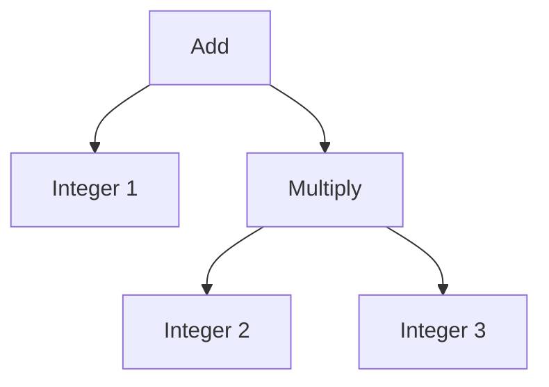

# 추상 구문 트리 (Abstract Syntax Tree)

- Level: Intermediate
- Prerequisites: [CS-Theory/Compilers/Parser.md](Parser.md), [CS-Theory/Programming-Languages/Syntax-and-Semantics.md](../Programming-Languages/Syntax-and-Semantics.md)
- Status: Draft
- Reviewed-by: -
- Depth: Deep-dive (자기완결)

---

## 개념 (Concept)

추상 구문 트리(AST)는 프로그램의 문법 구조에서 괄호, 구분자 같은 표면 문법을 덜어 내고 **의미 있는 구성 요소만 나무 형태로 표현한 중간 자료구조**다. 컴파일러의 의미 분석, 최적화, 코드 생성과 IDE의 탐색·변환 기능이 공통으로 사용하는 중심 표현이다.

## 직관 (Intuition)

`1 + 2 * 3`의 원문에는 공백과 연산자 문자가 있지만, 이후 단계가 정말 필요한 정보는 "덧셈의 왼쪽은 1, 오른쪽은 2와 3의 곱셈"이라는 구조다. AST는 소스의 장식보다 계산의 뼈대를 남긴다.



## 이론 (Theory)

AST 노드는 언어의 추상 구문에 대응하는 **합 타입(sum type)** 으로 볼 수 있다.

$$
Expr = Integer(value) + Add(left, right) + Variable(name) + Call(callee, arguments)
$$

파스 트리(concrete syntax tree)는 문법 생성 규칙과 모든 토큰을 가깝게 보존하지만, AST는 의미 분석에 불필요한 중간 비단말과 구두점을 생략한다.

| 표현 | 주목적 | 원문 보존 정도 |
|---|---|---|
| 토큰 스트림 | 문자 단위 분리 | 토큰 텍스트와 위치 |
| 파스 트리 | 문법 규칙의 적용 결과 | 높음 |
| AST | 프로그램 의미 구조 | 중간 |
| IR | 분석·최적화·코드 생성 | 낮음, 실행 의미 중심 |

각 노드에는 보통 source span을 붙여 원문 위치를 추적한다. 이름 해석 뒤에는 식별자 노드가 심볼 테이블 항목을 가리킬 수 있고, 타입 검사 뒤에는 추론된 타입을 별도 맵이나 노드 속성으로 기록할 수 있다. 불변 AST를 새로 만드는 방식은 변환 이력을 추적하기 쉽고, 가변 AST는 메모리와 구현 비용을 줄일 수 있다.

## 구현 (Implementation)

데이터 클래스로 식 AST를 정의하고 visitor 형태로 평가한다.

```python
from dataclasses import dataclass


@dataclass(frozen=True)
class Integer:
    value: int


@dataclass(frozen=True)
class Binary:
    operator: str
    left: object
    right: object


def evaluate(node):
    if isinstance(node, Integer):
        return node.value
    if isinstance(node, Binary):
        left, right = evaluate(node.left), evaluate(node.right)
        if node.operator == "+":
            return left + right
        if node.operator == "*":
            return left * right
    raise ValueError(f"unsupported node: {node!r}")


tree = Binary("+", Integer(1), Binary("*", Integer(2), Integer(3)))
print(evaluate(tree))  # 7
```

새 연산을 자주 추가한다면 visitor가 편하고, 새 노드 종류를 자주 추가한다면 노드별 메서드가 편할 수 있다. 이는 표현 문제(expression problem)의 한 사례다.

## 복잡도 (Complexity)

모든 노드를 한 번 방문하는 평가·출력·단순 분석은 노드 수 $n$에 대해 시간 `O(n)`, 재귀 스택 `O(h)`다. AST 자체는 `O(n)` 공간을 사용한다. DAG로 공통 부분식을 공유하면 공간을 줄일 수 있지만, 순회 시 중복 방문과 갱신 규칙을 별도로 관리해야 한다.

## 응용 (Applications)

- 이름 해석, 타입 검사, 상수 접기 같은 컴파일러 패스
- 인터프리터의 직접 실행과 바이트코드 생성
- IDE의 심볼 탐색, 자동 완성, 안전한 이름 변경
- 린터, 포매터, 코드 마이그레이션과 정적 분석
- 원본 언어에서 다른 언어나 IR로의 변환

## 흔한 오해 (Common Misunderstandings)

- AST는 원본 코드를 완벽히 복원하는 형식이 아니다. 주석과 공백을 버렸다면 포매터가 그대로 되살릴 수 없다.
- AST와 파스 트리는 항상 같은 것이 아니다. 도구가 둘을 같은 이름으로 부르기도 하므로 보존 정보와 목적을 확인해야 한다.
- 모든 컴파일러 패스가 AST에서 수행되는 것은 아니다. 제어 흐름과 기계 수준 최적화는 더 낮은 IR이 적합하다.
- 트리라고 불러도 심볼 참조와 타입 연결을 붙이면 실제 구조는 그래프가 될 수 있다.

## TMI

- 코드 포매터와 리팩터링 도구는 주석을 잃지 않기 위해 AST 외에 토큰이나 concrete syntax tree를 함께 보존하는 경우가 많다.
- 브라우저 개발자 도구가 보여 주는 DOM도 트리지만, 언어 AST와는 목적이 다르다. DOM은 문서의 실행 중 객체 모델이다.
- 컴파일러 오류 메시지가 원문을 정확히 밑줄 칠 수 있는 것은 AST 노드에 source span을 끝까지 전달하기 때문이다.

## 연습 / 확인 문제 (Exercises)

- `Unary`, `Variable` 노드를 추가하고 AST를 다시 소스 문자열로 출력하는 함수를 작성하라.
- `2 * (3 + 4)`의 파스 트리와 AST에서 생략 가능한 토큰을 비교하라.
- 정수 상수끼리의 연산을 미리 계산하는 상수 접기 변환을 구현하라.

## 이어서 읽기 (Reading Path)

- 이전: [구문 분석기](Parser.md)
- 다음: [의미 분석과 타입 검사](Semantic-Analysis.md)
- 관련: [구문과 의미론](../Programming-Languages/Syntax-and-Semantics.md), [타입 시스템](../Programming-Languages/Type-Systems.md)

## 참조 (References)

- [CS-Theory/Compilers/Parser.md](Parser.md)
- [CS-Theory/Programming-Languages/Syntax-and-Semantics.md](../Programming-Languages/Syntax-and-Semantics.md)
- [Reference/Books.md](../../Reference/Books.md)
- [Reference/Courses.md](../../Reference/Courses.md)
