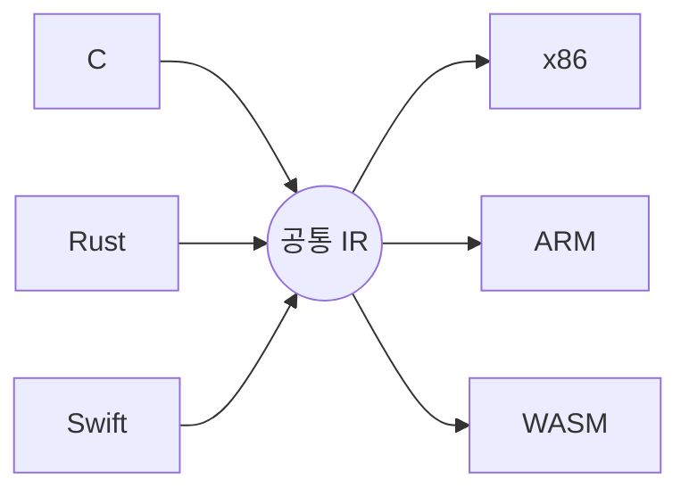

# 중간 표현 (Intermediate Representation, IR)

- Level: Advanced
- Prerequisites: [Semantic-Analysis.md](Semantic-Analysis.md), [AST.md](AST.md), [CS-Theory/Programming-Languages/Syntax-and-Semantics.md](../Programming-Languages/Syntax-and-Semantics.md)
- Status: Draft
- Reviewed-by: -
- Depth: Deep-dive (자기완결)

---

## 개념 (Concept)

IR은 소스 언어와 대상 기계어 **사이의 내부 표현**이다. 컴파일러는 [AST](AST.md)를 분석·최적화에 적합한 IR로 낮추고(lower), 그 위에서 최적화·코드 생성을 한다. 핵심 가치는 **프론트엔드와 백엔드의 분리**.

## 직관 (Intuition)

$M$ 개 언어를 $N$ 개 CPU로 번역하면 직접 조합은 $M\times N$ 개. **공통 IR**을 두면 프론트엔드 $M$ 개 + 백엔드 $N$ 개로 $M+N$ 개면 된다. 프론트엔드가 소스→IR, 백엔드가 IR→타깃.



## 이론 (Theory)

### 1. 수준(level)

- **High-level IR**: 소스 구조 유지(루프·배열).
- **Mid-level IR**: 제어 흐름 + 타입 보존, 최적화에 적합.
- **Low-level IR**: 기계어 근접(레지스터·메모리 주소).

### 2. 대표 형태

**three-address code**(연산당 임시 1개), **CFG**(기본 블록 + 분기), **SSA**(각 변수 단 1회 정의). SSA가 def-use를 명시해 [데이터 흐름 분석·최적화](Optimization.md)를 단순화한다.

### 3. phi node

분기가 합쳐지는 곳에서 "어느 경로로 왔나"에 따라 값을 고르는 가상 연산 $\phi$ 가 SSA의 단일 정의 규칙을 유지한다:

```text
if c: x1 = 1   else: x2 = 2
x3 = φ(x1, x2)     # 합류점: 온 경로에 따라 x1 또는 x2
```

## 구현 (Implementation)

```text
# source: x = (a + b) * c   → three-address code
t1 = a + b
t2 = t1 * c
x  = t2
```

각 명령이 단순·독립이라 최적화 pass가 한 줄씩 검사하기 쉽다(constant fold·CSE 등).

## 복잡도 (Complexity)

| 항목 | 특성 |
|---|---|
| AST→IR lowering | 보통 AST 크기에 선형 |
| SSA 구성 | CFG + 지배자(dominator) 분석에 의존 |
| 좋은 IR 설계 | 이후 pass 수·복잡도를 크게 절감 |

## 응용 (Applications)

- 언어 프론트엔드/백엔드 분리, 최적화 pass 구현.
- 정적·데이터 흐름 분석, JIT·인터프리터 내부 표현(bytecode).

## 흔한 오해 (Common Misunderstandings)

- **IR은 하나가 아니다** — 컴파일러는 여러 수준 IR을 거친다.
- **AST ≠ IR** — AST는 구문, IR은 분석/실행 중심.
- **SSA의 "단일 정의"는 기계 레지스터 얘기가 아니다** — IR 변수 차원.
- **IR 설계가 나쁘면** 최적화·코드 생성이 어려워진다.

## TMI

- LLVM IR은 typed SSA 기반으로 가장 널리 쓰이며, `clang -emit-llvm -S` 로 직접 볼 수 있다.
- MLIR은 여러 abstraction level의 IR을 한 틀에서 다루려는 프로젝트(ML 컴파일러에 인기).
- bytecode(JVM·CPython)도 넓은 의미의 IR — 이식성과 해석 실행을 위한 중간 형태.

## 연습 / 확인 문제 (Exercises)

- AST와 three-address code의 차이를 한 식으로 비교하라.
- 분기-합류 예제에서 phi node가 왜 필요한지 SSA로 설명하라.
- IR이 다중 언어/다중 아키텍처 지원을 $M\times N \to M+N$ 으로 줄이는 이유를 설명하라.
- 같은 식을 high/low-level IR로 각각 표현해 차이를 보여라.

## 이어서 읽기 (Reading Path)

- 이전: [의미 분석](Semantic-Analysis.md)
- 다음: [코드 최적화](Optimization.md)
- 관련: [AST](AST.md)

## 참조 (References)

- [Semantic-Analysis.md](Semantic-Analysis.md)
- [AST.md](AST.md)
- [Reference/Books.md](../../Reference/Books.md)
