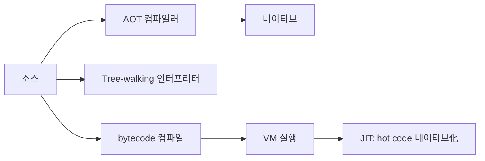

# 인터프리터 vs 컴파일러 (Interpreter vs Compiler)

- Level: Intermediate
- Prerequisites: [Lexer.md](Lexer.md), [Parser.md](Parser.md)
- Status: Draft
- Reviewed-by: -
- Depth: Deep-dive (자기완결)

---

## 개념 (Concept)

컴파일러는 프로그램을 **실행 전에** 다른 표현으로 번역하고, 인터프리터는 프로그램 표현을 **직접 읽으며** 실행한다. 실제 구현은 둘을 섞어 bytecode VM·JIT 형태가 흔하다 — 그래서 "실행 방식은 스펙트럼"이다.

## 직관 (Intuition)

컴파일은 책 전체를 번역·출판한 뒤 읽기, 인터프리트는 통역사가 문장마다 즉시 설명하기. 전자는 실행이 빠르고, 후자는 준비가 없고 동적 상호작용이 유연하다. **"컴파일 언어 vs 인터프리터 언어"는 언어가 아니라 구현의 성질**이다(C도 인터프리트 가능, Python도 컴파일 가능).



## 이론 (Theory)

### 1. 실행 스펙트럼

| 방식 | 실행 전 | 실행 | 특성 |
|---|---|---|---|
| AOT 컴파일 | 소스→네이티브 | 빠름 | 빌드 시간↑, 동적성↓ |
| Tree-walking | 파싱만 | AST 순회 | 단순·느림(dispatch 오버헤드) |
| Bytecode VM | 소스→bytecode | VM 루프 | 균형(이식성) |
| JIT | bytecode | hot path 네이티브 | warmup 후 빠름 |

### 2. dispatch 오버헤드

tree-walking 인터프리터는 노드마다 타입 분기(`isinstance`)·재귀 호출이 들어 **명령당 오버헤드**가 크다. bytecode VM은 단순 명령의 큰 switch(또는 computed goto)로 이를 줄이고, JIT은 아예 네이티브로 컴파일해 없앤다.

## 구현 (Implementation)

```python
def eval_expr(expr, env):                     # tree-walking 인터프리터
    if isinstance(expr, int): return expr
    if isinstance(expr, str): return env[expr]
    op, l, r = expr
    a, b = eval_expr(l, env), eval_expr(r, env)
    return a + b if op == "add" else a * b

print(eval_expr(("add", "x", ("mul", 2, 3)), {"x": 4}))   # 10
```

컴파일러라면 이 AST를 bytecode([코드 생성](Code-Generation.md))나 기계어로 바꿔, 매 실행마다 트리를 재해석하지 않는다.

## 복잡도 (Complexity)

| 방식 | 준비 비용 | 실행 성능 | 동적성 |
|---|---|---|---|
| 인터프리터 | 낮음 | dispatch 오버헤드 | 높음 |
| AOT | 높음(최적화) | 좋음 | 낮음 |
| JIT | warmup | hot path 우수 | 높음 |

## 응용 (Applications)

- 스크립트 언어·REPL·DSL 실행기, VM/bytecode 런타임.
- JIT 기반 고성능 동적 언어(V8·JVM·PyPy), DB 쿼리 엔진(해석 ↔ JIT).

## 흔한 오해 (Common Misunderstandings)

- **"컴파일 언어/인터프리터 언어"는 언어가 아니라 구현** — 같은 언어도 둘 다 가능.
- **인터프리터가 반드시 느리지 않다** — JIT·최적화 VM.
- **컴파일러가 있어도 런타임이 필요할 수 있다**(GC·예외·reflection).
- **bytecode는 소스도 기계어도 아닌 중간 실행 표현**.

## TMI

- CPython은 소스를 bytecode로 컴파일한 뒤 VM이 실행한다(`.pyc` 캐시) — 그래서 "인터프리터"지만 컴파일 단계가 있다.
- Java는 bytecode + JIT(HotSpot)의 대표 — 인터프리트로 시작해 hot 메서드를 컴파일.
- JIT의 warmup 때문에 짧은 벤치마크는 인터프리트 구간만 측정하는 함정이 있다.

## 연습 / 확인 문제 (Exercises)

- AOT·bytecode VM·JIT의 차이를 준비/실행/동적성으로 비교하라.
- tree-walking이 느린 이유를 dispatch 오버헤드로 설명하라.
- "Python은 인터프리터 언어"라는 말의 부정확한 점을 설명하라.
- 같은 AST를 해석 실행과 bytecode 컴파일로 처리할 때의 차이를 적어라.

## 이어서 읽기 (Reading Path)

- 이전: [코드 생성](Code-Generation.md)
- 다음: [패러다임 비교](../Programming-Languages/Paradigms.md)
- 관련: [중간 표현](Intermediate-Representation.md)

## 참조 (References)

- [Lexer.md](Lexer.md)
- [Parser.md](Parser.md)
- [Intermediate-Representation.md](Intermediate-Representation.md)
- [Reference/Books.md](../../Reference/Books.md)
