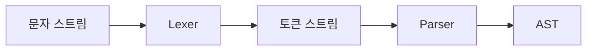

# 어휘 분석기 (Lexer)

- Level: Intermediate
- Prerequisites: [CS-Theory/Computation-Theory/Regular-Expressions.md](../Computation-Theory/Regular-Expressions.md), [CS-Theory/Programming-Languages/Syntax-and-Semantics.md](../Programming-Languages/Syntax-and-Semantics.md)
- Status: Draft
- Reviewed-by: -

---

## 개념 (Concept)

어휘 분석기(lexer, scanner)는 소스 코드의 문자 스트림을 **토큰(token) 스트림**으로 바꾼다. `total = price + 3`을 식별자, 대입 연산자, 식별자, 덧셈 연산자, 정수 같은 의미 있는 단위로 잘라 파서가 문법 구조에 집중할 수 있게 한다.

## 직관 (Intuition)

글을 읽을 때 먼저 글자를 단어로 묶고 그다음 문장 구조를 이해하듯, 컴파일러도 문자 경계와 문법 구조를 분리한다. 렉서는 공백과 주석을 건너뛰고 숫자·이름·연산자를 인식하며, 파서는 그 토큰들이 올바른 식과 문장을 이루는지 판단한다.



## 이론 (Theory)

대부분의 토큰 종류는 정규 표현식으로 기술할 수 있고 유한 오토마타로 인식할 수 있다.

| 토큰 | 예시 패턴 | 예 |
|---|---|---|
| 정수 | `[0-9]+` | `42` |
| 식별자 | `[A-Za-z_][A-Za-z0-9_]*` | `total_2` |
| 공백 | `[ \\t\\n]+` | 줄바꿈, 탭 |
| 연산자 | `==|=|\+|-` | `==` |

여러 규칙이 동시에 맞으면 보통 **가장 긴 일치(maximal munch)** 를 택하고, 길이가 같으면 규칙 우선순위를 사용한다. 그래서 `==`를 `=` 두 개가 아니라 하나의 토큰으로 읽고, `ifx`를 키워드 `if`와 식별자 `x`로 잘못 자르지 않는다. 식별자를 인식한 뒤 예약어 표에서 `if`, `while` 등을 다시 분류하는 방식이 흔하다.

렉서는 줄과 열 위치를 토큰에 붙여야 한다. 이 위치 정보가 이후 구문·타입 오류 메시지에서 사용자에게 원인을 정확히 보여 주는 기반이다.

## 구현 (Implementation)

다음은 파이썬 정규식의 이름 붙은 그룹으로 만든 작은 렉서다.

```python
import re

TOKEN_RE = re.compile(
    r"(?P<INT>\d+)|(?P<ID>[A-Za-z_]\w*)|"
    r"(?P<EQ>==)|(?P<ASSIGN>=)|(?P<PLUS>\+)|"
    r"(?P<SPACE>[ \t]+)|(?P<MISMATCH>.)"
)


def lex(source):
    for match in TOKEN_RE.finditer(source):
        kind, text = match.lastgroup, match.group()
        if kind == "SPACE":
            continue
        if kind == "MISMATCH":
            raise SyntaxError(f"unexpected character {text!r} at {match.start()}")
        value = int(text) if kind == "INT" else text
        yield kind, value, match.start()


print(list(lex("total = 3 + 20")))
```

실전에서는 줄바꿈, 문자열 이스케이프, 중첩 주석, 들여쓰기 토큰처럼 상태가 필요한 규칙을 별도로 처리한다.

## 복잡도 (Complexity)

입력 길이를 $n$이라 하면 DFA나 Thompson NFA 기반 렉서는 보통 시간 `O(n)`을 목표로 한다. 생성된 토큰 저장 공간은 최악 `O(n)`이며 스트리밍하면 추가 공간을 줄일 수 있다. 백트래킹 정규식과 잘못 구성한 패턴은 최악 시간이 크게 악화될 수 있다.

## 응용 (Applications)

- 컴파일러와 인터프리터의 첫 번째 프런트엔드 단계
- 구문 강조, 코드 포매터, 정적 분석기의 빠른 토큰화
- 설정 파일, 쿼리 언어, 템플릿 언어 처리
- 오류 위치와 원본 텍스트 범위(source span) 추적

## 흔한 오해 (Common Misunderstandings)

- 렉서가 괄호 중첩이나 연산자 우선순위를 이해하는 것은 아니다. 이런 계층 구조는 파서의 몫이다.
- 모든 공백을 버리면 안 되는 언어도 있다. Python의 들여쓰기나 문자열 안의 공백은 의미가 있다.
- 키워드는 항상 별도 정규식으로 먼저 자르면 되는 것이 아니다. `ifx` 같은 식별자와의 경계를 고려해야 한다.
- 토큰화에 성공했다고 문법적으로 올바른 프로그램은 아니다. `1 + * 2`도 각각의 토큰은 인식된다.

## TMI

- "lexer"와 "scanner"는 대체로 같은 뜻으로 쓰지만, 도구나 교재에 따라 문자 분류와 토큰화를 구분하기도 한다.
- C++의 오래된 문법에서는 중첩 템플릿의 `>>`가 오른쪽 시프트 토큰과 충돌해 공백을 넣어야 했고, 이후 표준에서 문맥에 맞게 해석하도록 바뀌었다.
- 오류 메시지 품질은 렉서가 보존한 위치 정보에 크게 좌우된다. 토큰 값만 남기면 후속 단계에서 원문 위치를 복구하기 어렵다.

## 연습 / 확인 문제 (Exercises)

- 위 렉서에 줄바꿈과 `#` 한 줄 주석 처리를 추가하라.
- `if`, `else`를 예약어로 분류하되 `ifx`는 식별자로 유지하라.
- 가장 긴 일치 규칙이 없을 때 `==`가 어떻게 잘못 토큰화될 수 있는지 설명하라.

## 이어서 읽기 (Reading Path)

- 이전: [정규 표현식](../Computation-Theory/Regular-Expressions.md)
- 다음: [구문 분석기](Parser.md)
- 관련: [구문과 의미론](../Programming-Languages/Syntax-and-Semantics.md)

## 참조 (References)

- [CS-Theory/Computation-Theory/Regular-Expressions.md](../Computation-Theory/Regular-Expressions.md)
- [CS-Theory/Programming-Languages/Syntax-and-Semantics.md](../Programming-Languages/Syntax-and-Semantics.md)
- [Reference/Books.md](../../Reference/Books.md)
- [Reference/Courses.md](../../Reference/Courses.md)
