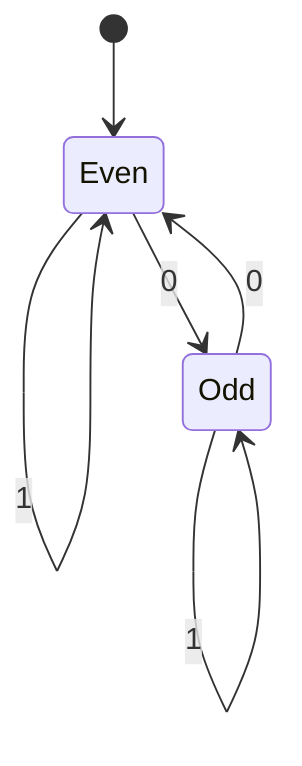

# 정규 언어와 유한 오토마타 (Regular Languages and Finite Automata)

- Level: Intermediate
- Prerequisites: [Math/Discrete/Logic.md](../../Math/Discrete/Logic.md), [Math/Discrete/](../../Math/Discrete/)
- Status: Draft
- Reviewed-by: -
- Depth: Deep-dive (자기완결)

---

## 개념 (Concept)

정규 언어는 **유한 오토마타(finite automaton)** 로 인식할 수 있는 문자열 집합이다. 유한 오토마타는 유한한 상태를 가지며, 입력 문자를 하나씩 읽어 상태를 옮기다가, 마지막 상태가 받아들이는 상태(accepting)면 그 문자열을 "받아들인다".

## 직관 (Intuition)

자판기를 떠올리자. 현재까지 넣은 금액이 "상태"이고, 동전을 넣을 때마다 상태가 바뀐다. 목표 금액 상태에 도달하면 음료가 나온다. 유한 오토마타도 똑같이, 지금까지 읽은 입력을 유한한 상태 하나로 요약하면서 "이 문자열이 패턴에 맞는가"를 판정한다.

아래는 "0이 짝수 개인 문자열"을 받아들이는 DFA다(`Even`이 받아들이는 상태).



## 이론 (Theory)

알파벳 $\Sigma$는 기호의 유한 집합, 문자열은 그 기호의 유한 나열, 언어는 문자열의 집합이다. **결정적 유한 오토마타(DFA)** 는 5-튜플로 정의한다.

$$M = (Q,\ \Sigma,\ \delta,\ q_0,\ F)$$

여기서 $Q$는 상태 집합, $\delta: Q \times \Sigma \to Q$는 전이 함수, $q_0$는 시작 상태, $F \subseteq Q$는 받아들이는 상태 집합이다.

**비결정적 유한 오토마타(NFA)** 는 한 입력에 여러 전이를 허용하지만, 표현력은 DFA와 **동일**하다(모든 NFA는 동치인 DFA로 변환 가능). 정규 언어는 합집합·교집합·여집합·연결·클레이니 스타에 대해 닫혀 있다.

모든 언어가 정규인 것은 아니다. **펌핑 보조정리(pumping lemma)** 로 $\{a^n b^n \mid n \ge 0\}$ 같은 언어가 정규가 아님을 증명할 수 있다 — 유한 상태로는 "여는 것과 닫는 것의 개수가 같은지"를 셀 수 없기 때문이다.

## 구현 (Implementation)

위 DFA(0이 짝수 개)를 그대로 옮긴 시뮬레이터다.

```python
def accepts_even_zeros(s):
    state = "Even"                     # 시작 상태
    for ch in s:
        if ch == "0":
            state = "Odd" if state == "Even" else "Even"
        # '1'은 상태를 바꾸지 않음
    return state == "Even"             # 받아들이는 상태인가?

print(accepts_even_zeros("1010"))   # True  (0이 2개)
print(accepts_even_zeros("100"))    # True  (0이 2개)
print(accepts_even_zeros("0"))      # False (0이 1개)
```

## 복잡도 (Complexity)

| 항목 | 비용 |
|---|---|
| 길이 `n` 입력에 대한 DFA 실행 | `O(n)` (문자당 상수 시간 전이) |
| 추가 메모리 | `O(1)` (현재 상태 하나) |
| NFA → DFA 변환 | 최악 상태 수 `O(2^k)` (k = NFA 상태 수) |

DFA 실행은 입력을 한 번 훑으므로 매우 효율적이다. 단, NFA를 DFA로 바꿀 때 상태가 지수적으로 늘 수 있다(부분집합 구성).

## 응용 (Applications)

- 정규 표현식 엔진과 패턴 매칭
- 컴파일러·인터프리터의 어휘 분석(렉서, 토크나이저)
- 입력 형식 검증(이메일·전화번호 등 단순 패턴)
- 프로토콜·UI의 상태 기계 모델링

## 흔한 오해 (Common Misunderstandings)

- 정규 표현식으로 모든 패턴을 표현할 수 있는 것은 아니다. 균형 잡힌 괄호처럼 "세는" 패턴은 정규 언어가 아니다.
- NFA가 DFA보다 강력한 것은 아니다. 표현력은 같고, NFA가 더 작게 표현될 뿐이다.
- 실무의 "정규식 엔진"은 역참조 같은 확장을 포함해 이론적 정규 언어보다 더 강력(하지만 더 느릴 수 있음)하다.
- 상태가 유한하다는 것이 약점만은 아니다. 그래서 메모리 `O(1)`로 매우 빠르게 동작한다.

## TMI

- 정규 언어와 유한 오토마타의 동치성은 1950년대 Kleene의 정리로 정리됐고, "클레이니 스타(`*`)"가 그의 이름에서 왔다.
- 유닉스 `grep`의 이름은 ed 편집기 명령 `g/re/p`(global / regular expression / print)에서 유래했다.
- 정규식에 역참조를 넣으면 더 이상 "정규"가 아니며, 어떤 입력에서는 지수 시간으로 폭주(ReDoS)할 수 있다.

## 연습 / 확인 문제 (Exercises)

- "1로 끝나는 이진 문자열"을 받아들이는 DFA를 상태도로 그리고 시뮬레이터로 구현하라.
- $\{a^n b^n \mid n \ge 0\}$가 왜 유한 오토마타로 인식될 수 없는지 상태 개수 관점에서 설명하라.
- NFA를 DFA로 바꿀 때 상태가 늘어나는 예를 하나 만들어 보라.

## 이어서 읽기 (Reading Path)

- 이전: 없음
- 다음: [정규 표현식](Regular-Expressions.md), [문맥 자유 문법](Context-Free.md)

## 참조 (References)

- [Math/Discrete/Logic.md](../../Math/Discrete/Logic.md)
- [Reference/Books.md](../../Reference/Books.md)
- [Reference/Courses.md](../../Reference/Courses.md)
