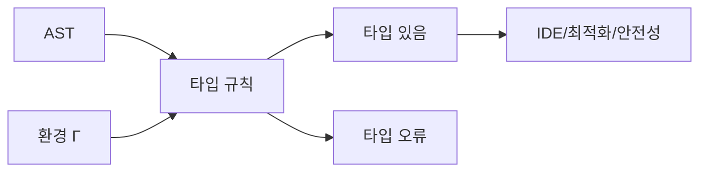

# 타입 시스템 (Type Systems)

- Level: Intermediate
- Prerequisites: [CS-Theory/Programming-Languages/Syntax-and-Semantics.md](Syntax-and-Semantics.md), [CS-Theory/Programming-Languages/Lambda-Calculus.md](Lambda-Calculus.md)
- Status: Draft
- Reviewed-by: -
- Depth: Deep-dive (자기완결)

---

## 개념 (Concept)

타입 시스템은 프로그램의 값과 식을 분류하고, 허용되는 연산을 규칙으로 제한하는 체계다. 실행 전에 `1 + true` 같은 잘못된 조합을 거부하는 정적 타입 시스템도 있고, 실행 중 값의 태그를 검사하는 동적 타입 시스템도 있다. 목표는 단순히 오류 메시지를 내는 것이 아니라 **프로그램이 지켜야 할 불변식**을 표현하는 데 있다.

## 직관 (Intuition)

타입은 값에 붙인 라벨이라기보다 값의 사용 계약이다. `int`라는 계약은 덧셈 같은 연산을 허용하고, `A -> B`라는 함수 타입은 `A`를 받아 `B`를 돌려준다고 약속한다. 타입 검사기는 프로그램을 실행하지 않고도 이 계약들이 서로 맞물리는지 확인한다.



## 이론 (Theory)

타입 판단은 보통 $\Gamma \vdash e : \tau$로 쓴다. 환경 $\Gamma$ 아래에서 식 $e$의 타입이 $\tau$라는 뜻이다. 단순 타입 람다 대수의 함수 적용 규칙은 다음과 같다.

$$
\frac{\Gamma \vdash e_1 : \tau_1 \rightarrow \tau_2 \qquad \Gamma \vdash e_2 : \tau_1}
     {\Gamma \vdash e_1\ e_2 : \tau_2}
$$

좋은 타입 시스템이 보통 노리는 안전성은 두 정리로 나뉜다.

- 진행(progress): 잘 타입된 닫힌 항은 값이거나 다음 계산 단계가 있다.
- 보존(preservation): 잘 타입된 항이 한 단계 계산된 뒤에도 타입이 유지된다.

둘을 합치면 잘 타입된 프로그램은 정의된 실행 규칙 안에서 "막히지 않는다"는 타입 안전성을 얻는다. 단, 배열 범위 오류, 0으로 나누기, 논리 버그까지 모두 막는다는 뜻은 아니다.

| 구분 | 예 | 장단점 |
|---|---|---|
| 정적 / 동적 | Rust / Python | 이른 검출 / 유연한 실행 시 검사 |
| 명시적 / 추론 | Java 타입 표기 / ML 추론 | 가시성 / 간결성 |
| 명목적 / 구조적 | Java 클래스 / TypeScript 객체 | 선언된 정체성 / 모양 기반 호환 |
| 단형 / 다형 | 한 타입 / 제네릭 | 단순성 / 재사용성 |

### 작은 타입 유도

환경 $\Gamma=\{x:Int\}$에서 `x + 1`의 타입을 유도하면, `x:Int`, `1:Int`, 덧셈 규칙 `Int + Int -> Int`가 합쳐져 전체 식은 `Int`가 된다. 반대로 `x + true`는 오른쪽이 `Bool`이라 덧셈 규칙을 적용할 수 없다.

## 구현 (Implementation)

작은 식 언어에 정수와 불리언 타입 검사를 붙여 보자.

```python
def type_of(expr):
    tag = expr[0]
    if tag == "integer":
        return "Int"
    if tag == "boolean":
        return "Bool"
    if tag == "add":
        left, right = type_of(expr[1]), type_of(expr[2])
        if left == right == "Int":
            return "Int"
        raise TypeError("addition requires two Int values")
    if tag == "if":
        condition = type_of(expr[1])
        then_type, else_type = type_of(expr[2]), type_of(expr[3])
        if condition != "Bool" or then_type != else_type:
            raise TypeError("invalid conditional")
        return then_type
    raise TypeError(f"unknown expression: {tag}")


print(type_of(("add", ("integer", 1), ("integer", 2))))  # Int
```

이 검사는 AST를 재귀적으로 순회하며 각 구문 규칙에 대응하는 타입 규칙을 적용한다.

실패 trace:

```python
bad = ("add", ("integer", 1), ("boolean", True))
print(type_of(bad))  # TypeError: addition requires two Int values
```

타입 검사기는 프로그램을 실행해 `1 + true`를 계산해 보는 것이 아니라, AST 모양과 하위 식의 타입만으로 거부한다.

## 복잡도 (Complexity)

위처럼 지역 규칙만 있는 AST 타입 검사는 노드 수 $n$에 대해 시간 `O(n)`, 재귀 스택 `O(h)`다. 실제 언어의 서브타이핑, 오버로딩, 제네릭 제약 해결은 더 비쌀 수 있으며, 충분히 강한 타입 시스템에서는 타입 검사나 추론 자체가 결정 불가능해질 수도 있다.

워크드 예제: `("if", cond, then, else)` 노드는 조건식, then, else 세 하위 노드를 각각 한 번 검사한다. AST에 공유가 없다면 전체 타입 검사 비용은 모든 노드를 한 번 방문하는 `O(n)`이다.

## 응용 (Applications)

- 잘못된 연산과 API 사용을 실행 전에 발견
- IDE 자동 완성, 이름 변경, 탐색 같은 정적 도구 지원
- 제네릭과 인터페이스로 재사용 가능한 추상화 표현
- 소유권·효과·null 가능성 타입으로 메모리와 부수 효과 제어
- 증명 보조기에서 명제를 타입, 증명을 프로그램으로 표현

## 흔한 오해 (Common Misunderstandings)

- 정적 타입 언어가 항상 안전하고 동적 타입 언어가 항상 위험한 것은 아니다. 보장 범위와 실행 모델을 봐야 한다.
- 타입 안전성은 프로그램이 의도대로 동작한다는 보장이 아니다. 올바른 타입의 잘못된 알고리즘도 얼마든지 가능하다.
- 강한 타입, 정적 타입, 명시적 타입은 같은 축이 아니다.
- 캐스팅은 값을 자동으로 안전하게 바꾸는 마법이 아니다. 검사 없는 캐스트는 보장을 우회할 수 있다.

## TMI

- `null`을 타입 시스템에 도입한 토니 호어는 훗날 이를 "10억 달러짜리 실수"라고 표현했다. 현대 언어는 option/nullable 타입으로 부재를 명시하려 한다.
- Curry–Howard 대응에서는 타입이 명제에, 그 타입을 가진 프로그램이 증명에 대응한다.
- Rust의 소유권 검사는 메모리 수명과 별칭 규칙을 타입 검사 단계에 끌어들인 대표 사례다.

## 연습 / 확인 문제 (Exercises)

- 위 검사기에 문자열 타입과 문자열 연결 연산을 추가하라.
- 진행과 보존이 각각 깨지는 작은 언어 규칙의 예를 하나씩 만들어라.
- 명목적 타입과 구조적 타입에서 같은 필드를 가진 두 객체가 어떻게 다르게 호환되는지 설명하라.

## 이어서 읽기 (Reading Path)

- 이전: [람다 대수](Lambda-Calculus.md)
- 다음: [타입 추론](Type-Inference.md)
- 관련: [구문과 의미론](Syntax-and-Semantics.md), [의미 분석과 타입 검사](../Compilers/README.md)

## 참조 (References)

- [CS-Theory/Programming-Languages/Syntax-and-Semantics.md](Syntax-and-Semantics.md)
- [CS-Theory/Programming-Languages/Lambda-Calculus.md](Lambda-Calculus.md)
- [Reference/Books.md](../../Reference/Books.md)
- [Reference/Courses.md](../../Reference/Courses.md)
