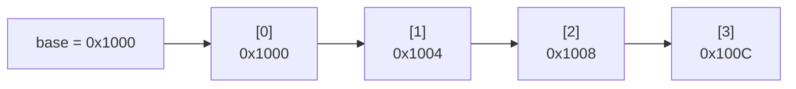

# 배열 (Array)

- Level: Beginner
- Prerequisites: [Programming/Variables-and-Types.md](../Programming/Variables-and-Types.md), [Programming/Control-Flow.md](../Programming/Control-Flow.md)
- Status: Draft
- Reviewed-by: -
- Depth: Deep-dive (자기완결)

---

## 개념 (Concept)

배열은 같은 크기의 원소를 **메모리에 연속으로** 배치하고, 정수 인덱스로 접근하는 선형 자료구조다. "연속 + 동일 크기"라는 두 제약 덕분에 i번째 원소의 주소를 **계산**으로 구할 수 있고, 이것이 O(1) 임의 접근(random access)의 근거다. 배열이 아닌 것(무엇과 구별되는가): 원소가 흩어져 링크로 연결되는 [연결 리스트](Linked-List.md)와 달리, 배열은 위치를 *주소 산술*로 즉시 안다.

## 직관 (Intuition)

배열은 번호가 붙은 연속된 칸들의 줄이다. 시작 주소(base)와 원소 크기(stride)만 알면 `i`번 칸은 "base에서 `i × stride`만큼 떨어진 곳"이라 곧바로 점프할 수 있다 — 앞에서부터 세지 않는다. 대신 중간에 끼워 넣거나 빼면 뒤 원소를 전부 한 칸씩 밀어야 해서 비싸다.



## 이론 (Theory)

### 1. 주소 산술이 O(1) 접근의 전부다

원소 크기 `s`바이트, 시작 주소 `base`일 때 1차원 배열의 i번째 원소 주소는

$$\text{addr}(i) = \text{base} + i \times s$$

곱셈·덧셈 한 번이라 인덱스 값과 무관하게 상수 시간이다. 2차원 배열은 메모리에 1차원으로 펴서 저장하는데, **row-major**(C, Python, 행을 이어 붙임)와 **column-major**(Fortran, MATLAB)로 갈린다. `R×C` 배열의 `(r, c)`는 row-major에서

$$\text{addr}(r, c) = \text{base} + (r \times C + c)\times s$$

그래서 **순회 순서가 row-major 저장과 맞으면**(안쪽 루프가 `c`) 캐시 적중률이 높고, 어긋나면(안쪽 루프가 `r`) 느려진다 — 같은 $O(RC)$여도 실측이 수 배 차이 난다.

### 2. 고정 배열 vs 동적 배열

고정 크기 배열은 용량이 컴파일/생성 시점에 정해진다. **동적 배열**(`list`, `ArrayList`, `vector`)은 `size`(현재 원소 수)와 `capacity`(확보한 칸 수)를 분리해 두고, 가득 차면 더 큰 버퍼를 새로 잡아 기존 원소를 복사한다.

### 3. 동적 배열의 amortized 분석 (핵심)

용량을 매번 +1씩 늘리면 추가마다 전체 복사가 일어나 n개 추가가 $O(n^2)$이 된다. 그래서 **기하급수적으로** 늘린다(성장 인자 `g`, 보통 2 또는 1.5). 성장 인자 2로 1부터 n까지 추가할 때, 복사가 일어나는 시점의 용량은 $1, 2, 4, \dots, 2^k \le n$이고 그때마다 그 수만큼 복사하므로 총 복사량은

$$\sum_{i=0}^{\lfloor \lg n \rfloor} 2^{i} = 2^{\lfloor \lg n\rfloor + 1} - 1 < 2n$$

즉 n번 추가의 총비용이 $O(n)$ → **추가 1회의 amortized 비용은 $O(1)$**(aggregate method). 일반 성장 인자 `g`에서는 resize당 복사가 추가 1회에 분산되어 amortized 복사 비용이 $\dfrac{1}{g-1}$이다.

| 성장 인자 `g` | amortized 복사/추가 | 최악 메모리 낭비 | 비고 |
|---|---|---|---|
| 2.0 | 1 | ~50% | 빠르지만 직전 버퍼 재사용 불가 |
| 1.5 | 2 | ~33% | 복사 많지만 이전 해제 블록 재사용 가능 |

성장 인자 2는 "이전에 해제한 블록들의 합($1+2+\dots+2^{k-1}=2^k-1$)이 다음 요청($2^{k+1}$)보다 항상 작아" 그 자리를 재사용 못 한다. 그래서 일부 구현(예: Folly의 `fbvector`)은 1.5를 쓴다. CPython의 `list`는 약 1/8(12.5%)만 더 잡는 보수적 over-allocation을 한다.

## 구현 (Implementation)

언어 내장 배열 사용:

```python
numbers = [10, 20, 30]
print(numbers[0])      # 10  ← 주소 산술, O(1)
numbers[1] = 25        # O(1)
numbers.append(40)     # amortized O(1)
numbers.insert(0, 5)   # O(n) ← 뒤 원소 전부 한 칸씩 밀기
```

동적 배열을 바닥부터 (성장·복사가 보이게):

```python
class DynamicArray:
    def __init__(self):
        self._n = 0
        self._cap = 1
        self._buf = [None] * self._cap

    def append(self, x):
        if self._n == self._cap:        # 가득 참 → 2배로 확장
            self._resize(self._cap * 2)
        self._buf[self._n] = x
        self._n += 1

    def _resize(self, new_cap):
        new_buf = [None] * new_cap
        for i in range(self._n):        # 기존 원소 전부 복사: O(n)
            new_buf[i] = self._buf[i]
        self._buf, self._cap = new_buf, new_cap

    def __getitem__(self, i):
        if not 0 <= i < self._n:
            raise IndexError(i)
        return self._buf[i]             # O(1)
```

중간 삽입(인덱스 `i`)은 `[i..n)`를 오른쪽으로 한 칸씩 밀어야 하므로 $O(n)$:

```python
def insert_at(buf, n, i, x):           # buf의 유효 길이 n, 용량 충분 가정
    for j in range(n, i, -1):
        buf[j] = buf[j - 1]            # 뒤에서부터 밀기
    buf[i] = x
```

## 복잡도 (Complexity)

| 연산 | 시간 | 공간 | 메모 |
|---|---|---|---|
| 인덱스 접근/갱신 | $O(1)$ | $O(1)$ | 주소 산술 |
| 끝에 추가 (동적) | amortized $O(1)$, 최악 $O(n)$ | $O(1)$ amortized | resize 순간만 $O(n)$ |
| 끝에서 삭제 | $O(1)$ | $O(1)$ | |
| 중간 삽입/삭제 | $O(n)$ | $O(1)$ | 밀기/당기기 |
| 값 검색(비정렬) | $O(n)$ | $O(1)$ | 정렬되면 이진탐색 $O(\log n)$ |
| 전체 순회 | $O(n)$ | $O(1)$ | 캐시 친화적 |

**워크드 예제.** 빈 동적 배열에 성장 인자 2로 9번 `append`. 복사가 일어나는 추가는 용량이 가득 찰 때: 1→2(1복사), 2→4(2), 4→8(4), 8→16(8). 총 복사 $1+2+4+8=15$, 추가 9회 자체 9회 → 총 $24$ 연산, 추가당 평균 $24/9 \approx 2.7$ → 상수. $2n=18$ 상한 안에 든다.

## 응용 (Applications)

- 정렬·이진탐색·동적계획법 등 **인덱스 기반 알고리즘의 기본 입력** ([복잡도](../Algorithms/Complexity.md)).
- 행렬·이미지·오디오 버퍼 같은 수치 데이터(연속 메모리라 SIMD·캐시에 유리).
- 다른 자료구조의 **내부 백본**: [스택](Stack.md), [힙](Heap.md)(완전 이진 트리를 배열로), [해시 테이블](Hash-Table.md)의 버킷 배열, ring buffer 기반 [큐](Queue.md)·[덱](Deque.md).

## 흔한 오해 (Common Misunderstandings)

- **"접근이 O(1)"은 "값을 바로 찾는다"가 아니다.** *위치(인덱스)를 알 때* O(1)이다. 값으로 찾기는 비정렬이면 $O(n)$.
- **`append`는 항상 O(1)이 아니다.** amortized $O(1)$ — 개별 호출은 resize 순간 $O(n)$이 될 수 있어, 실시간 보장이 필요한 시스템에선 주의.
- **resize 후 옛 버퍼를 가리키던 포인터·iterator는 무효화된다**(C++ `vector` 재할당, dangling reference의 흔한 원인).
- **이론상 삽입/삭제는 연결 리스트가 유리해도 실전은 배열이 이기는 일이 잦다** — 캐시 지역성과 예측 가능한 prefetch 때문.

## TMI

- 0-기반 인덱싱이 흔한 이유 중 하나는 인덱스가 곧 "시작 주소로부터의 오프셋"이기 때문이다($\text{addr}(0)=\text{base}$).
- Python의 `list`는 이름과 달리 연결 리스트가 아니라 **포인터들의 동적 배열**이다. 그래서 임의 접근이 $O(1)$.
- 다익스트라는 1982년 메모 "Why numbering should start at zero(EWD831)"에서 0-기반과 반열린 구간 `[a, b)`을 옹호했다.
- C++ `std::vector<bool>`은 비트로 압축 저장하는 특수화라 다른 `vector`와 달리 진짜 `bool&`를 못 돌려준다 — 표준의 유명한 함정.

## 연습 / 확인 문제 (Exercises)

- 한 번의 순회로 배열의 최솟값과 최댓값을 동시에 찾아라(비교 횟수를 약 `1.5n`으로).
- 동적 배열에 성장 인자 1.5로 100번 추가할 때 발생하는 총 복사량을 $\frac{1}{g-1}$ 분석으로 추정하라.
- `R×C` 행렬을 row-major로 순회할 때와 column-major 순서로 순회할 때 캐시 미스가 왜 달라지는지 주소 식으로 설명하라.
- 제자리(in-place)로 배열을 뒤집어라. 추가 메모리 $O(1)$ 임을 보여라.

## 이어서 읽기 (Reading Path)

- 이전: [명제 논리와 술어 논리](../Math/Discrete/Logic.md)
- 다음: [연결 리스트](Linked-List.md)
- 관련: [복잡도](../Algorithms/Complexity.md), [해시 테이블](Hash-Table.md)

## 참조 (References)

- [Programming/Control-Flow.md](../Programming/Control-Flow.md)
- [Data-Structures/Linked-List.md](Linked-List.md)
- [Algorithms/Complexity.md](../Algorithms/Complexity.md)
- [Reference/Books.md](../Reference/Books.md)
- [Reference/Courses.md](../Reference/Courses.md)
