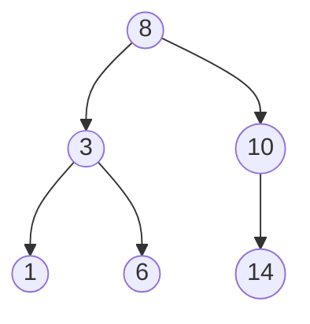

# 이진 탐색 트리 (Binary Search Tree)

- Level: Intermediate
- Prerequisites: [Data-Structures/Binary-Tree.md](Binary-Tree.md), [Programming/Functions-and-Recursion.md](../Programming/Functions-and-Recursion.md)
- Status: Draft
- Reviewed-by: -

---

## 개념 (Concept)

이진 탐색 트리(BST)는 **"왼쪽 서브트리의 모든 값 < 노드 값 < 오른쪽 서브트리의 모든 값"** 이라는 순서 조건을 만족하는 이진 트리다. 이 조건 덕분에 정렬된 배열의 이진 탐색과 같은 원리로, 한 번 비교할 때마다 탐색 범위를 한쪽 서브트리로 절반씩 줄여 나갈 수 있다.

## 직관 (Intuition)

값을 찾을 때 "찾는 값이 현재 노드보다 작으면 왼쪽, 크면 오른쪽"만 반복하면 된다. 정렬된 배열의 이진 탐색을 포인터로 연결한 자료구조라고 보면 된다. 배열과 달리 삽입·삭제 시 원소를 밀지 않고 포인터만 바꾸므로, 동적으로 변하는 정렬된 집합을 다룰 때 유리하다.



## 이론 (Theory)

BST의 핵심 성질은 **중위 순회(in-order traversal)가 정렬된 순서를 만든다**는 것이다. 왼쪽 → 루트 → 오른쪽 순서로 방문하면 항상 오름차순이 나온다.

탐색·삽입·삭제는 모두 루트에서 잎까지 한 경로를 따라 내려가므로 비용이 트리 높이 $h$에 비례한다.

$$T(\text{탐색}) = O(h)$$

높이 $h$는 트리 형태에 달려 있다. $n$개의 노드가 균형을 이루면 $h = \Theta(\log n)$이지만, 정렬된 순서로 삽입하면 한쪽으로만 자라 연결 리스트가 되어 $h = n - 1$이 된다. 이 최악의 편향을 막으려고 AVL 트리, 레드-블랙 트리 같은 **자기 균형(self-balancing) BST**가 높이를 강제로 $O(\log n)$으로 유지한다.

삭제는 세 경우로 나뉜다.

| 경우 | 처리 |
|---|---|
| 잎(자식 0) | 그냥 제거 |
| 자식 1개 | 그 자식을 부모에 직접 연결 |
| 자식 2개 | 오른쪽 서브트리의 최솟값(중위 후계자)으로 값을 대체하고, 그 후계자를 삭제 |

## 구현 (Implementation)

```python
class Node:
    def __init__(self, key):
        self.key = key
        self.left = None
        self.right = None


def insert(root, key):
    if root is None:
        return Node(key)
    if key < root.key:
        root.left = insert(root.left, key)
    elif key > root.key:
        root.right = insert(root.right, key)
    return root            # 중복 키는 무시


def search(root, key):
    while root and root.key != key:
        root = root.left if key < root.key else root.right
    return root            # 못 찾으면 None


root = None
for k in [8, 3, 10, 1, 6, 14]:
    root = insert(root, k)

print(search(root, 6).key)   # 6
print(search(root, 7))       # None
```

## 복잡도 (Complexity)

`n`은 노드 수, `h`는 높이다.

| 연산 | 균형 (`h = log n`) | 최악 (`h = n`) |
|---|---|---|
| 탐색 | `O(log n)` | `O(n)` |
| 삽입 | `O(log n)` | `O(n)` |
| 삭제 | `O(log n)` | `O(n)` |

공간은 노드 저장에 `O(n)`, 재귀 호출에 `O(h)`다. 최악은 정렬된 입력으로 트리가 한쪽으로 치우칠 때이며, 이것이 균형 트리가 필요한 이유다.

## 응용 (Applications)

- 정렬된 상태를 유지하며 삽입·삭제가 잦은 동적 집합
- 범위 질의(특정 구간의 값 모두 찾기)
- C++ `std::map`/`std::set`, Java `TreeMap`/`TreeSet`의 기반(보통 레드-블랙 트리)
- 데이터베이스 인덱스의 토대가 되는 균형 트리·B-트리의 개념적 출발점

## 흔한 오해 (Common Misunderstandings)

- BST가 항상 `O(log n)`인 것은 아니다. 균형이 깨지면 `O(n)`까지 나빠진다. `O(log n)` 보장은 균형 트리(AVL, 레드-블랙)에서만 성립한다.
- "왼쪽 자식 < 루트 < 오른쪽 자식"만 보는 것은 부분 조건이다. 정확한 조건은 **왼쪽/오른쪽 서브트리 전체**가 범위를 만족해야 한다.
- 중복 키 처리는 정해진 규칙이 없다. 무시·카운트·한쪽 정렬 중 구현이 정해야 한다.
- 삭제에서 자식이 둘일 때 단순히 한쪽 자식을 올리면 순서 조건이 깨진다. 중위 후계자(또는 선행자)로 대체해야 한다.

## TMI

- 정렬된 데이터를 그대로 삽입하는 것이 BST 최악의 시나리오다. 그래서 일부 구현은 입력을 무작위로 섞거나, 무작위 우선순위를 부여하는 트립(Treap)으로 기대 높이를 `O(log n)`으로 만든다.
- 실무 표준 라이브러리의 정렬 맵은 대부분 레드-블랙 트리다. AVL보다 삽입·삭제 시 회전이 적어 쓰기가 잦은 작업에 유리하기 때문이다.
- 디스크 기반 데이터베이스는 이진이 아니라 한 노드에 수백 개 키를 담는 B-트리/B+트리를 쓴다. 디스크 읽기 횟수(트리 높이)를 더 줄이기 위해서다.

## 연습 / 확인 문제 (Exercises)

- 주어진 이진 트리가 BST인지 검사하는 함수를 작성하라. (힌트: 각 노드에 허용 범위 `(min, max)`를 전달한다.)
- 자식이 둘인 노드를 삭제하는 함수를 중위 후계자 방식으로 구현하라.
- `[1, 2, 3, 4, 5]`를 순서대로 삽입했을 때 트리의 높이를 구하고, 어떤 삽입 순서가 균형 트리를 만드는지 설명하라.

## 이어서 읽기 (Reading Path)

- 이전: [이진 트리](Binary-Tree.md)
- 다음: [힙](Heap.md), [AVL 트리](AVL-Tree.md), [레드-블랙 트리](Red-Black-Tree.md)
- 관련: [이진 탐색](../Algorithms/Binary-Search.md)

## 참조 (References)

- [Data-Structures/Binary-Tree.md](Binary-Tree.md)
- [Algorithms/Binary-Search.md](../Algorithms/Binary-Search.md)
- [Reference/Books.md](../Reference/Books.md)
- [Reference/Courses.md](../Reference/Courses.md)
