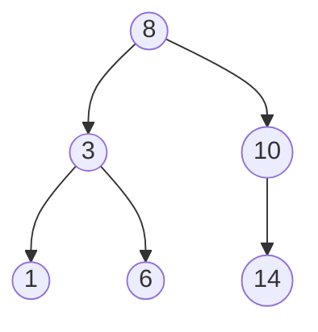

# 이진 탐색 트리 (Binary Search Tree)

- Level: Intermediate
- Prerequisites: [Data-Structures/Binary-Tree.md](Binary-Tree.md), [Programming/Functions-and-Recursion.md](../Programming/Functions-and-Recursion.md)
- Status: Draft
- Reviewed-by: -
- Depth: Deep-dive (자기완결)

---

## 개념 (Concept)

이진 탐색 트리(BST)는 모든 노드에서 **"왼쪽 서브트리 전체 < 노드 < 오른쪽 서브트리 전체"** 라는 순서 불변식을 만족하는 이진 트리다. 이 불변식 덕에 [이진 탐색](../Algorithms/Binary-Search.md)을 포인터로 연결한 형태가 되어, 한 번 비교마다 탐색 범위가 한쪽 서브트리로 줄어든다.

## 직관 (Intuition)

"찾는 값 < 현재면 왼쪽, 크면 오른쪽"을 반복. 정렬 배열의 이진 탐색과 같은 원리지만, **삽입·삭제 시 원소를 밀지 않고 포인터만 바꿔** 동적으로 변하는 정렬된 집합에 강하다. 핵심 약점은 단 하나 — *모양이 입력에 좌우*되어, 정렬된 입력이면 한 줄로 늘어진다.



## 이론 (Theory)

### 1. 중위 순회 = 정렬

BST의 **중위 순회는 항상 오름차순**을 낸다. 이 한 사실에서 검증·범위 질의·후계자 탐색이 모두 따라 나온다.

### 2. 비용은 높이에 비례 → 균형이 전부

탐색·삽입·삭제는 루트→잎 한 경로를 타므로 $T = O(h)$. $n$개 노드를 **무작위 순서로** 삽입하면 기대 높이가 $\Theta(\log n)$(평균 탐색 비교 ≈ $1.39\lg n$). 그러나 **정렬된 순서로 삽입하면 $h=n-1$ 로 연결 리스트**가 되어 $O(n)$. 이 최악을 막으려 [AVL](AVL-Tree.md)·[레드-블랙 트리](Red-Black-Tree.md)가 높이를 강제로 $O(\log n)$ 으로 유지한다.

### 3. 삭제의 세 경우

| 경우 | 처리 |
|---|---|
| 잎(자식 0) | 그냥 제거 |
| 자식 1개 | 그 자식을 부모에 직접 연결 |
| 자식 2개 | **중위 후계자**(오른쪽 서브트리의 최솟값)로 값 대체 후, 그 후계자를 삭제(후계자는 자식이 0 또는 1) |

자식 둘일 때 단순히 한쪽 자식을 올리면 순서 불변식이 깨진다 — 후계자(또는 선행자)만이 순서를 보존한다.

### 4. 증강(augmentation) — 순위/선택 질의

각 노드에 **서브트리 크기**를 들고 다니면, "k번째로 작은 값(select)"과 "x의 순위(rank)"를 $O(h)$ 에 푼다. 왼쪽 서브트리 크기 `L`과 비교: `k == L+1`이면 현재 노드, `k ≤ L`이면 왼쪽, 아니면 오른쪽에서 `k-L-1`.

## 구현 (Implementation)

```python
class Node:
    __slots__ = ("key", "left", "right")
    def __init__(self, key):
        self.key, self.left, self.right = key, None, None

def insert(root, key):
    if root is None: return Node(key)
    if key < root.key:   root.left  = insert(root.left, key)
    elif key > root.key: root.right = insert(root.right, key)
    return root                                  # 중복은 무시(정책)

def search(root, key):
    while root and root.key != key:
        root = root.left if key < root.key else root.right
    return root                                  # 못 찾으면 None

def delete(root, key):
    if root is None: return None
    if key < root.key:   root.left  = delete(root.left, key)
    elif key > root.key: root.right = delete(root.right, key)
    else:
        if root.left is None:  return root.right
        if root.right is None: return root.left
        succ = root.right                        # 중위 후계자 = 오른쪽 최솟값
        while succ.left: succ = succ.left
        root.key = succ.key
        root.right = delete(root.right, succ.key)
    return root
```

BST 검증(범위 전달):

```python
def is_bst(node, lo=float("-inf"), hi=float("inf")):
    if node is None: return True
    if not (lo < node.key < hi): return False
    return is_bst(node.left, lo, node.key) and is_bst(node.right, node.key, hi)
```

## 복잡도 (Complexity)

`n`=노드 수, `h`=높이.

| 연산 | 균형 ($h=\log n$) | 무작위 삽입(기대) | 최악 ($h=n$) |
|---|---|---|---|
| 탐색/삽입/삭제 | $O(\log n)$ | $O(\log n)$ | $O(n)$ |
| select/rank(증강) | $O(\log n)$ | $O(\log n)$ | $O(n)$ |

공간 $O(n)$, 재귀 $O(h)$. **워크드 예제.** `[1,2,3,4,5]`를 순서대로 삽입하면 오른쪽으로만 자라 높이 4(=n-1), 탐색이 $O(n)$. 반면 `[3,1,5,2,4]` 순이면 높이 2 — 같은 집합도 *삽입 순서가 모양과 성능을 결정*한다.

## 응용 (Applications)

- 정렬 상태를 유지하며 삽입·삭제가 잦은 동적 집합, **범위 질의**.
- C++ `std::map`/`set`, Java `TreeMap`/`TreeSet`(보통 레드-블랙 트리).
- 순위·순서 통계(증강 BST), 구간 스케줄링.
- 디스크용 [B-트리](../Systems/Databases/Indexes-and-B-Tree.md)·DB 인덱스의 개념적 출발점.

## 흔한 오해 (Common Misunderstandings)

- **BST가 항상 $O(\log n)$ 이 아니다** — 균형이 깨지면 $O(n)$. $O(\log n)$ 보장은 AVL/레드-블랙에서만.
- **"왼쪽 자식 < 루트 < 오른쪽 자식"만 보는 검증은 틀렸다** — *서브트리 전체*가 범위를 만족해야 한다(범위 전달이 정답).
- **중복 키 정책은 구현이 정한다** — 무시/카운트/한쪽 정렬 중 택일.
- **자식 둘 삭제 시 한쪽 자식을 그냥 올리면 순서가 깨진다** — 후계자/선행자 사용.

## TMI

- 정렬된 데이터를 그대로 삽입하는 게 BST 최악 시나리오라, **Treap**(무작위 우선순위)·입력 셔플로 기대 높이를 $O(\log n)$ 으로 만든다.
- 표준 라이브러리 정렬 맵이 AVL이 아니라 레드-블랙을 주로 쓰는 이유는, **삽입·삭제당 회전이 적어** 쓰기가 잦을 때 유리하기 때문이다.
- 디스크 DB는 이진이 아니라 한 노드에 키 수백 개를 담는 **B/B+ 트리**를 쓴다 — 트리 높이(=디스크 접근 횟수)를 더 줄이려고.
- "splay tree"는 최근 접근한 노드를 루트로 끌어올려, 편중된 접근 패턴에서 amortized $O(\log n)$ 을 낸다.

## 연습 / 확인 문제 (Exercises)

- 범위 `(min, max)` 전달로 BST 검증 함수를 구현하라(잘못된 "자식만 비교" 버전이 통과시키는 반례도 제시).
- 자식이 둘인 노드 삭제를 중위 후계자 방식으로 구현하라.
- 서브트리 크기로 증강해 `select(k)`와 `rank(x)`를 $O(h)$ 로 구현하라.
- `[1..7]`을 어떤 순서로 삽입하면 높이가 최소(=2)가 되는지 찾아라.

## 이어서 읽기 (Reading Path)

- 이전: [이진 트리](Binary-Tree.md)
- 다음: [AVL 트리](AVL-Tree.md), [레드-블랙 트리](Red-Black-Tree.md)
- 관련: [이진 탐색](../Algorithms/Binary-Search.md), [힙](Heap.md)

## 참조 (References)

- [Data-Structures/Binary-Tree.md](Binary-Tree.md)
- [Algorithms/Binary-Search.md](../Algorithms/Binary-Search.md)
- [Systems/Databases/Indexes-and-B-Tree.md](../Systems/Databases/Indexes-and-B-Tree.md)
- [Reference/Books.md](../Reference/Books.md)
- [Reference/Courses.md](../Reference/Courses.md)
