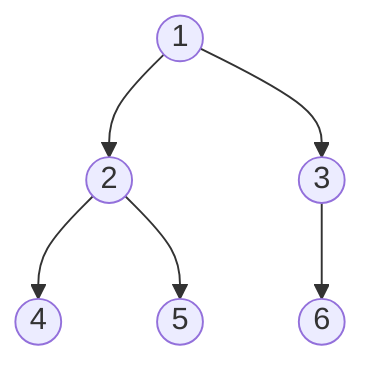

# 이진 트리 (Binary Tree)

- Level: Beginner
- Prerequisites: [Data-Structures/Linked-List.md](Linked-List.md), [Programming/Functions-and-Recursion.md](../Programming/Functions-and-Recursion.md)
- Status: Draft
- Reviewed-by: -
- Depth: Deep-dive (자기완결)

---

## 개념 (Concept)

이진 트리는 각 노드가 **최대 두 자식**(왼·오)을 갖고, 루트에서 한 방향으로만 흐르며 **사이클이 없는** 계층 구조다. "갈래를 둘로 제한"한 덕에 분할정복·재귀가 자연스럽고, [BST](BST.md)·[힙](Heap.md)·[세그먼트 트리](Segment-Tree.md) 등 수많은 구조의 토대가 된다.

## 직관 (Intuition)

조직도·폴더·토너먼트 대진표처럼 "하나가 둘로 갈라지는" 구조. 대부분의 트리 문제는 **"루트를 처리하고 왼/오 서브트리에 같은 일을 재귀"** 형태로 풀린다 — 트리가 재귀적으로 정의되기 때문이다(트리 = 루트 + 왼쪽 트리 + 오른쪽 트리).



## 이론 (Theory)

### 1. 용어와 경계

| 용어 | 의미 |
|---|---|
| 깊이(depth) | 루트→노드 간선 수(위에서 잼) |
| 높이(height) | 노드→가장 먼 잎 간선 수(아래에서 잼) |
| full | 모든 노드의 자식이 0 또는 2 |
| complete | 마지막 레벨 빼고 꽉 참 + 마지막은 왼쪽부터 |
| perfect | 모든 잎의 깊이가 같음 |

높이 $h$ 트리의 노드 수 $n$은 $h+1 \le n \le 2^{h+1}-1$. 즉 균형이면 $h=\Theta(\log n)$, 한쪽으로 치우치면 $h=n-1$. 노드가 $n$개인 **서로 다른 이진 트리 모양의 수는 카탈란 수** $C_n = \frac{1}{n+1}\binom{2n}{n}$ 이다.

### 2. 순회 — 재귀, 반복, Morris

깊이 우선 3종(전위 루트→왼→오, 중위 왼→루트→오, 후위 왼→오→루트)과 너비 우선(레벨 순회, 큐). 구현은 세 단계:

- **재귀**: 가장 단순하나 깊은 트리에서 호출 스택 한계(스택 오버플로) 위험, 보조 공간 $O(h)$.
- **명시적 스택**: 재귀를 펴서 깊이 제한 회피.
- **Morris traversal**: 잎의 빈 오른쪽 링크를 중위 후계자로 임시 연결(threading)해 **보조 공간 $O(1)$** 로 중위 순회. 트리를 잠깐 변형했다 복원한다.

**전위+중위로 트리 복원**이 가능하다(전위 첫 원소=루트 → 중위에서 루트 위치로 좌/우 분할 → 재귀).

### 3. 두 가지 메모리 표현

- **포인터(링크)**: 노드마다 `left`/`right`. 임의 모양에 유연.
- **암시적 배열**: 완전 이진 트리를 레벨 순서로 배열에 담으면 인덱스 `i`의 자식이 `2i+1`, `2i+2`, 부모가 `⌊(i-1)/2⌋`. 포인터가 없어 조밀·캐시 친화적 — [힙](Heap.md)의 토대. 단 **희소(skewed) 트리를 배열로 담으면 $2^h$까지 공간 낭비**.

## 구현 (Implementation)

```python
class Node:
    __slots__ = ("value", "left", "right")
    def __init__(self, value):
        self.value, self.left, self.right = value, None, None

def inorder_recursive(node):
    if node is None: return []
    return inorder_recursive(node.left) + [node.value] + inorder_recursive(node.right)

def inorder_iterative(root):            # 명시적 스택: O(h) 공간, 깊이 제한 없음
    out, stack, cur = [], [], root
    while cur or stack:
        while cur:
            stack.append(cur); cur = cur.left
        cur = stack.pop()
        out.append(cur.value)
        cur = cur.right
    return out

from collections import deque
def level_order(root):                  # BFS, 큐
    out, q = [], deque([root] if root else [])
    while q:
        node = q.popleft(); out.append(node.value)
        if node.left:  q.append(node.left)
        if node.right: q.append(node.right)
    return out
```

## 복잡도 (Complexity)

`n`=노드 수, `h`=높이.

| 연산 | 시간 | 보조 공간 |
|---|---|---|
| 순회(전·중·후·레벨) | $O(n)$ | $O(h)$ 재귀/스택, $O(n)$ 큐, Morris는 $O(1)$ |
| 임의 값 탐색(순서 보장 없음) | $O(n)$ | $O(h)$ |
| 높이/노드 수 계산 | $O(n)$ | $O(h)$ |

일반 이진 트리는 값 순서를 보장하지 않아 탐색이 $O(n)$. 순서·균형 조건을 더한 것이 [BST](BST.md)·균형 트리다.

**워크드 예제.** 위 그림에서 전위 `1 2 4 5 3 6`, 중위 `4 2 5 1 6 3`, 후위 `4 5 2 6 3 1`, 레벨 `1 2 3 4 5 6`. 전위의 첫 `1`이 루트, 중위에서 `1` 왼쪽 `4 2 5`가 왼 서브트리·오른쪽 `6 3`이 오른 서브트리 — 이렇게 복원된다.

## 응용 (Applications)

- 수식 트리(내부=연산자, 잎=피연산자), 추상 구문 트리(AST).
- [힙](Heap.md)(완전 이진 트리 → 배열), [BST](BST.md)·균형 트리, [세그먼트 트리](Segment-Tree.md).
- 허프만 코딩, 결정 트리(decision tree).

## 흔한 오해 (Common Misunderstandings)

- **이진 트리 ≠ BST.** BST는 "왼<루트<오" 순서 조건을 *추가로* 만족하는 이진 트리.
- **깊이와 높이는 다르다** — 깊이는 위에서, 높이는 아래에서.
- **이진 트리라고 $O(\log n)$ 탐색이 아니다** — 순서 조건 + 균형이 함께일 때만.
- **complete ≠ perfect** — complete는 마지막 레벨이 덜 차도 된다.
- 재귀 순회는 **깊은/한쪽으로 치우친 트리에서 스택 오버플로**가 날 수 있다.

## TMI

- 완전 이진 트리를 배열에 빈틈없이 담는 `2i+1`/`2i+2` 성질이 힙 구현의 핵심이다.
- Morris traversal은 잎의 빈 링크를 후계자로 잠시 연결해 $O(1)$ 공간을 얻는 영리한 트릭이다.
- 노드 $n$개의 트리 모양 수가 카탈란 수라는 사실은 "균형 괄호 문자열 수", "다각형 삼각분할 수"와 같은 값이다 — 조합론의 단골.
- 트리를 루트가 위로 가게 그리는 관행 탓에 "거꾸로 자라는 나무"라는 농담이 흔하다.

## 연습 / 확인 문제 (Exercises)

- 이진 트리의 높이를 재귀로 구하고, 같은 일을 레벨 순회(반복)로도 구현하라.
- 전위·중위 순회 배열로부터 트리를 복원하는 함수를 작성하라.
- Morris 중위 순회를 구현하고 보조 공간이 왜 $O(1)$ 인지 설명하라.
- 노드 수 $n$이 같아도 모양이 여러 개임을 카탈란 수 $C_3=5$로 확인하라(3노드 트리 5종 그리기).

## 이어서 읽기 (Reading Path)

- 이전: [연결 리스트](Linked-List.md)
- 다음: [이진 탐색 트리](BST.md), [힙](Heap.md)
- 관련: [세그먼트 트리](Segment-Tree.md), [트라이](Trie.md)

## 참조 (References)

- [Data-Structures/Linked-List.md](Linked-List.md)
- [Programming/Functions-and-Recursion.md](../Programming/Functions-and-Recursion.md)
- [Reference/Books.md](../Reference/Books.md)
- [Reference/Courses.md](../Reference/Courses.md)
