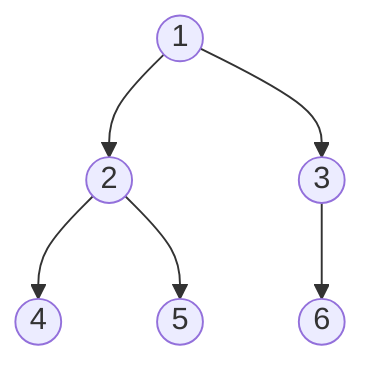

# 이진 트리 (Binary Tree)

- Level: Beginner
- Prerequisites: [Data-Structures/Linked-List.md](Linked-List.md), [Programming/Functions-and-Recursion.md](../Programming/Functions-and-Recursion.md)
- Status: Draft
- Reviewed-by: -

---

## 개념 (Concept)

이진 트리는 각 노드가 **최대 두 개의 자식**(왼쪽, 오른쪽)을 갖는 계층형 자료구조다. 맨 위 노드를 루트(root), 자식이 없는 노드를 잎(leaf)이라 한다. 자식을 가리키는 방향이 한쪽으로만 흐르고 사이클이 없다는 점에서 그래프의 트리를 자료구조로 구체화한 것이다.

## 직관 (Intuition)

조직도, 폴더 구조, 토너먼트 대진표처럼 "하나가 여러 갈래로 갈라지는" 구조를 표현한다. 이진 트리는 그 갈래를 둘로 제한해 탐색·분할을 단순하고 빠르게 만든다. 많은 문제가 "루트에서 시작해 왼쪽/오른쪽을 재귀로 처리"하는 형태로 자연스럽게 풀린다.



## 이론 (Theory)

| 용어 | 의미 |
|---|---|
| 깊이(depth) | 루트에서 그 노드까지의 간선 수 |
| 높이(height) | 그 노드에서 가장 먼 잎까지의 간선 수 |
| 정 이진 트리(full) | 모든 노드의 자식이 0개 또는 2개 |
| 완전 이진 트리(complete) | 마지막 레벨을 제외하고 꽉 차 있고, 마지막 레벨은 왼쪽부터 채워짐 |
| 포화 이진 트리(perfect) | 모든 잎의 깊이가 같고 내부 노드가 자식 2개 |

높이가 $h$인 이진 트리의 노드 수 $n$은 다음 범위를 가진다.

$$h + 1 \;\le\; n \;\le\; 2^{\,h+1} - 1$$

즉 균형이 잡히면 $n$개 노드의 높이는 $h = \Theta(\log n)$까지 낮아지고, 한쪽으로 치우치면 $h = n - 1$까지 커진다. 대표적인 순회 순서는 전위(루트→왼→오), 중위(왼→루트→오), 후위(왼→오→루트), 레벨 순회(너비 우선)다.

## 구현 (Implementation)

```python
class Node:
    def __init__(self, value):
        self.value = value
        self.left = None
        self.right = None


def inorder(node):
    if node is None:
        return []
    return inorder(node.left) + [node.value] + inorder(node.right)


root = Node(1)
root.left = Node(2)
root.right = Node(3)
root.left.left = Node(4)

print(inorder(root))   # [4, 2, 1, 3]
```

레벨 순회는 큐로 구현한다.

```python
from collections import deque

def level_order(root):
    order, queue = [], deque([root] if root else [])
    while queue:
        node = queue.popleft()
        order.append(node.value)
        if node.left:
            queue.append(node.left)
        if node.right:
            queue.append(node.right)
    return order
```

## 복잡도 (Complexity)

`n`은 노드 수, `h`는 높이다.

| 연산 | 시간 | 보조 공간 |
|---|---|---|
| 순회(전·중·후·레벨) | `O(n)` | `O(h)` 재귀 / `O(n)` 큐 |
| 임의 값 탐색(정렬 보장 없음) | `O(n)` | `O(h)` |
| 높이 계산 | `O(n)` | `O(h)` |

일반 이진 트리는 값의 순서를 보장하지 않으므로 탐색이 `O(n)`이다. 정렬·균형 조건을 추가한 것이 이진 탐색 트리와 균형 트리다.

## 응용 (Applications)

- 수식 트리(연산자=내부 노드, 피연산자=잎)
- 힙(완전 이진 트리 기반 우선순위 큐)
- 이진 탐색 트리·균형 트리의 토대
- 허프만 코딩, 결정 트리 등 분기 구조 모델링

## 흔한 오해 (Common Misunderstandings)

- 이진 트리와 이진 탐색 트리(BST)는 다르다. BST는 "왼쪽 < 루트 < 오른쪽" 순서 조건을 추가로 만족하는 이진 트리다.
- 깊이와 높이를 혼동하기 쉽다. 깊이는 위에서, 높이는 아래에서 잰다.
- 이진 트리라고 항상 `O(log n)` 탐색이 되는 것은 아니다. 일반 이진 트리는 균형 여부와 무관하게 값의 순서를 보장하지 않으므로 임의 값 탐색은 `O(n)`이다. `O(log n)` 탐색은 BST 순서 조건과 균형 조건이 함께 있을 때 기대할 수 있다.
- 완전(complete)과 포화(perfect)는 다른 개념이다. 완전은 마지막 레벨이 덜 차 있어도 된다.

## TMI

- 완전 이진 트리는 배열에 빈틈없이 담을 수 있다. 인덱스 `i`의 자식이 `2i+1`, `2i+2`가 되는 이 성질이 힙 구현의 핵심이다.
- 재귀 순회는 깊은 트리에서 호출 스택 한계에 걸릴 수 있어, 실무·대회에서는 명시적 스택이나 모리스 순회(Morris traversal, `O(1)` 추가 공간)를 쓰기도 한다.
- 트리를 그릴 때 루트를 위에 두는 관행 때문에 "트리"인데 거꾸로 자란다는 농담이 흔하다.

## 연습 / 확인 문제 (Exercises)

- 이진 트리의 높이를 재귀로 계산하는 함수를 작성하라.
- 전위·중위·후위 순회 결과가 같아지는 트리의 형태가 있는지 설명하라.
- 노드 수가 `n`인 완전 이진 트리의 높이를 `n`으로 표현하라.

## 이어서 읽기 (Reading Path)

- 이전: [연결 리스트](Linked-List.md)
- 다음: 이진 탐색 트리 (예정 `BST.md`), 힙 (예정 `Heap.md`)

## 참조 (References)

- [Data-Structures/Linked-List.md](Linked-List.md)
- [Programming/Functions-and-Recursion.md](../Programming/Functions-and-Recursion.md)
- [Reference/Books.md](../Reference/Books.md)
- [Reference/Courses.md](../Reference/Courses.md)
