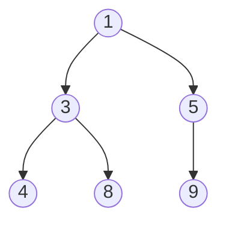

# 힙 (Heap)

- Level: Intermediate
- Prerequisites: [Data-Structures/Binary-Tree.md](Binary-Tree.md), [Data-Structures/Array.md](Array.md)
- Status: Draft
- Reviewed-by: -
- Depth: Deep-dive (자기완결)

---

## 개념 (Concept)

힙은 **완전 이진 트리**이면서 부모-자식 사이 크기 순서를 강제하는 구조다. 최소 힙은 모든 노드에서 "부모 ≤ 자식", 최대 힙은 "부모 ≥ 자식". 전체를 정렬하지 않고 **극값 하나를 항상 루트에서 $O(1)$** 로 보는 우선순위 큐(priority queue)의 표준 구현이다.

## 직관 (Intuition)

"지금 가장 급한 것 하나"만 빠르게 꺼내고 싶을 때. 완전 정렬은 비싸지만($O(n\log n)$), 힙은 **느슨한 부분 순서**만 유지해 극값을 꼭대기에 둔다. 완전 이진 트리라 **포인터 없이 배열에 빈틈없이** 담기는 것도 결정적 장점(캐시 친화·메모리 절약).



## 이론 (Theory)

### 1. 배열 매핑

완전 이진 트리를 0-기반 배열에 레벨 순서로 담으면:

$$\text{parent}(i)=\left\lfloor\tfrac{i-1}{2}\right\rfloor,\quad \text{left}(i)=2i+1,\quad \text{right}(i)=2i+2$$

### 2. 두 핵심 절차

- **sift-up(올리기)**: 새로 넣은 원소를 부모와 비교하며 조건 만족까지 위로 교환 → 삽입. $O(\log n)$.
- **sift-down(내리기)**: 루트에 온 원소를 더 작은(최소 힙) 자식과 교환하며 내림 → 삭제. $O(\log n)$.

### 3. build-heap이 $O(n)$ 인 이유 (증명)

배열을 힙으로: 잎을 뺀 절반 노드를 **뒤에서부터 sift-down**. 직관적으론 $n$개 × $O(\log n)$ 같지만, 대부분 노드가 잎 근처라 실제로 선형이다. 높이 $h$ 노드 수는 $\le \lceil n/2^{h+1}\rceil$ 이고 각 sift-down 비용은 $O(h)$ 이므로 총합

$$\sum_{h=0}^{\lfloor\lg n\rfloor}\left\lceil\frac{n}{2^{h+1}}\right\rceil O(h)\;=\;O\!\left(n\sum_{h=0}^{\infty}\frac{h}{2^{h}}\right)\;=\;O(2n)\;=\;O(n)$$

($\sum_{h\ge0} h/2^h = 2$ 를 사용). 그래서 **한꺼번에 heapify가 $n$번 push($O(n\log n)$)보다 싸다**.

### 4. 변종과 트레이드오프

| 힙 | push | pop-min | decrease-key | merge | 비고 |
|---|---|---|---|---|---|
| 이진 힙 | $O(\log n)$ | $O(\log n)$ | $O(\log n)$ | $O(n)$ | 배열, 실전 기본 |
| $d$-ary 힙 | $O(\log_d n)$ | $O(d\log_d n)$ | $O(\log_d n)$ | $O(n)$ | decrease-key 많으면 유리 |
| 이항 힙 | $O(1)$* | $O(\log n)$ | $O(\log n)$ | $O(\log n)$ | merge 빠름 |
| 피보나치 힙 | $O(1)$ | $O(\log n)$* | $O(1)$* | $O(1)$ | *amortized, 다익스트라 $O(E+V\log V)$ |

## 구현 (Implementation)

```python
import heapq
h = []
for x in [5, 1, 8, 3, 9, 4]:
    heapq.heappush(h, x)        # 각 O(log n)
print(heapq.heappop(h))         # 1 (항상 최솟값)

nums = [5, 1, 8, 3]
heapq.heapify(nums)             # 제자리 O(n)
```

sift-down 핵심:

```python
def sift_down(a, i, n):
    while (l := 2*i + 1) < n:
        smaller = l
        if l + 1 < n and a[l+1] < a[l]:
            smaller = l + 1
        if a[i] <= a[smaller]:
            break
        a[i], a[smaller] = a[smaller], a[i]
        i = smaller
```

in-place 힙 정렬($O(n\log n)$, 추가 메모리 $O(1)$): max-heap으로 build 후, 루트(최댓값)를 끝과 swap하고 범위를 줄이며 sift-down.

## 복잡도 (Complexity)

| 연산 | 시간 |
|---|---|
| peek(극값 조회) | $O(1)$ |
| push | $O(\log n)$ |
| pop | $O(\log n)$ |
| build-heap(heapify) | $O(n)$ |
| 임의 값 탐색 | $O(n)$ |

공간 $O(n)$, 노드당 포인터 오버헤드 없음. **워크드 예제(heapify `[5,1,8,3,9,4]`).** 마지막 내부 노드 `i=2`(값 8, 자식 4)부터: 8>4 swap→`[5,1,4,3,9,8]`; `i=1`(값 1, 자식 3,9) 1이 최소라 정지; `i=0`(값 5, 자식 1,4) 5>1 swap→`[1,5,4,3,9,8]`, 이어 5의 자식 3,9 중 3과 swap→`[1,3,4,5,9,8]`. 루트=1=최솟값. swap은 총 3회뿐 — 선형.

## 응용 (Applications)

- 우선순위 큐: 스케줄러, 이벤트 시뮬레이션.
- [다익스트라](../Algorithms/Dijkstra.md) 최단 경로, 프림 MST의 다음 정점 선택.
- 힙 정렬, **top-k**(크기 k 힙), 다중 정렬된 리스트 병합.
- **스트리밍 중앙값**: 최대 힙(아래 절반) + 최소 힙(위 절반)으로 $O(\log n)$/원소.

## 흔한 오해 (Common Misunderstandings)

- **힙은 정렬된 구조가 아니다** — 배열을 그대로 읽으면 정렬 순서가 아니다. 정렬은 하나씩 pop 해야.
- **자료구조 "힙" ≠ 메모리 영역 "heap"** — 이름만 같다.
- **임의 값을 $O(\log n)$ 에 못 찾는다** — 극값만 빠르고 일반 탐색은 $O(n)$.
- **`heapify`($O(n)$)를 n번 push($O(n\log n)$)와 혼동 말 것** — 한꺼번에가 더 싸다.
- 표준 `decrease-key`가 없으면(파이썬 `heapq`) "낡은 항목 무시 + 재삽입(lazy deletion)"으로 우회한다.

## TMI

- 힙 정렬은 in-place·$O(n\log n)$ 보장이지만, **캐시 지역성이 나빠** 실측은 퀵 정렬보다 느린 일이 많다.
- Python `heapq`는 최소 힙만 제공 → 최대 힙은 `-x`를 넣는 관용구를 쓴다.
- 피보나치 힙은 이론적으로 다익스트라를 $O(E+V\log V)$ 로 개선하지만, **상수가 커서** 실전에선 이진/$d$-ary 힙이 더 빠른 경우가 많다.
- C++ `priority_queue`는 기본이 **최대 힙**이라 최소 힙이 필요하면 비교자를 바꿔야 한다(파이썬과 정반대 기본값).

## 연습 / 확인 문제 (Exercises)

- 부호 반전 없이 최대 힙을 직접 구현하라(`sift_up`, `sift_down`).
- 힙 정렬을 in-place로 작성하고 추가 메모리가 $O(1)$ 임을 보여라.
- 정수 스트림에서 상위 `k`개를 크기 `k` 최소 힙으로 유지하라.
- 두 힙으로 스트리밍 중앙값을 구하고, 두 힙 크기 균형을 어떻게 맞추는지 설명하라.

## 이어서 읽기 (Reading Path)

- 이전: [이진 트리](Binary-Tree.md)
- 다음: [정렬](../Algorithms/Sorting.md), [다익스트라](../Algorithms/Dijkstra.md)
- 관련: [이진 탐색 트리](BST.md), [덱](Deque.md)

## 참조 (References)

- [Data-Structures/Binary-Tree.md](Binary-Tree.md)
- [Data-Structures/Array.md](Array.md)
- [Algorithms/Sorting.md](../Algorithms/Sorting.md)
- [Algorithms/Dijkstra.md](../Algorithms/Dijkstra.md)
- [Reference/Books.md](../Reference/Books.md)
- [Reference/Courses.md](../Reference/Courses.md)
