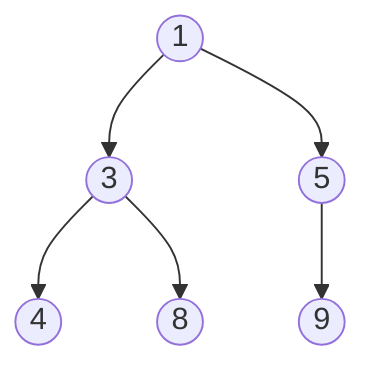

# 힙 (Heap)

- Level: Intermediate
- Prerequisites: [Data-Structures/Binary-Tree.md](Binary-Tree.md), [Data-Structures/Array.md](Array.md)
- Status: Draft
- Reviewed-by: -

---

## 개념 (Concept)

힙은 **완전 이진 트리** 형태이면서, 부모와 자식 사이에 일정한 크기 순서를 강제하는 자료구조다. 최소 힙(min-heap)은 "부모 ≤ 자식", 최대 힙(max-heap)은 "부모 ≥ 자식"을 모든 노드에서 만족한다. 이 부분 순서 덕분에 **최솟값(또는 최댓값)을 항상 루트에서 `O(1)`로 꺼낼 수 있는** 우선순위 큐(priority queue)의 표준 구현이 된다.

## 직관 (Intuition)

전체를 완전히 정렬할 필요 없이 "지금 가장 급한 것 하나"만 빠르게 꺼내고 싶을 때 쓴다. 힙은 느슨한 순서(부모-자식 관계)만 유지하므로 정렬보다 싸고, 그러면서도 극값은 항상 꼭대기에 있다. 완전 이진 트리라서 포인터 없이 **배열에 빈틈없이** 담을 수 있는 것도 큰 장점이다.



## 이론 (Theory)

완전 이진 트리를 0-기반 배열에 레벨 순서로 담으면 인덱스 관계가 단순해진다.

$$\text{parent}(i) = \left\lfloor \frac{i-1}{2} \right\rfloor, \quad \text{left}(i) = 2i+1, \quad \text{right}(i) = 2i+2$$

핵심 연산은 힙 조건이 깨진 노드를 제자리로 옮기는 두 절차다.

- **위로 올리기(sift-up)**: 삽입한 원소를 부모와 비교하며 조건을 만족할 때까지 위로 교환. 삽입에 쓴다.
- **아래로 내리기(sift-down)**: 루트에 들어온 원소를 더 작은(최소 힙 기준) 자식과 교환하며 내려보냄. 삭제에 쓴다.

두 절차 모두 트리 높이만큼 움직이므로 `O(log n)`이다. 정렬되지 않은 배열을 힙으로 만드는 **build-heap**은 위에서부터가 아니라 아래 절반 노드부터 sift-down하면 전체가 `O(n)`에 끝난다(직관적으로는 `O(n log n)`처럼 보이지만, 대부분의 노드가 잎 근처라 실제 합은 선형이다).

## 구현 (Implementation)

표준 라이브러리(Python `heapq`, 최소 힙)를 쓰는 것이 보통이다.

```python
import heapq

h = []
for x in [5, 1, 8, 3, 9, 4]:
    heapq.heappush(h, x)     # 각 삽입 O(log n)

print(heapq.heappop(h))      # 1  (항상 최솟값)
print(heapq.heappop(h))      # 3

nums = [5, 1, 8, 3]
heapq.heapify(nums)          # 제자리에서 O(n)
print(nums[0])               # 1  (루트 = 최솟값)
```

sift-down의 핵심만 직접 보면 다음과 같다.

```python
def sift_down(a, i, n):
    while (l := 2 * i + 1) < n:
        smallest = l
        r = l + 1
        if r < n and a[r] < a[l]:
            smallest = r
        if a[i] <= a[smallest]:
            break
        a[i], a[smallest] = a[smallest], a[i]
        i = smallest
```

## 복잡도 (Complexity)

`n`은 원소 수다.

| 연산 | 시간 |
|---|---|
| 최솟값 조회(peek) | `O(1)` |
| 삽입(push) | `O(log n)` |
| 삭제(pop) | `O(log n)` |
| 힙 구성(heapify) | `O(n)` |

공간은 `O(n)`이며, 배열에 담으므로 노드당 포인터 오버헤드가 없다.

## 응용 (Applications)

- 우선순위 큐: 작업 스케줄러, 이벤트 시뮬레이션
- 다익스트라 최단 경로, 프림 MST에서 다음 정점 선택
- 힙 정렬(heap sort), 상위 `k`개 추출(top-k)
- 중앙값 스트리밍(최소 힙 + 최대 힙 조합)

## 흔한 오해 (Common Misunderstandings)

- 힙은 완전히 정렬된 구조가 **아니다.** 부모-자식 관계만 보장하므로, 배열을 그대로 읽으면 정렬 순서가 나오지 않는다. 정렬을 얻으려면 하나씩 pop해야 한다.
- 자료구조 "힙"과 메모리 영역 "힙(heap memory)"은 이름만 같고 전혀 다른 개념이다.
- 임의의 값을 `O(log n)`에 찾을 수는 없다. 힙은 극값 접근만 빠르고, 일반 탐색은 `O(n)`이다.
- `heapify`가 `O(n)`인 것을 `n`번 push(`O(n log n)`)와 혼동하면 안 된다. 한꺼번에 구성하는 쪽이 더 싸다.

## TMI

- 힙 정렬은 추가 메모리 없이(in-place) `O(n log n)`을 보장하지만, 캐시 지역성이 나빠 실측에서는 퀵 정렬보다 느린 경우가 많다.
- Python `heapq`는 최소 힙만 제공한다. 최대 힙이 필요하면 값의 부호를 뒤집어 넣는 관용구(`-x`)를 흔히 쓴다.
- 이항 힙(binomial heap), 피보나치 힙(Fibonacci heap)은 두 힙을 합치는 merge나 키 감소(decrease-key)를 더 빠르게 해, 이론적 다익스트라 복잡도를 개선한다.

## 연습 / 확인 문제 (Exercises)

- 부호 반전 없이 최대 힙을 직접 구현하라(`sift_up`, `sift_down` 포함).
- 힙을 이용해 배열을 `O(n log n)`에 정렬하는 힙 정렬을 작성하라.
- 정수 스트림에서 항상 상위 `k`개를 유지하는 함수를 크기 `k`의 최소 힙으로 구현하라.

## 이어서 읽기 (Reading Path)

- 이전: [이진 트리](Binary-Tree.md)
- 다음: 우선순위 큐 활용 — [정렬](../Algorithms/Sorting.md), [다익스트라](../Algorithms/Dijkstra.md)
- 관련: [이진 탐색 트리](BST.md)

## 참조 (References)

- [Data-Structures/Binary-Tree.md](Binary-Tree.md)
- [Data-Structures/Array.md](Array.md)
- [Algorithms/Sorting.md](../Algorithms/Sorting.md)
- [Reference/Books.md](../Reference/Books.md)
- [Reference/Courses.md](../Reference/Courses.md)
