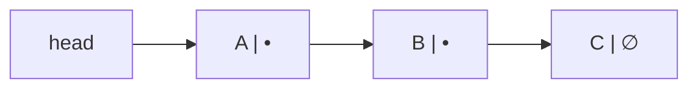

# 연결 리스트 (Linked List)

- Level: Beginner
- Prerequisites: [Programming/Variables-and-Types.md](../Programming/Variables-and-Types.md), [Programming/Functions-and-Recursion.md](../Programming/Functions-and-Recursion.md)
- Status: Draft
- Reviewed-by: -
- Depth: Deep-dive (자기완결)

---

## 개념 (Concept)

연결 리스트는 각 원소(노드)가 **값 + 다음 노드의 참조(링크)** 를 함께 들고, 링크를 따라 순서가 정해지는 선형 자료구조다. [배열](Array.md)이 "연속 메모리 + 주소 산술"로 임의 접근을 얻는 대신, 연결 리스트는 **연속성을 포기**해서 "위치만 알면 상수 시간 삽입·삭제"를 얻는다 — 정반대의 트레이드오프다.

## 직관 (Intuition)

배열이 번호 붙은 연속 칸이라면, 연결 리스트는 *다음 쪽지의 주소가 적힌 쪽지들의 사슬*이다. 첫 노드(`head`)만 알면 링크를 따라 끝까지 갈 수 있다. 중간 삽입·삭제는 **주변 링크 몇 개만 갈아끼우면** 되지만, 노드가 메모리에 흩어져 있어 i번째를 바로 못 찾고 앞에서부터 따라가야 한다(pointer chasing).



## 이론 (Theory)

### 1. 노드와 변종

기본 단일 연결 리스트 노드: `value`, `next`. 변종은 트레이드오프가 다르다.

| 변종 | 추가 링크 | 얻는 것 | 비용 |
|---|---|---|---|
| 단일(singly) | `next` | 메모리 최소 | 뒤로 못 감, 이전 노드 모를 때 삭제 $O(n)$ |
| 이중(doubly) | `prev`, `next` | 양방향 순회, 노드 핸들만으로 $O(1)$ 삭제 | 포인터 1개·갱신 1개 더 |
| 원형(circular) | 꼬리→머리 | round-robin, 끝 판정 불필요 | 순회 종료 조건 주의 |
| sentinel(dummy head) | 빈 머리 노드 | 빈 리스트·머리 삽입 분기 제거 | 노드 1개 |

### 2. 링크 수술(pointer surgery)

삽입·삭제는 "끊고 다시 잇기"다. 순서가 틀리면 리스트가 끊긴다.

```text
A -> B -> C   에서 B 뒤에 X 삽입
X.next = B.next   (= C)   ← 먼저 X를 C에 연결
B.next = X                 ← 그 다음 B를 X로
결과: A -> B -> X -> C
```

삭제는 역방향: `prev.next = target.next`. **단일 리스트에서 어떤 노드를 지우려면 그 이전 노드가 필요**하다 — 그래서 이전 노드를 모르면 탐색에 $O(n)$이 든다(이중 리스트는 `node.prev`가 있어 $O(1)$).

### 3. 두 포인터 기법 — 한 번의 순회로 더 많이

링크를 못 되감는 단일 리스트에서 **속도가 다른 두 포인터**는 강력하다.

- **중간 노드**: `slow`는 1칸, `fast`는 2칸 → `fast`가 끝나면 `slow`가 중앙.
- **끝에서 k번째**: `fast`를 먼저 k칸 보낸 뒤 둘을 함께 → `fast`가 끝나면 `slow`가 답.
- **순환 탐지(Floyd, tortoise–hare)**: `slow`(1), `fast`(2). 순환이 있으면 둘은 반드시 사이클 안에서 만난다(매 스텝 간격이 1씩 줄어 0이 됨). 만난 뒤 한 포인터를 `head`로 되돌리고 둘 다 1칸씩 가면 **사이클 시작점**에서 만난다. (꼬리 길이 `a`, 사이클 길이 `c`일 때 만남 지점이 $a \equiv -b \pmod c$를 만족해 성립.)

## 구현 (Implementation)

```python
class Node:
    __slots__ = ("value", "next")          # 노드당 메모리 절약
    def __init__(self, value, next_node=None):
        self.value = value
        self.next = next_node

def push_front(head, value):               # 맨 앞 삽입 O(1)
    return Node(value, head)

def delete_value(head, target):            # 첫 일치 노드 삭제 (sentinel로 분기 제거)
    dummy = Node(None, head)
    prev = dummy
    while prev.next is not None:
        if prev.next.value == target:
            prev.next = prev.next.next     # 링크 우회 = 삭제
            break
        prev = prev.next
    return dummy.next
```

반복 뒤집기(포인터 반전, $O(n)$ 시간·$O(1)$ 공간):

```python
def reverse(head):
    prev = None
    while head is not None:
        head.next, prev, head = prev, head, head.next   # 링크를 뒤로 꺾기
    return prev
```

Floyd 순환 탐지:

```python
def has_cycle(head):
    slow = fast = head
    while fast and fast.next:
        slow, fast = slow.next, fast.next.next
        if slow is fast:
            return True
    return False
```

## 복잡도 (Complexity)

| 연산 | 단일 | 이중 | 메모 |
|---|---|---|---|
| 머리 접근 | $O(1)$ | $O(1)$ | |
| i번째 접근 / 값 검색 | $O(n)$ | $O(n)$ | 임의 접근 불가 |
| 머리 삽입/삭제 | $O(1)$ | $O(1)$ | |
| 노드 핸들 뒤 삽입 | $O(1)$ | $O(1)$ | |
| 노드 핸들 삭제 | $O(n)$* | $O(1)$ | *단일은 prev 탐색 필요 |
| 꼬리 삽입 | $O(n)$ 또는 $O(1)$** | 동일 | **tail 포인터 유지 시 $O(1)$ |

공간은 값 외에 **노드당 포인터 1~2개의 오버헤드**가 추가된다.

## 응용 (Applications)

- [스택](Stack.md)·[큐](Queue.md)의 링크 기반 구현(머리/꼬리 $O(1)$).
- [해시 테이블](Hash-Table.md)의 **체이닝** 충돌 처리(각 버킷이 연결 리스트).
- LRU 캐시: 이중 연결 리스트 + 해시 맵(노드 핸들로 $O(1)$ 이동/삭제).
- 빈번한 머리/중간 삽입이 있고 임의 접근이 거의 없는 경우.

## 흔한 오해 (Common Misunderstandings)

- **연결 리스트가 배열보다 항상 빠르지 않다.** 노드가 흩어져 있어 **캐시 미스·pointer chasing**이 잦고, prefetch 이득도 없어 실측은 배열이 이기는 일이 많다.
- **i번째 접근은 $O(1)$이 아니다**($O(n)$).
- **삭제 시 이전 노드 링크를 안 고치면** 리스트가 끊기거나 삭제가 반영되지 않는다.
- **순환이 생기면 단순 `while next` 순회가 끝나지 않는다** — 무한 루프.
- 수동 메모리 관리 언어에선 노드 해제를 빠뜨리면 **메모리 누수**, 먼저 해제하면 dangling.

## TMI

- Lisp는 "LISt Processor"의 약자고, `cons` 셀(값 + 다음 링크)은 초기 AI·함수형 프로그래밍 문화의 핵심 자료구조였다.
- **Intrusive linked list**: 노드가 데이터를 감싸는 대신, 사용자 구조체 *안에* 링크 필드를 둔다. Linux 커널의 `list_head`가 대표 — 별도 노드 할당이 없어 빠르고 캐시에 유리하다.
- **XOR 연결 리스트**: `prev`와 `next`를 XOR 한 값 하나로 양방향을 표현해 포인터 한 칸을 아끼는 기법. 실전에선 디버깅·GC 문제로 거의 안 쓴다.
- 면접 단골이지만, 실제 앱 코드는 동적 배열·해시 맵·덱을 더 자주 쓴다.

## 연습 / 확인 문제 (Exercises)

- 길이를 세는 함수와, 끝에서 k번째 노드를 한 번의 순회로 찾는 함수를 작성하라.
- 두 포인터로 중간 노드를 찾아라(짝수 길이일 때 정의를 명시).
- Floyd로 순환을 탐지하고, 순환이 있으면 **시작 노드**까지 반환하라.
- 이중 연결 리스트 + 해시 맵으로 $O(1)$ get/put 하는 LRU 캐시를 설계하라.

## 이어서 읽기 (Reading Path)

- 이전: [배열](Array.md)
- 다음: [스택](Stack.md)
- 관련: [해시 테이블](Hash-Table.md), [큐](Queue.md)

## 참조 (References)

- [Data-Structures/Array.md](Array.md)
- [Programming/Functions-and-Recursion.md](../Programming/Functions-and-Recursion.md)
- [Reference/Books.md](../Reference/Books.md)
- [Reference/Courses.md](../Reference/Courses.md)
