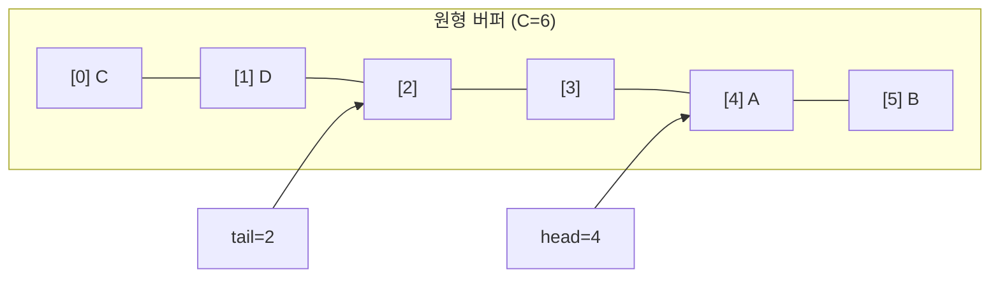

# 큐 (Queue)

- Level: Beginner
- Prerequisites: [Data-Structures/Array.md](Array.md), [Data-Structures/Linked-List.md](Linked-List.md)
- Status: Draft
- Reviewed-by: -
- Depth: Deep-dive (자기완결)

---

## 개념 (Concept)

큐는 **먼저 넣은 값이 먼저 나오는** FIFO(First In, First Out) 추상 자료형이다. 뒤(rear)에 넣는 `enqueue`, 앞(front)에서 꺼내는 `dequeue`, 앞을 확인하는 `front`. [스택](Stack.md)이 한쪽 끝만 쓰는 LIFO라면, 큐는 **양 끝을 분담**(뒤로 넣고 앞으로 뺀다)하는 FIFO다.

## 직관 (Intuition)

줄 서기: 먼저 온 사람이 먼저 처리되고, 새 사람은 뒤에 선다. "도착 순서 보존"이 핵심이라 **BFS**(가까운 노드부터)·작업 스케줄링·버퍼링처럼 *공정한 순서*가 필요한 곳에 들어간다. 함정은 구현 — 배열 앞에서 빼면 뒤를 전부 당겨야 $O(n)$이 된다. 그래서 진짜 기술은 "앞을 안 당기는 법"이다.

## 이론 (Theory)

### 1. 왜 `pop(0)`이 함정인가 → 원형 버퍼(ring buffer)

배열의 0번을 빼고 나머지를 당기면 $O(n)$. 대신 **데이터를 옮기지 말고 인덱스를 옮긴다.** `head`(다음에 뺄 칸), `tail`(다음에 넣을 칸)을 두고 용량 `C`로 모듈러 회전시킨다.

$$\text{enqueue}: \text{buf}[\text{tail}] = x,\ \text{tail} = (\text{tail}+1) \bmod C \qquad \text{dequeue}: x=\text{buf}[\text{head}],\ \text{head}=(\text{head}+1)\bmod C$$



**가득참 vs 빔 구분**이 핵심 함정: `head == tail`이 둘 다일 수 있다. 보통 ① 원소 수 `count`를 따로 세거나, ② 칸 하나를 비워 두거나(용량 `C-1`만 사용), ③ wrap 비트를 둔다.

### 2. 두 스택으로 만든 amortized 큐

스택 둘(`in`, `out`): `enqueue`는 `in`에 push. `dequeue`는 `out`이 비면 `in`을 전부 옮겨 뒤집은 뒤 pop. 각 원소는 정확히 한 번 `in`→`out`으로 이동하므로 **dequeue의 amortized 비용은 $O(1)$**(개별 dequeue는 최악 $O(n)$).

### 3. 변종

| 변종 | 핵심 | 쓰임 |
|---|---|---|
| 원형 큐 | 고정 용량 ring buffer | 고정 메모리 버퍼, 임베디드 |
| [덱](Deque.md) | 양 끝 모두 삽입/삭제 | 슬라이딩 윈도우, 0-1 BFS |
| 우선순위 큐 | 순서 = 우선순위 | [힙](Heap.md)으로 구현, 다익스트라 |
| 동시성/블로킹 큐 | 생산자-소비자, backpressure | 스레드 간 작업 전달 |

## 구현 (Implementation)

`collections.deque` 기반(앞·뒤 모두 $O(1)$):

```python
from collections import deque

class Queue:
    def __init__(self):
        self._items = deque()
    def enqueue(self, x): self._items.append(x)       # 뒤로
    def dequeue(self):    return self._items.popleft() # 앞에서, O(1)
    def front(self):      return self._items[0]
    def is_empty(self):   return not self._items
```

고정 용량 원형 큐(인덱스만 움직임):

```python
class RingQueue:
    def __init__(self, cap):
        self._buf = [None] * cap
        self._cap, self._head, self._count = cap, 0, 0

    def enqueue(self, x):
        if self._count == self._cap:
            raise OverflowError("queue full")
        tail = (self._head + self._count) % self._cap
        self._buf[tail] = x
        self._count += 1

    def dequeue(self):
        if self._count == 0:
            raise IndexError("queue empty")
        x = self._buf[self._head]
        self._head = (self._head + 1) % self._cap
        self._count -= 1
        return x
```

## 복잡도 (Complexity)

| 연산 | deque/링버퍼 | 잘못된 배열(`pop(0)`) |
|---|---|---|
| `enqueue` | $O(1)$ (amortized) | $O(1)$ |
| `dequeue` | $O(1)$ | $O(n)$ |
| `front` / `is_empty` | $O(1)$ | $O(1)$ |
| 공간 | $O(n)$ | $O(n)$ |

**워크드 예제(두 스택 큐).** enqueue 1,2,3 → `in=[1,2,3]`. 첫 dequeue: `out` 비었으니 `in`을 옮겨 `out=[3,2,1]`, pop→1. 다음 두 dequeue는 `out`에서 바로 pop(2,3). 총 이동 3회 / dequeue 3회 → amortized $O(1)$.

## 응용 (Applications)

- **BFS**·레벨 순회([BFS·DFS](../Algorithms/BFS-DFS.md)): 큐가 "거리 순" 프런티어를 보장.
- OS 스케줄러의 ready queue, 프린터 큐, 요청 버퍼.
- **생산자-소비자**: 유한 버퍼 + backpressure로 속도 차 흡수.
- 메시지 브로커·이벤트 루프의 작업 전달.

## 흔한 오해 (Common Misunderstandings)

- **Python `list`의 `pop(0)`/`insert(0)`은 $O(n)$** — 큐엔 `deque`를 써라.
- 큐는 **우선순위가 없다** — 우선순위가 필요하면 [힙](Heap.md) 기반 우선순위 큐.
- 빈 큐 `dequeue`·가득 찬 큐 `enqueue`의 **정책(예외 vs 블로킹 vs 버림)을 명시**해야 한다.
- BFS에서 **큐에 넣는 순간 방문 표시**를 안 하면 같은 노드가 중복으로 들어간다.
- 원형 큐는 `head == tail`만으로 가득참/빔을 구분 못 한다.

## TMI

- `deque`는 double-ended queue의 줄임말, 보통 "덱"으로 읽는다.
- CPython `collections.deque`는 단일 배열이 아니라 **고정 크기 블록들의 이중 연결 리스트**라 양 끝이 빠르고 중간 임의 접근은 $O(n)$.
- 락 없는(lock-free) 동시성 큐의 고전은 **Michael–Scott 큐**(CAS 기반)이고, 여기서 **ABA 문제**가 유명한 함정이다.
- Kafka는 큐처럼 쓰이지만 파티션·소비자 그룹·오프셋 때문에 단순 FIFO와 동작이 다르다.

## 연습 / 확인 문제 (Exercises)

- 원형 버퍼 큐를 구현하고 가득참/빔을 어떻게 구분했는지 설명하라.
- 스택 두 개로 큐를 구현하고 dequeue가 amortized $O(1)$ 임을 증명하라.
- 작은 그래프에서 BFS 한 스텝마다 큐 상태 변화를 추적하라(방문 표시 시점 포함).
- 유한 버퍼 생산자-소비자에서 backpressure가 없으면 무엇이 깨지는지 설명하라.

## 이어서 읽기 (Reading Path)

- 이전: [스택](Stack.md)
- 다음: [그래프 표현](Graph-Representation.md)
- 관련: [덱](Deque.md), [힙](Heap.md), [BFS·DFS](../Algorithms/BFS-DFS.md)

## 참조 (References)

- [Data-Structures/Array.md](Array.md)
- [Algorithms/BFS-DFS.md](../Algorithms/BFS-DFS.md)
- [Reference/Books.md](../Reference/Books.md)
- [Reference/Courses.md](../Reference/Courses.md)
