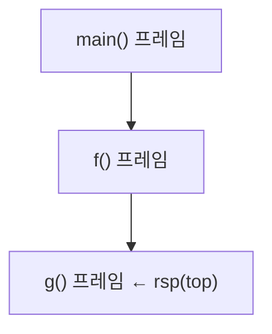

# 스택 (Stack)

- Level: Beginner
- Prerequisites: [Data-Structures/Array.md](Array.md), [Data-Structures/Linked-List.md](Linked-List.md)
- Status: Draft
- Reviewed-by: -
- Depth: Deep-dive (자기완결)

---

## 개념 (Concept)

스택은 **가장 나중에 넣은 값이 가장 먼저 나오는** LIFO(Last In, First Out) 추상 자료형(ADT)이다. 연산은 `push`(맨 위에 넣기), `pop`(맨 위 꺼내기), `peek`/`top`(맨 위 확인), `is_empty`. "맨 위 한 곳"만 만진다는 제약이 곧 스택의 정체성이다.

## 직관 (Intuition)

접시 더미: 새 접시는 맨 위에 올리고 꺼낼 때도 맨 위부터. 중간 접시를 바로 빼지 않는다. 이 "한쪽 끝만" 규칙 덕에 **되돌아가야 하는 작업**(괄호 짝, 함수 호출, 실행 취소, 백트래킹)을 자연스럽게 표현한다 — *가장 최근 것부터 처리*가 LIFO다.

## 이론 (Theory)

### 1. ADT vs 구현

스택은 *연산 규칙*이지 구현이 아니다. 두 가지 표준 구현 모두 모든 연산이 $O(1)$(동적 배열은 amortized):

| 구현 | push/pop 위치 | 장점 | 단점 |
|---|---|---|---|
| 동적 [배열](Array.md) | 배열 **끝** | 캐시 친화적, 메모리 조밀 | resize 순간 $O(n)$ |
| [연결 리스트](Linked-List.md) | **머리** | 최악도 $O(1)$, 크기 제한 없음 | 노드 오버헤드, 캐시 불리 |

배열의 *앞쪽*을 top으로 쓰면 매 연산이 $O(n)$(전부 밀기)이 되므로 **끝을 top**으로 쓴다.

### 2. 호출 스택(call stack) — 스택이 하드웨어다

프로그램의 함수 호출 자체가 스택이다. 호출마다 **스택 프레임**(반환 주소, 저장 레지스터, 지역 변수, 인자)이 쌓이고, 함수가 끝나면 가장 최근 프레임부터 걷힌다. x86에서 스택은 보통 **높은 주소→낮은 주소로 자란다**. 스택 포인터(`rsp`)가 top을 가리킨다.



재귀 깊이가 한계를 넘으면 **스택 오버플로**가 난다. 그래서 깊은 재귀는 명시적 스택을 쓴 반복으로 바꾸거나 꼬리 재귀 최적화에 의존한다.

### 3. 대표 알고리즘 패턴

- **수식 처리**: 중위 → 후위 변환(shunting-yard)과 후위식 계산 모두 스택으로 연산자·피연산자를 관리.
- **DFS의 명시적 스택**: 재귀 DFS를 스택으로 펴면 깊이 제한을 우회([BFS·DFS](../Algorithms/BFS-DFS.md)).
- **백트래킹**: 선택을 push, 막히면 pop 해서 직전 분기로 복귀.
- **monotonic stack**: 값이 단조가 되도록 유지하며 훑어 "다음 큰 원소(next greater element)"류를 **전체 $O(n)$**에 푼다 — 각 원소가 한 번 push·한 번 pop.

## 구현 (Implementation)

동적 배열 기반:

```python
class Stack:
    def __init__(self):
        self._items = []
    def push(self, x): self._items.append(x)      # amortized O(1)
    def pop(self):     return self._items.pop()    # O(1), 빈 스택이면 예외
    def peek(self):    return self._items[-1]
    def is_empty(self): return not self._items
```

괄호 짝 검사:

```python
def is_balanced(text):
    stack, pair = [], {")": "(", "]": "[", "}": "{"}
    for ch in text:
        if ch in "([{":
            stack.append(ch)
        elif ch in pair:
            if not stack or stack.pop() != pair[ch]:
                return False
    return not stack
```

다음 큰 원소(monotonic stack, $O(n)$):

```python
def next_greater(nums):
    res = [-1] * len(nums)
    stack = []                      # 아직 답을 못 찾은 '인덱스'들, 값이 내림차순
    for i, x in enumerate(nums):
        while stack and nums[stack[-1]] < x:
            res[stack.pop()] = x    # x가 그들의 다음 큰 원소
        stack.append(i)
    return res
```

$O(1)$ 최솟값을 지원하는 min-stack: 값과 함께 "그 시점까지의 최솟값"을 같이 push.

## 복잡도 (Complexity)

| 연산 | 시간 | 공간 |
|---|---|---|
| `push` | amortized $O(1)$ (배열), $O(1)$ (링크) | $O(1)$ |
| `pop` / `peek` / `is_empty` | $O(1)$ | $O(1)$ |
| n개 저장 | — | $O(n)$ |
| monotonic stack 1패스 | $O(n)$ 전체 | $O(n)$ |

**워크드 예제.** `next_greater([2,1,3])`: i0 push[0]; i1 `1<2`아님→push[1] (stack=[0,1]); i2 x=3 → `nums[1]=1<3` pop res[1]=3, `nums[0]=2<3` pop res[0]=3, push[2]. 결과 `[3,3,-1]`. 각 인덱스가 정확히 한 번 push/pop 되어 총 $O(n)$.

## 응용 (Applications)

- 함수 호출 스택, 예외 전파, 스택 트레이스.
- 괄호·태그 짝 검사, 수식 파싱·계산.
- DFS·백트래킹의 명시적 프런티어.
- 실행 취소/다시 실행(undo/redo)·브라우저 뒤로/앞으로 — **스택 두 개**.

## 흔한 오해 (Common Misunderstandings)

- 스택은 **정렬된 구조가 아니다** — 삽입 순서의 역순으로만 꺼낸다.
- `pop`은 보통 *확인 + 제거*를 함께 한다. 확인만이면 `peek`.
- **재귀는 호출 스택을 쓰므로** 깊으면 스택 오버플로. "스택 자료구조"와 "호출 스택"은 같은 원리.
- 배열의 **앞쪽을 top**으로 쓰면 $O(n)$ — 끝쪽을 써야 $O(1)$.

## TMI

- 오류 메시지의 **stack trace**는 호출 프레임이 쌓인 순서를 그대로 펼친 것이다.
- "Stack Overflow"는 호출 스택 한계를 넘을 때 나는 오류이자, 같은 이름의 Q&A 사이트의 유래다.
- 스택·큐는 1968년 Knuth의 *TAOCP* 1권에서 이미 기본 구조로 정리됐다.
- WebAssembly·JVM·CPython 같은 많은 가상머신이 **스택 머신**이다 — 연산이 피연산자를 스택에서 꺼내 결과를 다시 올린다.

## 연습 / 확인 문제 (Exercises)

- 문자열의 `()[]{}` 짝이 맞는지 검사하라(중첩·순서 위반 모두 처리).
- 스택 두 개로 큐를 구현하고, `enqueue`/`dequeue`의 amortized 비용을 분석하라.
- 후위 표기식(예: `3 4 + 5 *`)을 스택으로 계산하라.
- `push`/`pop`/`top`에 더해 `get_min`을 모두 $O(1)$로 지원하는 스택을 설계하라.

## 이어서 읽기 (Reading Path)

- 이전: [연결 리스트](Linked-List.md)
- 다음: [큐](Queue.md)
- 관련: [BFS·DFS](../Algorithms/BFS-DFS.md), [덱](Deque.md)

## 참조 (References)

- [Data-Structures/Array.md](Array.md)
- [Algorithms/BFS-DFS.md](../Algorithms/BFS-DFS.md)
- [Reference/Books.md](../Reference/Books.md)
- [Reference/Courses.md](../Reference/Courses.md)
