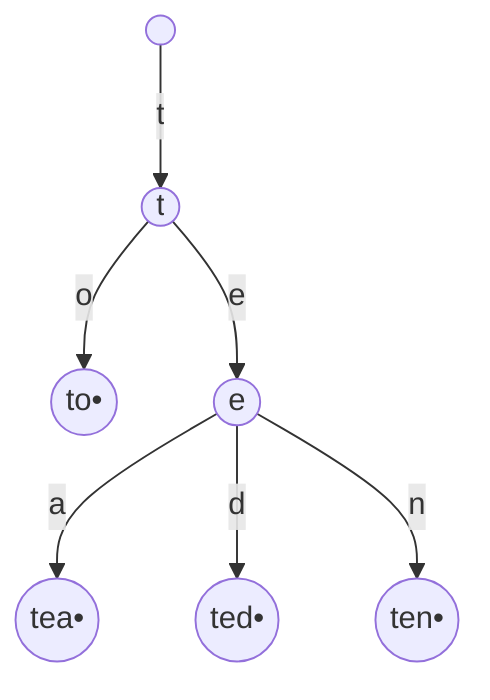

# 트라이 (Trie, Prefix Tree)

- Level: Intermediate
- Prerequisites: [Data-Structures/Binary-Tree.md](Binary-Tree.md), [Data-Structures/Hash-Table.md](Hash-Table.md)
- Status: Draft
- Reviewed-by: -
- Depth: Deep-dive (자기완결)

---

## 개념 (Concept)

트라이는 문자열 집합을 **공통 접두사를 공유하는 트리**로 저장한다. 루트→노드 경로가 하나의 접두사이고, 간선이 문자 하나다. 키 비교를 통째로 하지 않고 **한 글자씩 따라가** 접두사 탐색·자동완성·최장 접두사 매칭에 특화된다.

## 직관 (Intuition)

`car`, `card`, `care`는 모두 `car`로 시작 → 그 접두사를 **한 번만 저장**하고 뒤만 가지친다. "`ca`로 시작하는 단어"를 찾을 때 사전 전체가 아니라 해당 가지만 따라간다. 탐색 비용이 **사전 크기 $n$ 이 아니라 키 길이 $m$** 에만 의존하는 것이 핵심.



## 이론 (Theory)

### 1. 노드 구조와 공간 트레이드오프

노드 = **자식 맵 + "단어 끝" 표시**. 자식 맵을 어떻게 두느냐가 시간·공간을 가른다.

| 자식 표현 | 한 글자 이동 | 공간 |
|---|---|---|
| 고정 배열 `[Σ]` | $O(1)$ | 노드당 $|\Sigma|$ — 희소하면 폭증 |
| 해시 맵 | 평균 $O(1)$ | 실제 자식 수만큼 |
| 정렬 배열/BST | $O(\log|\Sigma|)$ | 조밀 |

총 노드 수는 **삽입한 전체 문자 수**를 넘지 않는다(접두사 공유로 보통 더 적음).

### 2. 변형

- **압축 트라이(radix / Patricia)**: 외자식(외길) 경로를 한 간선으로 합쳐 공간·깊이 절감 → IP 라우팅의 최장 접두사 매칭.
- **접미사 트라이/트리**: 한 문자열의 *모든 접미사*를 저장 → 부분문자열·반복 검색.
- **DAWG / MA-FSA**: 공통 *접미사*까지 공유(DAG) → 사전을 극단적으로 압축.
- **삼진 탐색 트라이(TST)**: 노드당 3링크로 배열·해시의 절충.

### 3. Aho–Corasick

트라이에 **실패 링크(failure link, 일치 실패 시 점프할 최장 접미사=접두사 노드)** 를 더하면 여러 패턴을 텍스트 한 번 훑어 모두 찾는다 — KMP의 다중 패턴 일반화.

## 구현 (Implementation)

```python
class Trie:
    def __init__(self):
        self.children = {}
        self.is_end = False

    def insert(self, word):
        node = self
        for ch in word:
            node = node.children.setdefault(ch, Trie())  # 없으면 새 노드 생성
        node.is_end = True

    def search(self, word):                 # 완전한 단어인가
        node = self._walk(word)
        return node is not None and node.is_end

    def starts_with(self, prefix):          # 접두사 경로가 있는가
        return self._walk(prefix) is not None

    def _walk(self, s):
        node = self
        for ch in s:
            node = node.children.get(ch)
            if node is None:
                return None
        return node

    def autocomplete(self, prefix):         # prefix로 시작하는 모든 단어
        node, out = self._walk(prefix), []
        def dfs(n, path):
            if n.is_end: out.append(prefix + path)
            for ch, child in n.children.items():
                dfs(child, path + ch)
        if node: dfs(node, "")
        return out
```

## 복잡도 (Complexity)

$m$=키 길이, $n$=사전 크기, $\Sigma$=알파벳.

| 연산 | 시간 | 메모 |
|---|---|---|
| 삽입/탐색/접두사 질의 | $O(m)$ | $n$ 과 무관 |
| 자동완성(접두사 + 결과) | $O(m + 출력크기)$ | 서브트리 DFS |
| 공간 | $O(\text{총문자수}\times \text{노드비용})$ | 배열 자식이면 $\times|\Sigma|$ |

**워크드 예제.** `to, tea, ted, ten` 삽입 → 루트 아래 `t`, 그 아래 `o`(끝)와 `e`, `e` 아래 `a`/`d`/`n`(각 끝). `te` 접두사 질의는 4글자가 아니라 2노드만 따라가 즉시 가지 발견. `tea` 탐색은 `t→e→a` 3노드 후 `is_end` 확인.

## 응용 (Applications)

- 자동완성·검색어 추천, 사전·맞춤법 검사.
- **IP 라우팅 테이블의 최장 접두사 매칭**(압축 트라이/하드웨어 변형).
- 문자열 알고리즘의 토대: 접미사 트리, [Aho–Corasick](../Algorithms/Aho-Corasick.md) 다중 패턴 매칭.

## 흔한 오해 (Common Misunderstandings)

- **탐색이 $n$ 이 아니라 키 길이 $m$ 에 의존** — 사전이 커도 단어 길이만큼.
- **해시 셋보다 항상 빠르지 않다** — 접두사 질의가 불필요하면 해시가 더 메모리 효율적일 수 있다.
- **노드마다 `[Σ]` 배열을 두면 희소 사전에서 메모리 폭증** — 희소하면 맵을.
- **"단어 끝" 표시가 없으면** `car`가 사전에 있는지와 `car`가 단지 `card`의 접두사인지를 **구분 못 한다**.

## TMI

- "trie"는 re**trie**val에서 따왔다. 발음은 "트라이"가 흔하지만 "트리"라고도 한다(tree와의 혼동을 피하려 일부러 "트라이").
- 라우터는 압축 트라이(또는 TCAM 하드웨어)로 패킷마다 최장 접두사 매칭을 나노초 단위로 한다.
- 영어 사전을 DAWG로 압축하면 트라이 대비 노드가 수십 배 줄기도 한다 — 단어 게임(스크래블) 엔진의 단골.

## 연습 / 확인 문제 (Exercises)

- `to, tea, ted, ten`을 삽입한 트라이를 그리고 노드 수를 세라(접두사 공유 효과 확인).
- `autocomplete(prefix)`를 구현하고 시간이 $O(m + 출력)$ 임을 설명하라.
- 트라이에서 단어 삭제를 구현하라(다른 단어가 쓰지 않는 노드만 제거).
- 같은 사전을 해시 셋과 트라이로 저장할 때 접두사 질의·메모리를 비교하라.

## 이어서 읽기 (Reading Path)

- 이전: [해시 테이블](Hash-Table.md)
- 다음: [문자열 매칭 (KMP)](../Algorithms/KMP.md)
- 관련: [Aho–Corasick](../Algorithms/Aho-Corasick.md), [이진 트리](Binary-Tree.md)

## 참조 (References)

- [Data-Structures/Hash-Table.md](Hash-Table.md)
- [Data-Structures/Binary-Tree.md](Binary-Tree.md)
- [Algorithms/KMP.md](../Algorithms/KMP.md)
- [Reference/Books.md](../Reference/Books.md)
