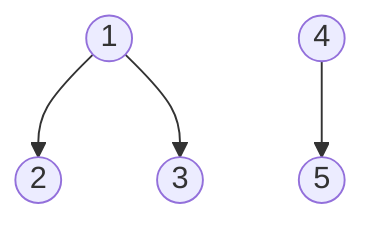

# 유니온-파인드 (Union-Find / Disjoint Set Union)

- Level: Intermediate
- Prerequisites: [Data-Structures/Array.md](Array.md), [Data-Structures/Graph-Representation.md](Graph-Representation.md)
- Status: Draft
- Reviewed-by: -
- Depth: Deep-dive (자기완결)

---

## 개념 (Concept)

유니온-파인드(서로소 집합, DSU)는 원소들을 **겹치지 않는 집합들**로 관리하며 `find(x)`("x가 어느 집합?")와 `union(x, y)`("두 집합 합치기")를 거의 상수 시간에 답한다. *동적으로 늘어나는 연결 관계*를 추적하는 데 특화된다.

## 직관 (Intuition)

각 집합을 트리로, **루트(대표 원소)** 로 집합을 식별한다. "같은 집합?"은 "두 루트가 같은가", "합치기"는 "한 루트를 다른 루트 밑에 붙이기". 관건은 이 트리를 **납작하게** 유지해 루트 찾기를 거의 $O(1)$ 로 만드는 것 — 두 최적화가 그 일을 한다.



## 이론 (Theory)

### 1. 기본 구조와 두 최적화

`parent[]` 배열 하나. `parent[x]==x` 면 루트. 순진한 구현은 트리가 한 줄로 늘어나 `find`가 $O(n)$.

| 최적화 | 내용 | 효과 |
|---|---|---|
| 경로 압축(path compression) | `find` 경로의 노드를 루트에 직접 연결 | 트리를 납작하게 |
| union by rank/size | 작은(낮은) 트리를 큰 트리 밑에 붙임 | 높이 증가 억제 |

### 2. $O(\alpha(n))$ 의 의미

**둘을 함께** 쓰면 한 연산의 amortized 비용이 $O(\alpha(n))$ 이다. $\alpha$ 는 **역 아커만 함수**로, 아커만 함수가 폭발적으로 커지는 만큼 그 역은 극도로 느리게 자라 — 현실의 모든 $n$(우주 원자 수보다 큰 값까지)에서 $\alpha(n)\le 4$. 사실상 상수다. 이 상한은 **타잔(1975)** 이 증명했고, 자료구조 분석에서 가장 유명한 비자명 결과 중 하나다(전위/포텐셜 논증).

> 한쪽만 쓰면? 경로 압축만 또는 union by rank만이면 $O(\log n)$, 단순 트리는 $O(n)$. **$O(\alpha(n))$ 은 둘을 함께** 써야 나온다.

### 3. 경로 압축 변형과 관계형 DSU

- **full compression**(재귀, 경로 전체를 루트로) vs **path halving/splitting**(반복, 한 번에 한 칸/두 칸씩) — 후자가 재귀 없이 거의 같은 효과라 실무 인기.
- **weighted/relational DSU**: 루트까지의 "상대 관계(거리·패리티)"를 함께 들고 다니면, "두 원소가 같은 편인가 반대편인가"(이분성 검사)·모듈러 관계까지 푼다.
- **rollback DSU**: union을 되돌려야 하면 경로 압축을 포기하고 union by rank만 쓴다 → 한 연산 $O(\log n)$, 대신 union 스택으로 undo 가능(오프라인 동적 연결성).

## 구현 (Implementation)

```python
class DSU:
    def __init__(self, n):
        self.parent = list(range(n))     # 각자 자기 집합
        self.size = [1] * n

    def find(self, x):
        while self.parent[x] != x:
            self.parent[x] = self.parent[self.parent[x]]  # path halving
            x = self.parent[x]
        return x

    def union(self, a, b):
        ra, rb = self.find(a), self.find(b)
        if ra == rb:
            return False                  # 이미 같은 집합
        if self.size[ra] < self.size[rb]:
            ra, rb = rb, ra               # 큰 쪽을 루트로
        self.parent[rb] = ra
        self.size[ra] += self.size[rb]
        return True
```

## 복잡도 (Complexity)

`n`=원소 수, `m`=연산 수.

| 연산 | 두 최적화(amortized) | 한쪽만 | 없음 |
|---|---|---|---|
| `find` / `union` | $O(\alpha(n))\approx O(1)$ | $O(\log n)$ | $O(n)$ |
| 전체 `m`개 | $O(m\,\alpha(n))$ | $O(m\log n)$ | $O(mn)$ |

공간 $O(n)$. **워크드 예제(경로 압축).** `0→1→2→3`(0이 루트, 일렬)에서 `find(3)`: halving이 매 스텝 `parent[x]`를 조부모로 바꿔 3과 2가 0 근처로 끌려온다 — 다음 `find`들이 즉시 루트에 닿는다. 압축이 없으면 같은 트리에서 `find`가 계속 $O(n)$.

## 응용 (Applications)

- **크루스칼 MST**에서 사이클 판별([최소 신장 트리](../Algorithms/MST.md)).
- 연결 요소 개수, **동적 연결성**(간선 추가 시 연결 여부).
- 이미지 연결 영역 라벨링, 퍼콜레이션, "섬 개수 II"(격자에 땅을 추가하며 연결 수 추적).
- 오프라인 **Tarjan LCA**, 관계형 제약(이분 그래프 판별, 모듈러 관계).

## 흔한 오해 (Common Misunderstandings)

- **기본 DSU는 union만** 지원 — 분리(undo)는 효율적으로 못 한다(필요하면 rollback DSU).
- **$\alpha(n)$ 은 $\log n$ 보다 훨씬 느리다** — "거의 상수"는 과장이 아니라 실제 $\le 4$.
- **$O(\alpha(n))$ 보장은 두 최적화를 함께** 써야 나온다.
- **초기화에서 각 원소를 자기 자신으로** 가리키게 하는 걸 빠뜨리면 안 된다(`parent[x]=x`).

## TMI

- 역 아커만 상한은 1975년 타잔의 결과로, "거의 선형이지만 정확히 선형은 아닌" 알고리즘의 대표 사례다(실제로 비선형 하한도 알려져 있다).
- path halving은 재귀 호출 스택 없이 한 번의 while로 충분히 납작해져, 깊은 트리에서 스택 오버플로 걱정이 없다.
- "되돌릴 수 있는 DSU + 분할 정복"으로 간선 삭제까지 포함한 **오프라인 동적 연결성**을 $O(m\log m\log n)$ 에 푼다.

## 연습 / 확인 문제 (Exercises)

- DSU로 무방향 그래프의 연결 요소 개수를 세는 함수를 작성하라.
- 간선 목록에서 사이클을 만드는 첫 간선을 찾아라(크루스칼 핵심).
- 경로 압축을 제거했을 때와 유지했을 때의 트리 높이 변화를 같은 입력으로 비교하라.
- relational DSU로 "친구/적" 관계의 모순(이분성 위반)을 탐지하라.

## 이어서 읽기 (Reading Path)

- 이전: [그래프 표현](Graph-Representation.md)
- 다음: [최소 신장 트리](../Algorithms/MST.md)
- 관련: [그래프 이론](../Math/Discrete/Graph-Theory.md), [분할 상환 분석](../Algorithms/Amortized-Analysis.md)

## 참조 (References)

- [Data-Structures/Graph-Representation.md](Graph-Representation.md)
- [Math/Discrete/Graph-Theory.md](../Math/Discrete/Graph-Theory.md)
- [Algorithms/MST.md](../Algorithms/MST.md)
- [Reference/Books.md](../Reference/Books.md)
- [Reference/Courses.md](../Reference/Courses.md)
