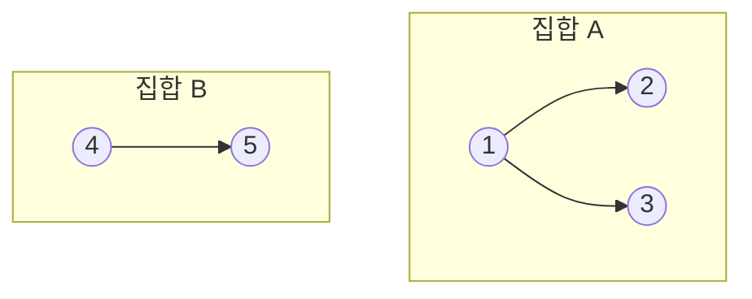

# 유니온-파인드 (Union-Find / Disjoint Set Union)

- Level: Intermediate
- Prerequisites: [Data-Structures/Array.md](Array.md), [Data-Structures/Graph-Representation.md](Graph-Representation.md)
- Status: Draft
- Reviewed-by: -

---

## 개념 (Concept)

유니온-파인드(서로소 집합, DSU)는 **여러 원소를 겹치지 않는(disjoint) 집합들로 관리**하면서 두 가지 질문에 빠르게 답하는 자료구조다. `find(x)`는 "`x`가 어느 집합에 속하는가", `union(x, y)`는 "`x`가 속한 집합과 `y`가 속한 집합을 하나로 합쳐라"이다. 동적으로 변하는 "연결 관계"를 추적하는 데 특화돼 있다.

## 직관 (Intuition)

각 집합을 하나의 트리로 표현하고, 트리의 **루트(대표 원소)** 로 집합을 식별한다. 두 원소가 같은 집합인지 묻는 것은 "두 트리의 루트가 같은가"를 묻는 것이고, 합치는 것은 "한 트리의 루트를 다른 트리의 루트 아래에 붙이는 것"이다. 핵심은 이 트리를 최대한 납작하게 유지해 루트 찾기를 거의 상수 시간으로 만드는 것이다.



## 이론 (Theory)

기본 구조는 `parent[]` 배열 하나다. `parent[x]`는 `x`의 부모이고, `parent[x] == x`이면 `x`가 루트다. 순수 구현은 트리가 한 줄로 길어지면 `find`가 `O(n)`까지 나빠진다. 두 가지 최적화가 이를 거의 상수로 만든다.

| 최적화 | 내용 |
|---|---|
| 경로 압축(path compression) | `find` 도중 지나간 노드들을 루트에 직접 연결해 트리를 납작하게 만든다 |
| 랭크/크기 합치기(union by rank/size) | 합칠 때 항상 작은(또는 낮은) 트리를 큰 트리 아래에 붙여 높이 증가를 막는다 |

두 최적화를 함께 쓰면 한 연산의 **분할 상환(amortized) 비용**이 다음과 같다.

$$O(\alpha(n))$$

여기서 $\alpha(n)$은 **역 아커만 함수(inverse Ackermann)** 로, 현실적인 모든 $n$(우주의 원자 수보다 큰 값까지)에서 $\alpha(n) \le 4$다. 즉 사실상 상수 시간이다.

## 구현 (Implementation)

```python
class DSU:
    def __init__(self, n):
        self.parent = list(range(n))   # 각자 자기 집합
        self.size = [1] * n

    def find(self, x):
        while self.parent[x] != x:
            self.parent[x] = self.parent[self.parent[x]]  # 경로 압축(절반 건너뛰기)
            x = self.parent[x]
        return x

    def union(self, a, b):
        ra, rb = self.find(a), self.find(b)
        if ra == rb:
            return False                # 이미 같은 집합
        if self.size[ra] < self.size[rb]:
            ra, rb = rb, ra             # 큰 쪽을 루트로
        self.parent[rb] = ra
        self.size[ra] += self.size[rb]
        return True


dsu = DSU(5)
dsu.union(0, 1)
dsu.union(1, 2)
print(dsu.find(0) == dsu.find(2))   # True  (0,1,2 같은 집합)
print(dsu.find(0) == dsu.find(3))   # False
```

## 복잡도 (Complexity)

`n`은 원소 수, `m`은 연산 횟수다.

| 연산 | 최적화 적용 시(분할 상환) | 최적화 없음 |
|---|---|---|
| `find` | `O(α(n))` ≈ `O(1)` | `O(n)` |
| `union` | `O(α(n))` ≈ `O(1)` | `O(n)` |
| 전체 `m`개 연산 | `O(m · α(n))` | `O(m · n)` |

공간은 `parent`, `size` 배열로 `O(n)`이다.

## 응용 (Applications)

- 크루스칼(Kruskal) MST에서 사이클 판별
- 그래프의 연결 요소(connected component) 개수 세기
- 동적 연결성 질의(간선이 추가될 때 두 정점이 연결됐는지)
- 이미지의 연결 영역 라벨링, 네트워크 클러스터링

## 흔한 오해 (Common Misunderstandings)

- 유니온-파인드는 합치기(union)만 지원한다. 일반적으로 한 번 합친 집합을 **다시 분리(undo)하는 연산은 효율적으로 제공하지 않는다.**
- `α(n)`은 `log n`보다 훨씬 느리게 자란다. "거의 상수"라는 말은 과장이 아니라 실제로 4 이하다.
- 경로 압축만 쓰거나 랭크 합치기만 써도 빨라지지만, $O(\alpha(n))$ 보장은 **둘을 함께** 써야 나온다.
- `parent[x] == x`로 루트를 판별하므로, 초기화에서 각 원소를 자기 자신으로 가리키게 하는 것을 빠뜨리면 안 된다.

## TMI

- 역 아커만 함수가 등장하는 이 분석은 1975년 타잔(Tarjan)이 증명했고, 자료구조 분석에서 가장 유명한 비자명한 상한 중 하나다.
- 경로 압축에는 여러 변형이 있다. 위 코드의 "경로 절반 압축(path halving)"은 재귀 없이 한 번의 순회로 충분히 납작하게 만들어 실무에서 자주 쓰인다.
- 합치기를 되돌려야 하는 문제에서는 경로 압축을 포기하고 랭크 합치기만 쓰는 "롤백 가능한 DSU"를 쓴다. 이때 한 연산은 `O(log n)`이 된다.

## 연습 / 확인 문제 (Exercises)

- DSU로 무방향 그래프의 연결 요소 개수를 세는 함수를 작성하라.
- 간선 목록이 주어질 때 사이클이 생기는 첫 간선을 찾아라(크루스칼의 핵심).
- 경로 압축을 제거하면 같은 입력에서 트리 높이가 어떻게 달라지는지 관찰하라.

## 이어서 읽기 (Reading Path)

- 이전: [그래프 표현](Graph-Representation.md)
- 다음: 최소 신장 트리 (예정 `MST.md`), 크루스칼 알고리즘
- 관련: [그래프 이론](../Math/Discrete/Graph-Theory.md)

## 참조 (References)

- [Data-Structures/Graph-Representation.md](Graph-Representation.md)
- [Math/Discrete/Graph-Theory.md](../Math/Discrete/Graph-Theory.md)
- [Reference/Books.md](../Reference/Books.md)
- [Reference/Courses.md](../Reference/Courses.md)
