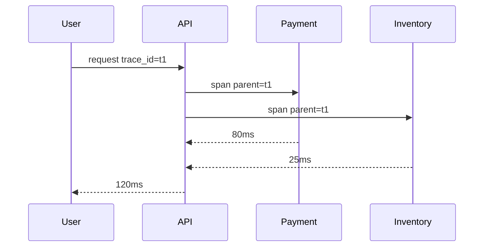

# 분산 트레이싱 (Distributed Tracing)

- Level: Intermediate
- Prerequisites: [Engineering/DevOps/Logging-Systems.md](Logging-Systems.md), [Systems/Distributed-Systems/System-Models.md](../../Systems/Distributed-Systems/System-Models.md)
- Status: Draft
- Reviewed-by: -
- Depth: Deep-dive (자기완결)

---

## 개념 (Concept)

분산 트레이싱은 하나의 요청이 여러 service를 지나며 만든 span을 trace로 연결해 end-to-end latency와 dependency 경로를 보여 주는 관찰 가능성 기법이다.

## 직관 (Intuition)

사용자 요청 하나에 GPS 추적표를 붙인다. 어느 서비스에서 얼마나 머물렀고 어디서 길이 막혔는지 한 장의 경로로 본다.



## 이론 (Theory)

Trace는 전체 요청, span은 개별 작업 구간이다. Trace context는 HTTP header나 message metadata로 전파된다. OpenTelemetry는 instrumentation과 data model을 표준화하고, Jaeger 같은 backend가 저장·조회한다. Sampling은 비용을 줄이지만 tail event를 놓칠 수 있어 head/tail sampling 전략을 고른다.

### span 설계

좋은 span은 "어디서 시간이 쓰였는가"와 "어떤 dependency가 실패했는가"를 알려 준다. HTTP route, DB query 종류, queue topic, retry count 같은 낮은 cardinality attribute는 유용하다. 사용자 이메일, raw token, 전체 SQL parameter처럼 민감하거나 cardinality가 큰 값은 비용과 개인정보 위험을 만든다.

## 구현 (Implementation)

```text
trace_id=abc
  span api /checkout        120ms
    span payment service     80ms
    span inventory service   25ms
```

로그에 trace_id를 함께 남기면 trace에서 관련 로그로 바로 이동할 수 있다.

Queue 경계에서는 context를 message metadata에 넣어야 trace가 끊기지 않는다.

```text
headers:
  traceparent: 00-4bf92f3577b34da6a3ce929d0e0e4736-00f067aa0ba902b7-01
```

## 복잡도 (Complexity)

Instrumentation 범위가 넓을수록 원인 분석은 쉬워지지만 data volume과 runtime overhead가 증가한다. 비동기 queue 경계에서는 context propagation을 명시적으로 챙긴다.

워크드 예제: 하루 요청 1억 개를 모두 trace로 저장할 수 없다면 head sampling 1%는 비용을 줄이지만 희귀한 500 에러를 놓칠 수 있다. tail sampling은 응답 후 성공/실패/지연을 보고 느린 요청과 실패 요청을 더 많이 남길 수 있다.

## 응용 (Applications)

- microservice latency 분석
- dependency map 작성
- tail latency root cause 추적
- deployment 전후 경로 비교

## 흔한 오해 (Common Misunderstandings)

- Trace가 있으면 로그와 metric이 필요 없어지는 것은 아니다.
- Sampling된 trace만 보면 rare failure를 놓칠 수 있다.
- 모든 span에 과도한 attribute를 넣으면 비용과 개인정보 위험이 커진다.
- Context propagation이 끊기면 trace가 조각난다.

## TMI

- Tail-based sampling은 느리거나 실패한 요청을 더 잘 보존할 수 있다.
- Span event는 중요한 중간 상태를 남기는 데 유용하다.
- Service mesh가 일부 tracing을 자동화할 수 있지만 application-level 의미는 코드가 알아야 한다.

## 연습 / 확인 문제 (Exercises)

- API 요청 하나의 trace/span 구조를 설계하라.
- Queue를 지나는 trace context 전파 방법을 설명하라.
- Trace ID를 로그와 metric label에 어떻게 연결할지 정하라.

## 이어서 읽기 (Reading Path)

- 이전: [로깅 시스템](Logging-Systems.md)
- 다음: [SLI / SLO / SLA](SLI-SLO-SLA.md)

## 참조 (References)

- [Engineering/Debugging/Distributed-Log-Correlation.md](../Debugging/Distributed-Log-Correlation.md)
- [Systems/Distributed-Systems/Time-and-Ordering.md](../../Systems/Distributed-Systems/Time-and-Ordering.md)
