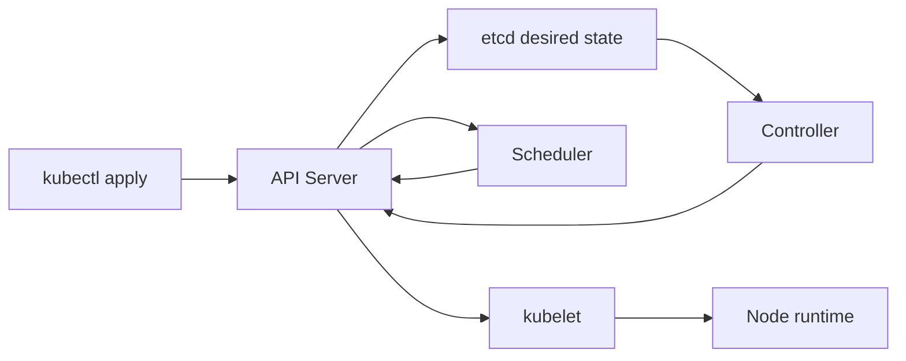

# Kubernetes 기초 (Kubernetes Basics)

- Level: Intermediate
- Prerequisites: [Engineering/DevOps/Docker-Basics.md](Docker-Basics.md), [Systems/Distributed-Systems/System-Models.md](../../Systems/Distributed-Systems/System-Models.md)
- Status: Draft
- Reviewed-by: -
- Depth: Deep-dive (자기완결)

---

## 개념 (Concept)

Kubernetes는 containerized workload의 desired state를 선언하면 controller가 실제 cluster 상태를 지속적으로 맞추는 orchestration system이다. Pod, Deployment, Service가 기본 building block이다.

## 직관 (Intuition)

운영자가 "이 버전 pod 3개"를 선언하면 controller가 죽은 pod를 다시 만들고 rolling update한다. 직접 서버를 하나씩 조작하기보다 상태와 reconciliation loop를 관리한다.



## 이론 (Theory)

Pod는 scheduling·network의 최소 단위, Deployment는 stateless replica와 rollout, Service는 변하는 pod 집합에 stable virtual endpoint를 제공한다. Scheduler는 node를 선택하고 kubelet이 pod를 실행한다. Readiness probe는 traffic 수신 가능, liveness probe는 restart 필요 여부를 나타낸다.

Request는 scheduling 기준, limit는 runtime resource 경계를 제공한다. ConfigMap과 Secret은 설정을 분리하지만 Secret object가 자동으로 완전한 secret management를 제공하는 것은 아니다.

### reconciliation loop

Kubernetes controller는 "현재 상태"와 "원하는 상태"를 계속 비교한다. Deployment가 replicas=3인데 실제 Pod가 2개면 하나를 만든다. 이미지가 바뀌면 새 ReplicaSet을 만들고 점진적으로 traffic을 옮긴다. 이 모델에서는 일회성 명령보다 선언된 상태와 controller의 수렴을 이해해야 한다.

## 구현 (Implementation)

```yaml
apiVersion: apps/v1
kind: Deployment
metadata:
  name: web
spec:
  replicas: 3
  selector:
    matchLabels: {app: web}
  template:
    metadata:
      labels: {app: web}
    spec:
      containers:
        - name: web
          image: example/web@sha256:REPLACE_WITH_DIGEST
          ports: [{containerPort: 8080}]
          readinessProbe:
            httpGet: {path: /ready, port: 8080}
          resources:
            requests: {cpu: "100m", memory: "128Mi"}
            limits: {memory: "256Mi"}
```

Service와 연결하려면 label selector가 맞아야 한다.

```yaml
apiVersion: v1
kind: Service
metadata:
  name: web
spec:
  selector: {app: web}
  ports:
    - port: 80
      targetPort: 8080
```

## 복잡도 (Complexity)

사용자는 reconciliation의 eventual convergence를 다룬다. 운영 비용은 object·node·watch event 수, scheduling, image pull과 control-plane 규모에 좌우된다.

워크드 예제: replicas=3이고 readiness probe가 실패한 Pod가 1개 있으면 Service endpoint에는 준비된 2개만 들어간다. liveness가 실패하면 kubelet이 컨테이너를 재시작한다. readiness는 "트래픽 받을 수 있나", liveness는 "죽어서 다시 띄워야 하나"를 묻는다.

## 응용 (Applications)

- replicated service와 rolling update
- batch job·scheduled job
- autoscaling과 self-healing
- platform engineering과 multi-service 운영

## 흔한 오해 (Common Misunderstandings)

- Kubernetes가 application state consistency를 대신 해결하지 않는다.
- Pod는 영구 server identity가 아니며 재생성될 수 있다.
- liveness probe를 잘못 두면 장애 중 restart loop를 악화시킨다.
- CPU/memory request 없이 배포하면 scheduling·capacity 판단이 흐려진다.

## TMI

- controller는 level-triggered reconciliation을 반복한다.
- label selector는 Service·Deployment 등 object 연결의 핵심이다.
- StatefulSet은 identity와 ordered lifecycle이 필요한 workload를 돕지만 database 운영을 자동 해결하지 않는다.

## 연습 / 확인 문제 (Exercises)

- Deployment와 Service manifest를 연결하라.
- readiness와 liveness failure 시 동작을 비교하라.
- request·limit가 없는 pod의 운영 위험을 설명하라.

## 이어서 읽기 (Reading Path)

- 이전: [Docker 기초](Docker-Basics.md)
- 다음: [메트릭과 알람](Metrics-Alerts.md)
- 관련: [Kubernetes 고급](Kubernetes-Advanced.md)

## 참조 (References)

- [Kubernetes Concepts](https://kubernetes.io/docs/concepts/overview/)
- [Systems/Distributed-Systems/System-Models.md](../../Systems/Distributed-Systems/System-Models.md)
- [Reference/Books.md](../../Reference/Books.md)
