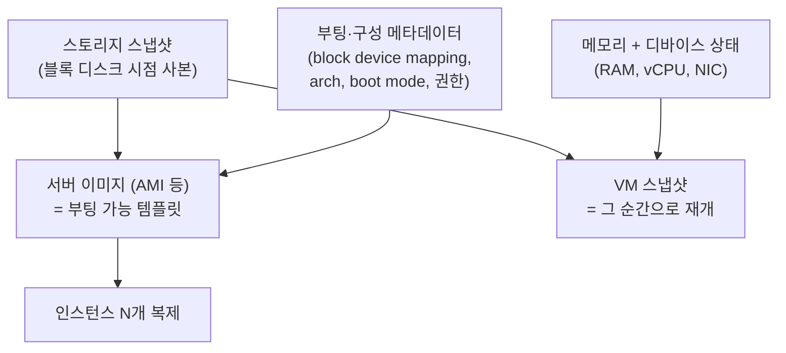

# 서버 이미지와 스냅샷 (Server Images & Snapshots)

- Level: Intermediate
- Prerequisites: [Engineering/DevOps/Cloud-Computing.md](Cloud-Computing.md), [Systems/Operating-Systems/File-Systems.md](../../Systems/Operating-Systems/File-Systems.md)
- Status: Draft
- Reviewed-by: -
- Depth: Deep-dive (자기완결)

---

## 개념 (Concept)

세 용어는 비슷해 보이지만 **추상화 계층이 다르다.**

- **스토리지 스냅샷(storage / volume snapshot)**: 블록 볼륨(디스크) 한 개의 특정 시점(point-in-time) 사본. 메모리는 포함하지 않으며, **특정 스토리지 시스템에 묶여 있다.** (예: AWS EBS snapshot, GCP PD snapshot, LVM/ZFS snapshot)
- **서버 이미지(server / machine image)**: 부팅 가능한 템플릿 — **루트 볼륨의 스토리지 스냅샷 + 부팅·구성 메타데이터**. 스냅샷과 달리 **배포·복제 가능한 산출물(artifact)** 이다. (예: AWS AMI, GCP Image, Azure Managed Image)
- **VM 스냅샷(hypervisor snapshot)**: 디스크 **+ 메모리(RAM) + 디바이스 상태**까지 잡은 시점 사본. 복원하면 "전원을 끈 적 없이" 그 순간으로 재개된다. (예: VMware/Hyper-V/VirtualBox snapshot)

한 줄 관계식:

$$\text{서버 이미지} = \text{스토리지 스냅샷} + \text{부팅·구성 메타데이터}, \qquad \text{VM 스냅샷} = \text{스토리지 스냅샷} + \text{메모리·디바이스 상태}$$

즉 **스토리지 스냅샷이 가장 아래 재료**이고, 거기에 무엇을 더 얹느냐에 따라 이미지가 되거나 VM 스냅샷이 된다. 핵심 공통점은 셋 다 **"전체 복사가 아니라 참조 + 변경분"** 으로 시점을 보존한다는 것이다.

## 직관 (Intuition)

디스크 전체를 매번 통째로 복사하면 느리고 비싸다. 그래서 스냅샷은 **"바뀐 부분만 따로 보관하고, 나머지는 원본을 가리키는 포인터로 공유"** 하는 방식으로 시점을 보존한다. 사진을 찍듯 순간을 고정하되, 실제로 복제하는 데이터는 최소화하는 것이다.



두 번째 멘탈 모델: 스냅샷 체인은 **"버전 관리(Git)와 같은 구조"** 다. 첫 스냅샷이 초기 커밋, 이후 스냅샷은 diff(delta), 활성 볼륨은 working tree. 그래서 "어떤 블록이 바뀌었는지(diff)를 추적하는 장치"가 모든 증분 스냅샷의 심장이다 — 아래 CBT.

## 이론 (Theory)

### 1. 동작 원리: Copy-on-Write vs Redirect-on-Write

스냅샷은 두 메커니즘 중 하나로 "원본 보존 + 변경 분리"를 구현한다.

- **Copy-on-Write (COW)** — 스냅샷 직후엔 모든 블록을 원본과 공유한다. 원본 블록을 **수정하려는 순간**, 옛 값을 먼저 스냅샷 영역(exception store)으로 복사한 뒤 새 값을 원래 자리에 쓴다. 한 번의 논리적 쓰기가 `read(old) → write(old→snapshot) → write(new)`로 부풀어 **write penalty**(쓰기 증폭)가 생긴다. 클래식 LVM snapshot이 대표.
- **Redirect-on-Write (ROW)** — 새 쓰기를 **새 위치로 우회**시키고, 원본 블록은 그대로 두어 스냅샷이 참조하게 한다. 쓰기 증폭은 없지만 블록 위치가 흩어져 매핑 메타데이터·단편화 관리가 복잡하다. ZFS, NetApp WAFL, dm-thin, 대부분의 엔터프라이즈 어레이가 채택.

원본 활성 볼륨의 **읽기**는 COW가 유리하고(데이터가 제자리), **쓰기**는 ROW가 유리하다.

**thick vs thin (LVM 사례).** 같은 LVM이라도 메커니즘이 다르다.

| | 클래식(thick) 스냅샷 | thin pool(dm-thin) 스냅샷 |
|---|---|---|
| 메커니즘 | COW, 스냅샷마다 별도 exception store | ROW에 가까움, 공유 풀의 매핑 트리 |
| 스냅샷 N개일 때 원본 1회 쓰기 | 최대 N번 복사(증폭 ∝ N) | 증폭 없음 |
| 생성 비용 | exception store 할당 | $O(1)$ 매핑 |
| 위험 | exception store가 차면 스냅샷 **무효화** | 풀 고갈 시 전체 풀 위험 |

### 2. 변경 블록 추적 (Changed Block Tracking, CBT)

증분 스냅샷의 핵심 질문: **"직전 이후 어떤 블록이 바뀌었는지 어떻게 아는가?"** 전체를 매번 비교(diff)하면 $O(\text{volume})$이라 무의미하다. 그래서 쓰기를 가로채 **dirty block bitmap**(블록당 1비트)을 유지한다.

- **VMware CBT**: `QueryChangedDiskAreas`로 두 시점 간 변경 섹터를 받아 증분 백업. 추적 데이터는 `-ctk.vmdk`에 저장.
- **QEMU/KVM**: qcow2의 persistent **dirty bitmap**으로 변경 블록을 표시.
- **AWS EBS**: EBS direct API(`ListChangedBlocks`, `ListSnapshotBlocks`)가 두 스냅샷 간 변경 블록 인덱스를 직접 노출한다.

CBT가 손상·리셋되면(예: 비정상 종료, 일부 스토리지 작업) 다음 증분이 **전체 백업으로 강등**될 수 있다.

### 3. 증분 체인과 overlay, read amplification

연속 스냅샷은 전체를 매번 복사하지 않는다.

- **첫 스냅샷** $S_0$: 사용 중인 블록 전부 저장(사실상 full).
- **이후 스냅샷** $S_i$: 변경 블록만 저장하고 나머지는 이전 스냅샷을 참조.

체인 전체 저장량은 첫 스냅샷의 사용 블록 $U_0$에 각 단계 고유 변경분 $\Delta_i$를 더한 값에 가깝다:

$$\text{Storage}(S_0,\dots,S_n) \approx U_0 + \sum_{i=1}^{n} \Delta_i$$

여기서 **읽기 비용 모델이 구현마다 갈린다.**

- **overlay 체인형**(qcow2 backing file, VMware delta): 상위 레이어에 없는 블록은 부모로, 또 그 부모로 거슬러 올라간다 → 체인 길이 $k$에 대해 읽기 최악 $O(k)$. 그래서 체인이 길수록 느려진다.
- **flat 인덱스형**(EBS): 각 스냅샷이 "완전한 블록 인덱스"를 갖도록 서버 측에서 해소되어, 사용자에게는 평탄한 시점 뷰로 보인다. 그래서 **중간 스냅샷을 삭제해도** 참조 카운팅으로 안전하게 회수되고 뒤 스냅샷이 깨지지 않는다.

### 4. 서버 이미지의 해부 — EBS-backed vs instance-store-backed

이미지는 "디스크 비트"만이 아니라 **부팅 메타데이터 묶음**이다. AWS AMI는 루트 저장 방식에 따라 두 종류다.

| | EBS-backed AMI | instance-store-backed AMI |
|---|---|---|
| 루트 저장 | EBS **스냅샷**(들) | S3에 번들된 이미지 + manifest |
| 구성 | 스냅샷 + block device mapping + arch/boot mode + launch permission | 번들 + 메타데이터 |
| stop 가능 | ✅ | ❌ (reboot/terminate만) |
| 종료 시 루트 데이터 | 보존 가능 | **소실** |
| 생성 | `create-image`(내부적으로 스냅샷 선행) | 번들·업로드 |

즉 **(보편적인) EBS-backed AMI = EBS 스냅샷 위에 부팅 메타데이터를 씌운 것.** block device mapping이 "부팅 시 어느 스냅샷을 어느 디바이스에 몇 GB로 붙일지"를 규정한다.

### 5. VM 스냅샷: 델타 디스크, 스냅샷 트리, 메모리

VM 스냅샷은 디스크에 더해 **RAM과 디바이스 상태(vCPU 레지스터, NIC 등)** 까지 캡처한다.

- 스냅샷 생성 → base disk를 **read-only**로 잠그고 이후 쓰기를 **델타 디스크**(`-delta.vmdk` / 대용량은 `-sesparse.vmdk`)로 우회. 메모리는 `.vmsn`/`.vmem`에 저장.
- 스냅샷은 단일 체인이 아니라 **트리**가 될 수 있다(한 지점에서 갈라진 여러 분기).
- 복원이 "정지된 순간 재개"가 되는 대신, 델타 체인이 길수록 **읽기 read amplification**으로 성능 저하.
- 스냅샷 삭제 = **consolidation(병합)**: 델타를 부모로 합치며 상당한 I/O와 임시 공간을 쓴다. 실패하면 "consolidate needed" 상태로 남는다.

### 6. 일관성 (Consistency) — 단일 볼륨을 넘어서

스냅샷을 **언제** 찍느냐가 복원 후 정합성을 좌우한다.

| 수준 | 의미 | 확보 방법 |
|---|---|---|
| **Crash-consistent** | 전원을 뽑은 순간과 동일. 디스크 상태는 시점 정합이나 메모리/버퍼 미반영분은 유실 | 그냥 찍기 (저널링 fs는 `fsck`로 복구하나 보장 아님) |
| **File-system-consistent** | fs 버퍼를 flush·정지(quiesce) 후 캡처 | Linux `fsfreeze -f`, Windows VSS의 fs 단계 |
| **Application-consistent** | DB·앱이 버퍼를 flush하고 정합 상태에서 캡처 | Windows **VSS writer**, `qemu-guest-agent` freeze hook, DB 백업 모드 |

**(a) 쓰기 순서와 배리어.** crash-consistent가 "복구 가능"한 이유는 저널링 fs와 DB가 **write barrier/fsync**로 순서를 보장하기 때문이다. 스냅샷이 그 순서를 깨지 않는 한(원자적 시점) 저널 재생으로 정합 상태에 도달한다.

**(b) 멀티 볼륨 = consistency group.** 가장 흔한 함정. 앱 데이터와 WAL이 **서로 다른 볼륨**에 있거나 LVM/RAID가 여러 볼륨에 걸쳐 있으면, 볼륨마다 따로 찍은 스냅샷은 **서로 다른 시점**이 되어 복원 시 깨진다. 해법은 **consistency group snapshot**(모든 볼륨을 같은 순간에 원자적으로) 또는 앱을 quiesce한 뒤 전부 찍기.

**(c) VSS 흐름(Windows).** Requestor(백업앱) → VSS service → **Writer**(SQL Server 등, 자기 데이터를 flush/freeze) → **Provider**(섀도카피 생성). 순서: requestor 요청 → writer freeze → provider snapshot → writer thaw. → 트랜잭션 복구 이론은 [복구 (Recovery)](../../Systems/Databases/Recovery.md) 참고.

### 7. 암호화와 스냅샷

암호화 볼륨의 스냅샷은 **같은 KMS 키로 암호화**된 채 저장된다. 스냅샷 **copy** 시 다른 키로 재암호화할 수 있고, 암호화 스냅샷을 다른 계정과 **공유하려면 KMS 키 권한까지** 공유해야 한다. "스냅샷만 공유하면 된다"가 흔한 실수다.

## 구현 (Implementation)

### AWS: 스냅샷 → 이미지 → DR

```bash
# 1) 블록 볼륨의 스토리지 스냅샷 (증분 자동)
aws ec2 create-snapshot --volume-id vol-0abc --description "nightly"

# 2) 실행 중 인스턴스로부터 서버 이미지(AMI) 생성
#    기본은 일관성을 위해 재부팅; --no-reboot면 crash-consistent
aws ec2 create-image --instance-id i-0def --name "web-golden-2026-06"

# 3) 멀티 볼륨 앱은 consistency group으로 한꺼번에
aws ec2 create-snapshots --instance-specification InstanceId=i-0def \
    --description "app+wal coherent"

# 4) 두 스냅샷 간 변경 블록만 조회 (증분 백업 엔진의 토대)
aws ebs list-changed-blocks --first-snapshot-id snap-0001 \
    --second-snapshot-id snap-0002
```

### block device mapping (이미지 메타데이터의 실체)

```json
[
  { "DeviceName": "/dev/xvda",
    "Ebs": { "SnapshotId": "snap-0root", "VolumeSize": 20,
             "VolumeType": "gp3", "Encrypted": true,
             "DeleteOnTermination": true } },
  { "DeviceName": "/dev/xvdb",
    "Ebs": { "SnapshotId": "snap-0data", "VolumeSize": 100 } }
]
```

### Linux 블록 계층: LVM(COW) · ZFS(ROW) · qcow2(overlay)

```bash
# LVM 클래식: COW. -L은 exception store 크기(차면 스냅샷 무효화)
lvcreate --size 5G --snapshot --name snap_root /dev/vg0/root

# 애플리케이션 정합: 잠깐 파일시스템을 얼리고 찍기
fsfreeze -f /data && lvcreate -s -n snap_data -L 5G /dev/vg0/data; fsfreeze -u /data

# ZFS: ROW, 생성이 거의 무료. 증분 복제는 send/recv
zfs snapshot tank/data@mon
zfs send -i tank/data@sun tank/data@mon | ssh dr zfs recv tank/data   # 증분 전송

# qcow2: 외부 스냅샷 = backing_file 위 overlay(ROW). 체인이 길면 읽기 느림
qemu-img create -f qcow2 -b base.qcow2 -F qcow2 overlay.qcow2
```

### COW vs ROW 쓰기 경로 (의사코드)

```text
# COW: 원본 자리를 유지 → 첫 수정 때 옛 값을 스냅샷으로 대피
write_cow(b, new):
    if snapshot and not copied[b]:
        old = read_origin(b)        # 1 read
        write_snapshot(b, old)      # 1 write  ← COW 페널티
        copied[b] = true
    write_origin(b, new)            # 1 write

# ROW: 새 위치에 쓰고 포인터만 교체 → 옛 블록이 곧 스냅샷
write_row(b, new):
    loc = alloc_new_block()
    write(loc, new)                 # 1 write
    map[b] = loc                    # 포인터 갱신, 옛 블록은 스냅샷이 참조
```

## 복잡도 (Complexity)

알고리즘 복잡도보다 **운영·비용 특성**이 핵심이다. ($U$=사용 블록, $\Delta$=변경 블록, $k$=체인 길이)

| 항목 | COW(LVM/EBS류) | ROW(ZFS/dm-thin) | 비고 |
|---|---|---|---|
| 스냅샷 생성 | $O(1)$ | $O(1)$ | 둘 다 즉시 |
| 첫 스냅샷 저장량 | $O(U)$ | $O(U)$ | 사실상 full |
| 증분 저장량 | $O(\Delta)$ | $O(\Delta)$ | 변경분만 |
| 원본 쓰기 페널티 | 첫 수정 시 +1 read +1 write (thick는 ∝ 스냅샷 수) | 없음 | COW의 약점 |
| 원본/스냅샷 읽기 | 제자리 빠름 / overlay면 $O(k)$ | 매핑 조회 | overlay 체인의 약점 |
| 복원·볼륨 생성 | lazy-load면 초기 느림 | 보통 빠름 | EBS는 첫 접근 시 warm-up, FSR로 제거 |

**워크드 예제.** 100GB 볼륨(사용 40GB), 매일 고유 변경 2GB, 7일치 일일 스냅샷($S_0 \dots S_6$):

$$\text{Storage} \approx U_0 + \sum_{i=1}^{6}\Delta_i = 40 + 6\times 2 = 52\,\text{GB}$$

전체 7벌(280GB)이 아니라 **52GB**. 반면 qcow2 overlay로 같은 체인을 쌓으면 $S_0$ 블록 읽기는 최대 7단계 backing을 거슬러야 할 수 있다(읽기 $O(k)$) — EBS는 평탄 인덱스라 이 비용이 없다.

## 응용 (Applications)

- **백업·재해 복구(DR)**: 정기 스냅샷 + CBT 기반 증분 + 타 리전/계정 복사 → 3-2-1 백업의 한 축.
- **골든 이미지 + 오토스케일**: 패치·런타임·앱을 미리 구운 이미지로 노드를 즉시 증설. [배포 전략](Deployment-Strategies.md)의 불변 인프라(immutable infrastructure)와 직결.
- **개발/테스트 복제**: 운영 스냅샷을 스테이징 볼륨(또는 `zfs clone`)으로 붙여 실데이터 테스트.
- **Rollback 지점**: 위험한 업그레이드 직전 VM 스냅샷을 찍고 실패 시 즉시 되돌림(단, 단기).
- **보안·컴플라이언스**: 침해 분석용 디스크 포렌식 사본, 이미지 취약점 스캔, 감사용 시점 보존.

## 흔한 오해 (Common Misunderstandings)

- **"스냅샷 = 백업"이 아니다.** 증분 스냅샷은 원본 스토리지 시스템에 의존하므로, 그 시스템·리전이 손상되면 같이 사라질 수 있다. 진짜 백업은 별도 매체/리전/계정으로 복사한 것.
- **VM 스냅샷을 장기 백업으로** 쓰면 델타 체인이 길어져 성능 저하·병합 실패 위험 — "잠깐 되돌릴 지점"용이다.
- **멀티 볼륨인데 볼륨별로 따로** 찍으면 시점이 어긋나 깨진다 → consistency group 필요.
- **crash-consistent면 충분하다는 착각**: DB·큐는 application-consistent가 필요.
- **이미지에 비밀이 박제**: 골든 이미지에 SSH 키·토큰·셸 히스토리·로그가 남으면 그대로 배포된다. 빌드 끝에 cleanup 필수.
- **암호화 스냅샷만 공유하면 된다는 착각**: KMS 키 권한까지 공유해야 상대가 복호화한다.
- **중간 스냅샷 삭제 공포**: (EBS류 flat 인덱스) 참조 카운팅이라 안전하게 회수된다.

## TMI

- AWS EBS 스냅샷은 "S3에 저장"되지만 **당신의 S3 버킷에는 보이지 않는** AWS 관리 영역에 들어간다. 그래서 11-9s 내구성을 갖는다.
- ZFS는 흔히 "Copy-on-Write 파일시스템"이라 불리지만 동작은 사실 **redirect-on-write**다 — 제자리를 덮어쓰지 않고 항상 새 블록에 쓴 뒤 포인터를 바꾼다. "절대 in-place로 안 쓴다"는 점이 스냅샷을 거의 공짜로 만든다.
- "Copy-on-Write" 개념 자체는 스토리지 이전에 OS의 `fork()`에서 먼저 유명해졌다 — 자식이 부모 메모리를 공유하다 쓰는 순간에만 복제한다.
- VMware에서 스냅샷을 오래 방치하면 `-delta.vmdk`가 원본보다 커지는 일이 흔하다. "스냅샷=임시"가 운영 문화로 굳은 이유.
- AMI를 지워도 그것이 참조하던 EBS 스냅샷은 **별도로 남아 계속 과금**된다 — 이미지와 스냅샷이 다른 리소스라는 증거다(deregister ≠ delete snapshot).

## 연습 / 확인 문제 (Exercises)

- 200GB 볼륨(사용 80GB)에서 매일 고유 변경 3GB, 10일치 일일 스냅샷 체인의 대략적 저장량을 저장량 식으로 계산하라.
- 같은 워크로드에서 thick LVM 스냅샷을 **3개** 유지할 때 원본 1회 쓰기의 I/O 증폭이 thin pool 대비 어떻게 달라지는지 설명하라.
- qcow2 backing 체인 길이가 $k$일 때, 상위 레이어에 없는 블록 읽기의 최악 비용을 쓰고, EBS가 이를 어떻게 피하는지 대조하라.
- 데이터 볼륨과 WAL 볼륨이 분리된 PostgreSQL을 application-consistent하게 스냅샷하려면 어떤 순서로 freeze/flush/snapshot/thaw 해야 하는지 단계로 적어라(consistency group 포함).
- "AMI를 지웠는데 EBS 스냅샷이 남아 과금되더라"가 왜 생기는지 이미지·스냅샷 관계로 설명하라.

## 이어서 읽기 (Reading Path)

- 이전: [AWS 핵심 서비스](AWS-Core-Services.md)
- 다음: [GCP / Azure 개요](GCP-Azure-Overview.md)
- 관련: [컨테이너 네트워킹과 볼륨](Container-Networking-Volumes.md), [배포 전략](Deployment-Strategies.md), [파일 시스템](../../Systems/Operating-Systems/File-Systems.md), [복구](../../Systems/Databases/Recovery.md)

## 참조 (References)

- [Engineering/DevOps/Cloud-Computing.md](Cloud-Computing.md)
- [Engineering/DevOps/AWS-Core-Services.md](AWS-Core-Services.md)
- [Systems/Operating-Systems/File-Systems.md](../../Systems/Operating-Systems/File-Systems.md)
- [Systems/Databases/Recovery.md](../../Systems/Databases/Recovery.md)
- AWS, "Amazon EBS snapshots" — https://docs.aws.amazon.com/ebs/latest/userguide/ebs-snapshots.html
- AWS, "EBS direct APIs (changed blocks)" — https://docs.aws.amazon.com/ebs/latest/userguide/ebs-accessing-snapshot.html
- AWS, "Amazon Machine Images (AMI)" — https://docs.aws.amazon.com/AWSEC2/latest/UserGuide/AMIs.html
- Microsoft, "Volume Shadow Copy Service (VSS)" — https://learn.microsoft.com/windows-server/storage/file-server/volume-shadow-copy-service
- "The QCOW2 image format" — https://www.qemu.org/docs/master/interop/qcow2.html
