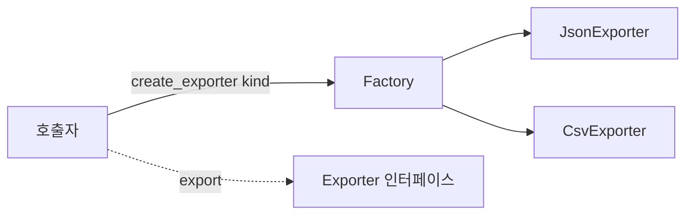

# 생성 패턴 (Creational Patterns)

- Level: Intermediate
- Prerequisites: [Engineering/Software-Design/SOLID.md](SOLID.md), [Programming/OOP.md](../../Programming/OOP.md)
- Status: Draft
- Reviewed-by: -
- Depth: Deep-dive (자기완결)

---

## 개념 (Concept)

생성 패턴은 **객체 생성 책임을 사용 코드에서 분리**하는 디자인 패턴이다. Factory(구현 선택 은닉), Builder(복잡한 조립), Singleton(단일 인스턴스), Abstract Factory(제품군). 생성 규칙의 *변화 가능성*을 호출자와 떼어 놓는 것이 핵심.

## 직관 (Intuition)

생성이 한 줄이면 패턴이 필요 없다. 하지만 "어떤 구현체를 만들지 조건에 따라 다르거나", "옵션이 많고 조립·검증이 복잡"하면 생성 로직이 여러 곳에 흩어진다. 생성 패턴은 이 로직을 **한 곳으로 모아** 변경 영향을 줄인다.

## 이론 (Theory)

| 패턴 | 언제 | 주의 |
|---|---|---|
| Factory | 구체 클래스를 호출자가 몰라야 할 때 | 분기 폭증 시 등록 테이블로 |
| Builder | 옵션 많음 / 단계적 조립 / 불변 객체 | 작은 생성엔 과함 |
| Singleton | 전역 단일 인스턴스 | **전역 상태 → 테스트·동시성 난점** |
| Abstract Factory | 일관된 제품군 생성 | 추상화 비용 큼 |



## 구현 (Implementation)

```python
# Factory: 구체 선택을 한 곳에
def create_exporter(kind):
    return {"json": JsonExporter, "csv": CsvExporter}[kind]()   # 등록 테이블

# Builder: 옵션 많은 불변 객체를 읽기 쉽게 조립
class QueryBuilder:
    def __init__(self): self._parts = {}
    def table(self, t): self._parts["table"] = t; return self    # 메서드 체이닝
    def where(self, c): self._parts.setdefault("where", []).append(c); return self
    def build(self):
        w = " AND ".join(self._parts.get("where", [])) or "1=1"
        return f"SELECT * FROM {self._parts['table']} WHERE {w}"

q = QueryBuilder().table("users").where("age>20").where("active").build()
# SELECT * FROM users WHERE age>20 AND active
```

**워크드 예제(Singleton 테스트 난점).** 전역 Singleton DB 커넥션을 쓰면, 테스트 A가 바꾼 상태가 테스트 B로 새어 **테스트 격리가 깨진다**. 그래서 생성을 경계로 밀어내(DI) 테스트에서 가짜를 주입하는 편이 낫다.

## 복잡도 (Complexity)

런타임보다 **구조적 비용**이 핵심. 작은 코드에 과한 패턴은 파일·타입 수만 늘린다. 생성 규칙이 **여러 곳 반복·변경 잦음**일 때 비용을 회수한다.

## 응용 (Applications)

- 외부 API 클라이언트 생성, 설정에 따른 저장소/전략 선택.
- 복잡한 request·query·테스트 fixture 조립, DI 컨테이너.

## 흔한 오해 (Common Misunderstandings)

- **Singleton은 편하지만 테스트·병렬을 어렵게** 한다(숨은 전역 상태).
- **Factory가 있으면 무조건 좋은 설계가 아니다** — 분기 1개면 불필요.
- **Builder가 매개변수 좀 많은 모든 함수에 필요한 건 아니다**.
- **패턴 이름보다 "왜 생성 책임을 분리하나"가 중요**.

## TMI

- DI는 Factory와 함께 객체 생성을 애플리케이션 경계로 밀어낸다.
- Builder는 불변 객체와 잘 어울린다(`build()` 가 완성된 불변값 반환).
- 많은 언어의 named argument·dataclass가 Builder 필요성을 줄인다(`Point(x=1, y=2)`).

## 연습 / 확인 문제 (Exercises)

- Factory로 호출자가 어떤 구체 지식에서 자유로워지는지 설명하라.
- Singleton이 테스트 격리를 깨는 예를 만들고 DI로 고쳐라.
- 옵션 많은 객체를 Builder(메서드 체이닝)로 조립하라.
- Factory의 if-분기가 폭증할 때 등록 테이블로 바꿔라.

## 이어서 읽기 (Reading Path)

- 이전: [SOLID](SOLID.md)
- 다음: [구조 패턴](Structural-Patterns.md)
- 관련: [리팩토링](Refactoring.md)

## 참조 (References)

- [Engineering/Software-Design/SOLID.md](SOLID.md)
- [Engineering/Software-Design/Refactoring.md](Refactoring.md)
- [Reference/Books.md](../../Reference/Books.md)
