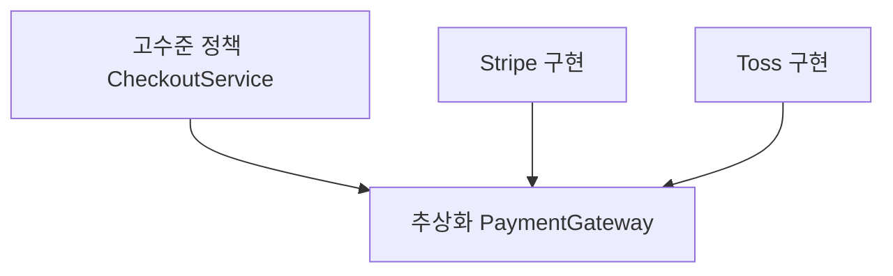

# SOLID 원칙

- Level: Intermediate
- Prerequisites: 객체지향 프로그래밍 기초
- Status: Draft
- Reviewed-by: -
- Depth: Deep-dive (자기완결)

---

## 개념 (Concept)

SOLID는 **변경 이유를 분리하고 의존 방향을 제어**하는 다섯 객체지향 설계 원칙이다 — 단일 책임(SRP), 개방-폐쇄(OCP), 리스코프 치환(LSP), 인터페이스 분리(ISP), 의존성 역전(DIP). 법칙이 아니라 *트레이드오프를 탐색하는 질문*이다.

## 직관 (Intuition)

서로 다른 이유로 바뀌는 코드를 한 덩어리에 두면 작은 변경이 연쇄 수정으로 번진다. 역할과 계약(contract)을 분리하고, **고수준 정책이 구체 구현이 아니라 추상화에 의존**하게 한다. 단, 추상화 비용이 실제 변경 가능성보다 크면 overengineering이다.

## 이론 (Theory)

| 원칙 | 핵심 질문 |
|---|---|
| SRP | 이 모듈의 변경 이유가 하나의 actor에 모이는가? |
| OCP | 새 behavior를 기존 핵심 *수정* 대신 *확장*으로 추가할 수 있는가? |
| LSP | subtype이 base **계약(pre/post/invariant)** 을 깨지 않고 대체되는가? |
| ISP | client가 쓰지 않는 method에 의존하는가? |
| DIP | 정책이 세부 구현이 아니라 추상화에 의존하는가? |



DIP의 핵심: 화살표가 **둘 다 추상화를 향한다**(구체→추상). 정책은 구현을 모른다.

## 구현 (Implementation)

```python
# SRP 위반 → 분리 (한 클래스가 계산·저장·알림 3가지 변경 이유)
class OrderBad:
    def total(self): ...
    def save_to_db(self): ...     # DB 스키마 변경 이유
    def send_email(self): ...     # 메일 템플릿 변경 이유

class Order:               def total(self): ...   # 하나의 이유(가격 규칙)
class OrderRepository:     def save(self, o): ...  # DB 변경
class OrderNotifier:       def notify(self, o): ...# 메일 변경

# DIP: 정책이 추상화에 의존
class PaymentGateway:
    def charge(self, amount): raise NotImplementedError
class CheckoutService:
    def __init__(self, gateway: PaymentGateway): self.gateway = gateway
    def checkout(self, total): return self.gateway.charge(total)   # 구현 무지
```

**워크드 예제(LSP 위반).** `Square(Rectangle)` 에서 `set_width(5)` 가 height까지 바꾸면, "너비만 바꿔도 높이는 그대로"라는 Rectangle 계약이 깨진다 → `area = w*h` 를 가정한 기존 코드가 정사각형에서 오작동. 상속이 LSP를 자동 보장하지 않는 고전 예.

## 복잡도 (Complexity)

런타임이 아니라 **변경·테스트·의존 비용**을 다룬다. 인터페이스·객체 수가 늘어 인지 비용이 생기므로, **변동이 잦은 경계(volatile boundary)** 에만 선택 적용한다.

## 응용 (Applications)

- 도메인 서비스와 어댑터 분리(헥사고날), 테스트 더블 주입.
- 플러그인 아키텍처, 레거시 리팩토링 기준.

## 흔한 오해 (Common Misunderstandings)

- **클래스마다 함수 하나 = SRP 아니다** — "변경 이유(actor)"가 기준.
- **OCP는 "절대 수정 금지"가 아니다** — 자주 바뀌는 축을 확장점으로.
- **상속하면 LSP 자동 성립 아니다** — 계약(pre/post/invariant) 보존이 핵심.
- **인터페이스가 많을수록 좋은 설계 아니다** — ISP는 *불필요한 의존 제거*지 잘게 쪼개기 자체가 목적이 아니다.

## TMI

- LSP는 메서드 시그니처보다 **pre/postcondition·불변식**을 포함한다(행위적 부분형).
- DIP(원칙)와 dependency injection(구현 기법)은 구분된다 — DI 없이도 DIP 가능.
- "SOLID"라는 두문자어는 Bob Martin의 원칙들을 Michael Feathers가 재배열해 만들었다.

## 연습 / 확인 문제 (Exercises)

- 파일 저장·메일 전송·계산을 한 클래스에서 SRP로 분리하라(위 예 확장).
- Square/Rectangle로 LSP 위반을 재현하고 상속 대신 합성으로 고쳐라.
- 추상화가 불필요한 작은 코드(YAGNI) 사례를 들어라.
- DIP로 결제 게이트웨이를 교체 가능하게 만들어라.

## 이어서 읽기 (Reading Path)

- 이전: [클린 코드](Clean-Code.md)
- 다음: [생성 패턴](Creational-Patterns.md)
- 관련: [리팩토링](Refactoring.md)

## 참조 (References)

- [Engineering/Software-Design/Clean-Code.md](Clean-Code.md)
- [Engineering/Testing/Test-Doubles.md](../Testing/Test-Doubles.md)
- [Reference/Books.md](../../Reference/Books.md)
