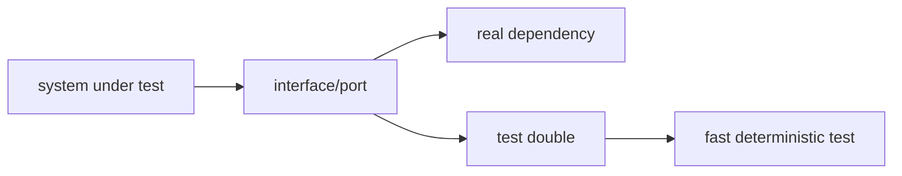

# 테스트 더블 (Test Doubles)

- Level: Intermediate
- Prerequisites: [Engineering/Testing/Unit-Test-Principles.md](Unit-Test-Principles.md), [Engineering/Software-Design/SOLID.md](../Software-Design/SOLID.md)
- Status: Draft
- Reviewed-by: -
- Depth: Deep-dive (자기완결)
- Depth: Deep-dive (자기완결)

---

## 개념 (Concept)

테스트 더블은 실제 의존성을 대신하는 테스트용 객체다. Dummy, Stub, Fake, Spy, Mock은 각각 입력 채우기, 고정 응답, 단순 구현, 호출 기록, 상호작용 검증에 쓰인다.

## 직관 (Intuition)

결제 API, 이메일 서버, 느린 DB를 매번 실제로 부르지 않고 무대 소품으로 바꿔 테스트한다. 중요한 것은 소품이 실제 계약을 얼마나 잘 대체하는가다.



## 이론 (Theory)

상태 검증은 결과 상태를 확인하고, 행위 검증은 특정 호출이 일어났는지 확인한다. Mock을 과도하게 쓰면 구현 세부사항에 테스트가 묶인다. Fake는 더 현실적이지만 유지보수 비용이 든다.

| 더블 | 목적 | 예 |
|---|---|---|
| Dummy | 채워 넣기만 함 | 사용하지 않는 logger |
| Stub | 정해진 응답 | 항상 성공하는 환율 API |
| Fake | 단순 실제 구현 | in-memory repository |
| Spy | 호출 기록 | 보낸 이메일 목록 저장 |
| Mock | 기대 상호작용 검증 | `send()`가 한 번 호출되어야 함 |

### Double 선택 기준

Dummy, stub, fake, spy, mock은 목적이 다르다. 값을 채우기만 하면 dummy, 정해진 응답을 주면 stub, 단순 구현으로 실제처럼 동작하면 fake, 호출 기록을 관찰하면 spy, interaction contract를 검증하면 mock이다.

테스트 더블은 경계를 제어하기 위한 도구다. 외부 시스템의 불안정성을 제거하는 데 쓰되, 실제 contract와 멀어지지 않도록 contract test나 integration test로 보완한다.

## 구현 (Implementation)

```python
class FakeEmailSender:
    def __init__(self):
        self.sent = []

    def send(self, to, body):
        self.sent.append((to, body))
```

사용 예:

```python
def welcome(user, email_sender):
    email_sender.send(user["email"], "welcome")

fake = FakeEmailSender()
welcome({"email": "a@example.com"}, fake)
assert fake.sent == [("a@example.com", "welcome")]
```

이 테스트는 "이메일 서버가 실제로 메일을 보냈다"가 아니라 "도메인 로직이 올바른 발송 요청을 만들었다"를 검증한다.

## 복잡도 (Complexity)

테스트 더블이 많아질수록 실제 시스템과의 drift를 관리해야 한다. 중요한 경계는 integration/contract test로 보완한다.

워크드 예제: 결제 API stub이 항상 `{"status": "paid"}`를 반환하지만 실제 API가 `{"state": "succeeded"}`로 바뀌면 단위 테스트는 계속 통과하고 운영은 실패한다. 그래서 외부 API 경계는 contract test나 sandbox integration test로 더블의 계약을 주기적으로 검증해야 한다.

## 응용 (Applications)

- 외부 API 호출 격리
- 시간·랜덤성 제어
- 느린 저장소 대체
- 실패 상황 재현

## 흔한 오해 (Common Misunderstandings)

- Mock은 모든 테스트에 필요한 기본값이 아니다.
- Stub 응답이 실제 API와 달라지면 테스트가 거짓 안정감을 준다.
- 내부 메서드 호출을 너무 자세히 검증하면 리팩터링이 어려워진다.
- Fake가 실제 DB의 transaction semantics를 완전히 대체하지는 않는다.

## TMI

- "London school"은 mock 기반 상호작용 검증을 더 선호하는 스타일로 알려져 있다.
- Test clock은 시간 의존 코드를 안정적으로 테스트하게 해 준다.
- In-memory fake는 빠르지만 실제 query 제약을 놓칠 수 있다.

## 연습 / 확인 문제 (Exercises)

- 이메일 발송 로직에 Fake와 Spy를 각각 적용하라.
- Mock을 쓰면 안 좋은 사례를 하나 설명하라.
- 외부 결제 API를 대체하는 테스트 더블의 계약을 정의하라.

## 이어서 읽기 (Reading Path)

- 이전: [단위 테스트 원칙](Unit-Test-Principles.md)
- 다음: [테스트 가능한 설계](Testable-Design.md), [계약 테스트](Contract-Testing.md)

## 참조 (References)

- [Engineering/Testing/Unit-Test-Principles.md](Unit-Test-Principles.md)
- [Reference/Books.md](../../Reference/Books.md)
