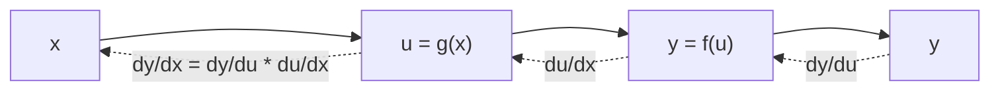

# 연쇄 법칙 (Chain Rule)

- Level: Intermediate
- Prerequisites: [Math/Calculus/Differentiation.md](Differentiation.md)
- Status: Draft
- Reviewed-by: -
- Depth: Deep-dive (자기완결)

---

## 개념 (Concept)

연쇄 법칙은 **합성 함수**의 도함수를 구하는 규칙이다. $y = f(g(x))$처럼 함수가 함수 안에 들어 있을 때, 바깥 함수의 변화율과 안쪽 함수의 변화율을 **곱한다**.

## 직관 (Intuition)

기어를 떠올리자. 페달이 한 바퀴 돌 때 중간 기어가 2배 빨리 돌고, 그 기어가 돌 때 바퀴가 3배 빨리 돈다면, 페달 대비 바퀴는 $2 \times 3 = 6$배 빠르다. 변화율은 단계마다 곱해진다.



## 이론 (Theory)

단변수 형태:

$$\frac{d}{dx} f(g(x)) = f'(g(x)) \cdot g'(x)$$

라이프니츠 표기로는 $y = f(u),\ u = g(x)$일 때

$$\frac{dy}{dx} = \frac{dy}{du} \cdot \frac{du}{dx}$$

여러 함수가 겹치면 곱이 계속 이어진다. 다변수에서는 각 경로의 기여를 더하는 형태로 확장되며, 이것이 신경망 **역전파**의 수학적 뼈대다.

### 계산 그래프에서의 지역 기울기

$x\to u\to y$처럼 계산이 이어질 때 각 노드는 자신의 입력에 대한 지역 기울기만 알면 된다. 뒤쪽에서 흘러온 기울기(upstream gradient)에 지역 기울기를 곱해 앞쪽으로 넘긴다.

예를 들어

$$
u=3x+1,\qquad y=u^2
$$

이면 $dy/du=2u$, $du/dx=3$이고,

$$
\frac{dy}{dx}=2u\cdot3=6(3x+1)
$$

이다. $x=2$에서는 $u=7$, $dy/dx=42$다.

### 다변수 연쇄 법칙

$z=f(x,y)$이고 $x=x(t)$, $y=y(t)$이면

$$
\frac{dz}{dt}
=\frac{\partial f}{\partial x}\frac{dx}{dt}
+\frac{\partial f}{\partial y}\frac{dy}{dt}
$$

처럼 가능한 경로의 기여가 더해진다. 벡터 함수에서는 야코비안 행렬 곱으로 일반화된다. 행렬 모양을 맞추는 것이 중요하다.

| 상황 | 연쇄 법칙 형태 |
|---|---|
| 스칼라 합성 | 기울기 곱 |
| 여러 경로 | 경로별 곱의 합 |
| 벡터 합성 | 야코비안 곱 |
| 계산 그래프 | upstream gradient × local gradient |

## 구현 (Implementation)

$h(x) = (3x + 1)^2$의 도함수는 $h'(x) = 2(3x+1)\cdot 3 = 6(3x+1)$이다.

```python
def derivative(f, x, h=1e-6):
    return (f(x + h) - f(x - h)) / (2 * h)

h = lambda x: (3 * x + 1) ** 2
print(derivative(h, 2))      # ~42.0
print(6 * (3 * 2 + 1))       # 42  (연쇄 법칙 결과와 일치)
```

작은 계산 그래프를 수동 역전파로 쓰면 구조가 보인다.

```python
x = 2.0
u = 3 * x + 1
y = u ** 2

dy_du = 2 * u
du_dx = 3
dy_dx = dy_du * du_dx
print(y, dy_dx)              # 49.0, 42.0
```

## 복잡도 (Complexity)

| 항목 | 비용 |
|---|---|
| 합성 깊이 `k`의 연쇄 미분 | 곱셈 `k`회 |
| 역전파(노드 `n`개 계산 그래프) | `O(n)` (한 번의 역방향 순회) |

역전파가 강력한 이유는, 연쇄 법칙을 그래프 뒤에서 앞으로 한 번만 훑어 모든 파라미터의 기울기를 `O(n)`에 구하기 때문이다.

수치 미분으로 파라미터 `p`개의 기울기를 구하면 함수 평가가 대략 `2p`번 필요하다. 반면 역전파는 중간값을 저장해 두었다가 역방향으로 재사용하므로, 많은 파라미터가 있어도 한 번의 forward/backward pass로 전체 기울기를 얻는다.

## 응용 (Applications)

- 신경망 역전파(층마다 국소 기울기를 곱해 전파)
- 합성된 손실 함수의 기울기 계산
- 변수 치환을 통한 미분·적분
- 물리·경제의 다단계 변화율 분석

## 흔한 오해 (Common Misunderstandings)

- 안쪽 함수의 도함수 $g'(x)$를 빼먹는 실수가 가장 흔하다. 바깥만 미분하면 틀린다.
- 역전파는 새로운 미분법이 아니라 연쇄 법칙을 효율적으로 적용하는 알고리즘이다.
- 곱의 순서는 스칼라에서는 상관없지만, 다변수(야코비안 행렬)에서는 행렬 곱이라 순서가 중요하다.
- 계산 그래프에서 같은 값이 여러 경로로 쓰이면, 그 값으로 들어오는 gradient는 경로별 기여를 모두 더해야 한다.
- forward pass의 중간값을 저장하지 않으면 backward에서 지역 기울기를 다시 계산하거나 비싼 재연산을 해야 한다.

## TMI

- "역전파(backpropagation)"는 1980년대에 신경망 학습으로 대중화됐지만, 그 핵심은 200년도 더 된 연쇄 법칙이다.
- 딥러닝 프레임워크의 자동 미분은 연쇄 법칙을 계산 그래프에 기계적으로 적용한 것이다. 순전파에서 그래프를 만들고, 역전파에서 거꾸로 곱해 내려온다.

## 연습 / 확인 문제 (Exercises)

- $h(x) = \sin(x^2)$의 도함수를 연쇄 법칙으로 구하라.
- $y = (2x+3)^5$를 미분하고 수치 미분으로 검증하라.
- 2층 합성 $f(g(h(x)))$의 도함수를 연쇄 법칙으로 써 보라.
- $z=x^2+y^2$, $x=t$, $y=t^2$일 때 $dz/dt$를 다변수 연쇄 법칙으로 구하라.
- 같은 중간값이 두 출력 경로에 쓰이는 계산 그래프를 만들고 gradient가 더해지는 지점을 표시하라.

## 이어서 읽기 (Reading Path)

- 이전: [미분](Differentiation.md)
- 다음: [편미분과 그래디언트](Partial-Derivatives.md)
- 관련: [경사 하강법](../Optimization/Gradient-Descent.md)

## 참조 (References)

- [Math/Calculus/Differentiation.md](Differentiation.md)
- [Reference/Books.md](../../Reference/Books.md)
- [Reference/Courses.md](../../Reference/Courses.md)
