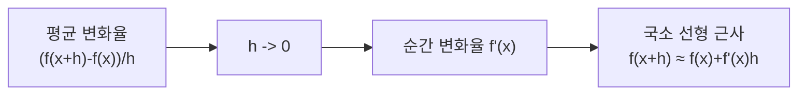

# 미분 (Differentiation)

- Level: Intermediate
- Prerequisites: 함수와 극한의 직관(본문에서 최소한으로 다시 설명), 고등학교 수학
- Status: Draft
- Reviewed-by: -
- Depth: Deep-dive (자기완결)

---

## 개념 (Concept)

미분은 함수가 한 점에서 얼마나 빠르게 변하는지를 재는 도구다. 도함수 $f'(x)$는 그 점에서의 **순간 변화율**이자 곡선에 그은 **접선의 기울기**다.

## 직관 (Intuition)

자동차의 평균 속도는 "거리 ÷ 시간"이다. 측정 구간을 점점 짧게 줄여 0에 가깝게 보내면, 어느 한 순간의 속도(순간 변화율)가 된다. 미분은 이 "구간을 0으로 보내는" 극한을 정식화한 것이다.



## 이론 (Theory)

도함수의 정의는 다음과 같다.

$$f'(x) = \lim_{h \to 0} \frac{f(x+h) - f(x)}{h}$$

자주 쓰는 규칙:

| 규칙 | 식 |
|---|---|
| 거듭제곱 | $\dfrac{d}{dx} x^n = n\,x^{n-1}$ |
| 합 | $(f+g)' = f' + g'$ |
| 곱 | $(fg)' = f'g + fg'$ |
| 몫 | $\left(\dfrac{f}{g}\right)' = \dfrac{f'g - fg'}{g^2}$ |

도함수가 $0$이 되는 점은 극값 후보다. 다만 $f'(x)=0$이라고 항상 극값은 아니다(예: $f(x)=x^3$의 $x=0$).

### 미분 가능성은 선형 근사 가능성이다

$f$가 $x=a$에서 미분 가능하다는 것은 작은 변화 $\Delta x$에 대해

$$
f(a+\Delta x)=f(a)+f'(a)\Delta x+\text{작은 오차}
$$

로 잘 근사된다는 뜻이다. 즉 도함수는 단순한 기울기 공식이 아니라, 함수가 그 점 주변에서 가장 잘 맞는 직선의 계수다. 이 관점은 테일러 전개와 gradient descent의 출발점이다.

### 극값 판정의 기본 흐름

1. 도함수가 0이거나 정의되지 않는 임계점을 찾는다.
2. 구간 끝점이 있으면 함께 후보에 넣는다.
3. 1차 도함수 부호 변화 또는 2차 도함수로 판정한다.

2차 도함수 $f''(a)>0$이면 아래로 볼록해 국소 최소, $f''(a)<0$이면 국소 최대 후보다. $f''(a)=0$이면 판정이 실패할 수 있어 별도 분석이 필요하다.

### 수치 미분 오차의 균형

중심 차분은 절단 오차(truncation error)와 반올림 오차(rounding error)의 균형을 잡아야 한다. $h$가 크면 접선 대신 넓은 구간의 평균 기울기를 보고, $h$가 너무 작으면 $f(x+h)$와 $f(x-h)$가 거의 같아져 뺄셈 상쇄가 커진다.

## 구현 (Implementation)

해석적 도함수가 없을 때는 수치 미분(중심 차분)으로 근사한다.

```python
def derivative(f, x, h=1e-6):
    return (f(x + h) - f(x - h)) / (2 * h)

print(derivative(lambda x: x**2, 3))   # ~6.0  (f'(x) = 2x)
print(derivative(lambda x: x**3, 0))   # ~0.0
```

선형 근사의 품질도 직접 확인할 수 있다.

```python
def linearize(f, df, a, x):
    return f(a) + df(a) * (x - a)

f = lambda x: x**2
df = lambda x: 2 * x
print(linearize(f, df, a=3, x=3.1))    # 9.6
print(f(3.1))                          # 9.61
```

## 복잡도 (Complexity)

| 방법 | 비용 |
|---|---|
| 해석적 도함수 평가 | `O(1)` (식이 정해져 있으면) |
| 수치 미분(한 점) | 함수 평가 2회 |

수치 미분은 간단하지만 `h`가 너무 작으면 부동소수점 오차가 커진다.

변수 $n$개 함수의 그래디언트를 수치 미분으로 구하면 보통 함수 평가가 `2n`번 필요하다. 그래서 딥러닝처럼 파라미터가 많은 문제에서는 자동 미분과 역전파가 필수다.

## 응용 (Applications)

- 최적화: 기울기가 0인 점에서 최소/최대 탐색
- 경사 하강법과 신경망 학습의 출발점
- 물리(속도·가속도), 경제(한계 비용)
- 곡선의 증가·감소·볼록성 분석

## 흔한 오해 (Common Misunderstandings)

- 미분 가능하면 연속이지만, 연속이라고 미분 가능한 것은 아니다(예: $|x|$의 $x=0$).
- $f'(x)=0$이 항상 극값을 뜻하지는 않는다. 변곡점일 수 있다.
- 수치 미분의 `h`는 작을수록 좋은 게 아니다. 너무 작으면 오차가 커진다.
- 도함수가 존재하지 않는 점도 최솟값/최댓값 후보가 될 수 있다. $|x|$의 0이 대표적이다.
- 도함수 값의 단위는 "출력 단위 / 입력 단위"다. 물리·경제 해석에서는 단위가 의미를 결정한다.

## TMI

- 미분은 17세기 뉴턴과 라이프니츠가 거의 동시에 독립적으로 정립했고, 표기법 우선권을 둘러싼 유명한 논쟁이 있었다. 오늘날 쓰는 $\frac{dy}{dx}$ 표기는 라이프니츠의 것이다.
- 자동 미분(autodiff)은 수치 미분도 기호 미분도 아닌 제3의 방법으로, 딥러닝 프레임워크가 기울기를 정확·효율적으로 계산하는 핵심 기술이다.

## 연습 / 확인 문제 (Exercises)

- $f(x) = 3x^2 + 2x + 1$의 도함수를 손으로 구하고 수치 미분과 비교하라.
- $f(x) = x^3$에서 $f'(0)=0$이지만 극값이 아님을 그래프로 설명하라.
- 수치 미분에서 `h`를 `1e-2`부터 `1e-12`까지 바꿔 가며 오차가 어떻게 변하는지 관찰하라.
- $f(x)=|x|$가 0에서 연속이지만 미분 불가능함을 좌미분·우미분으로 설명하라.
- $f(x)=x^4$에서 2차 도함수 판정이 $x=0$에서 왜 결정적이지 않은지 확인하라.

## 이어서 읽기 (Reading Path)

- 이전: [극한과 연속](Limits.md) (이 문서는 필요한 극한 직관을 요약해 독립적으로 읽을 수 있음)
- 다음: [연쇄 법칙](Chain-Rule.md), [편미분과 그래디언트](Partial-Derivatives.md)
- 관련: [적분](Integration.md), [테일러 전개](Taylor-Series.md)

## 참조 (References)

- [Math/Optimization/Gradient-Descent.md](../Optimization/Gradient-Descent.md)
- [Reference/Books.md](../../Reference/Books.md)
- [Reference/Courses.md](../../Reference/Courses.md)
