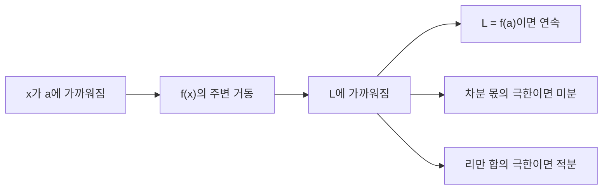

# 극한과 연속 (Limits and Continuity)

- Level: Beginner
- Prerequisites: 없음
- Status: Draft
- Reviewed-by: -
- Depth: Deep-dive (자기완결)

---

## 개념 (Concept)

극한은 입력이 어떤 값에 한없이 가까워질 때 함수값이 다가가는 값이다. 연속은 함수가 그 점에서 "끊김 없이" 이어지는 성질로, 극한값과 함수값이 일치함을 뜻한다. 미적분 전체의 출발점이다.

## 직관 (Intuition)

"$x$가 2에 가까워지면 $f(x)$는 무엇에 가까워지는가?"라는 질문이 극한이다. 실제로 2를 대입할 수 없거나(0/0 꼴) 정의되지 않아도, 주변의 거동으로 값을 추론한다. 미분(순간 변화율)과 적분(넓이의 극한)은 모두 이 "한없이 가까이"라는 아이디어 위에 세워진다.



## 이론 (Theory)

$\varepsilon$-$\delta$ 정의: $\lim_{x\to a}f(x)=L$이란, 모든 $\varepsilon>0$에 대해 어떤 $\delta>0$가 존재해

$$0<|x-a|<\delta \implies |f(x)-L|<\varepsilon$$

좌극한·우극한이 같아야 극한이 존재한다. 연속은 $\lim_{x\to a}f(x)=f(a)$. 연속 함수는 합·곱·합성에 닫혀 있다.

핵심 정리:
- **중간값 정리**: $[a,b]$에서 연속이고 $f(a)<y<f(b)$이면 $f(c)=y$인 $c$가 존재.
- **최대·최소 정리**: 닫힌 구간의 연속 함수는 최댓값·최솟값을 가진다.

부정형 $0/0,\ \infty/\infty$는 인수분해, 유리화, 또는 로피탈 정리로 푼다.

### 대입, 약분, 그리고 구멍

극한은 그 점의 함수값보다 주변 값의 추세를 본다. 예를 들어

$$
\lim_{x\to2}\frac{x^2-4}{x-2}
$$

는 $x=2$에서 원래 식이 정의되지 않는다. 하지만 $x\ne2$일 때

$$
\frac{x^2-4}{x-2}=\frac{(x-2)(x+2)}{x-2}=x+2
$$

이므로 주변의 함수값은 $x+2$와 같고 극한은 4다. 그래프 관점에서는 $x=2$에 구멍이 하나 뚫렸지만, 그 구멍을 향해 다가가는 높이는 4로 정해진다.

### 연속성의 세 조건

$f$가 $a$에서 연속이려면 다음이 모두 필요하다.

| 조건 | 실패하면 |
|---|---|
| $f(a)$가 정의됨 | 함수값 자체가 없음 |
| $\lim_{x\to a} f(x)$가 존재함 | 좌우 또는 경로가 다르게 접근 |
| $\lim_{x\to a} f(x)=f(a)$ | 구멍 또는 점프 불연속 |

이 세 조건을 분리해서 보면 removable discontinuity, jump discontinuity, infinite discontinuity를 더 쉽게 구분할 수 있다.

### $\varepsilon$-$\delta$ 정의의 읽는 법

정의는 "출력 오차를 $\varepsilon$ 안에 넣고 싶다면, 입력을 $\delta$ 안에 넣으면 된다"는 보장이다. $\delta$는 보통 $\varepsilon$에 의존해 작아져도 된다. 중요한 것은 임의로 작은 출력 허용오차에도 대응할 입력 허용오차를 찾을 수 있다는 점이다.

## 구현 (Implementation)

```python
def limit_estimate(f, a, side="both", h=1e-6):
    if side == "right":
        return f(a + h)
    if side == "left":
        return f(a - h)
    left, right = f(a - h), f(a + h)   # 좌/우 극한 비교
    return (left + right) / 2 if abs(left - right) < 1e-4 else None
```

수치적 추정은 직관용이며, 엄밀한 극한은 대수적/해석적으로 구한다.

좌우 극한이 다른 경우를 코드로도 감지할 수 있다.

```python
step = lambda x: 0 if x < 0 else 1
print(limit_estimate(step, 0))          # None: 좌우가 다름
print(limit_estimate(lambda x: (x*x - 4) / (x - 2), 2))
```

두 번째 예시는 실제 `x=2`를 대입하지 않고 주변의 `2±h`를 평가한다. 그래서 구멍이 있는 함수의 극한을 추정할 수 있다.

## 복잡도 (Complexity)

극한·연속은 해석적 성질이라 알고리즘 복잡도와 직접 관계는 없다. 다만 수치적 추정은 작은 $h$에서 부동소수점 반올림 오차에 민감해, 너무 작은 $h$는 오히려 정확도를 해친다(상쇄 오차).

## 응용 (Applications)

- 미분·적분의 정의 기반
- 알고리즘의 점근 분석(연속적 근사)
- 수치해석의 수렴 판정
- 최적화에서 함수의 거동 분석

## 흔한 오해 (Common Misunderstandings)

- 극한이 존재해도 그 점에서 함수가 정의되거나 연속일 필요는 없다.
- $0/0$은 "값이 없다"가 아니라 "더 따져 봐야 한다"는 부정형이다.
- 연속이라고 미분 가능한 것은 아니다(예: $|x|$는 0에서 연속이나 미분 불가).
- 수치적으로 $h$를 0에 가깝게 둘수록 항상 정확해지지는 않는다.
- 좌극한과 우극한 중 하나만 존재한다고 양쪽 극한이 존재하는 것은 아니다.
- 그래프가 손으로 보기에는 이어져 보여도, 정의역의 빠진 점이나 조각별 정의 때문에 연속성이 깨질 수 있다.

## TMI

- $\varepsilon$-$\delta$ 정의는 19세기 코시·바이어슈트라스가 미적분을 엄밀화하며 정립했다.
- 바이어슈트라스 함수는 "모든 점에서 연속이지만 어디서도 미분 불가능"한 충격적 예다.
- 로피탈 정리는 실은 그의 스승 베르누이의 결과로 알려져 있다.

## 연습 / 확인 문제 (Exercises)

- $\lim_{x\to 2}\frac{x^2-4}{x-2}$를 인수분해로 구하라.
- 좌극한과 우극한이 다른 함수의 예를 들고 극한이 없는 이유를 설명하라.
- 중간값 정리로 $x^3-x-1=0$이 $[1,2]$에 근을 가짐을 보여라.
- $f(0)=1$, $x\ne0$에서는 $f(x)=x$인 함수가 0에서 연속인지 세 조건으로 판정하라.
- $\varepsilon=0.01$일 때 $f(x)=2x+1$의 $x\to3$ 극한을 보장하는 $\delta$ 하나를 찾아라.

## 이어서 읽기 (Reading Path)

- 이전: [Math/Calculus/](README.md)
- 다음: [미분](Differentiation.md), [편미분과 그래디언트](Partial-Derivatives.md)

## 참조 (References)

- [Math/Calculus/Differentiation.md](Differentiation.md)
- [Math/Real-Analysis/Continuity.md](../Real-Analysis/Continuity.md)
- [Reference/Books.md](../../Reference/Books.md)
