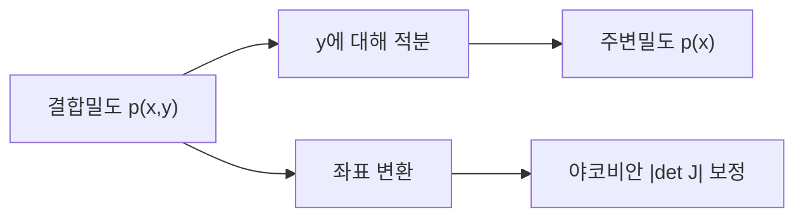

# 다변수 적분 (Multivariable Integration)

- Level: Advanced
- Prerequisites: [Math/Calculus/Integration.md](Integration.md), [Math/Calculus/Partial-Derivatives.md](Partial-Derivatives.md)
- Status: Draft
- Reviewed-by: -
- Depth: Deep-dive (자기완결)

---

## 개념 (Concept)

다변수 적분은 2차원 이상 영역에서 함수의 누적을 구한다. 이중·삼중 적분은 부피·질량·확률을 계산하고, 변수 변환(야코비안)으로 좌표계를 바꾼다. 확률과 머신러닝의 주변화에서 핵심이다.

## 직관 (Intuition)

1차원 적분이 곡선 아래 넓이라면, 이중 적분은 곡면 아래 부피다. 영역을 작은 격자 조각으로 쪼개 함수값에 면적을 곱해 더한다. 결합확률밀도를 한 변수에 대해 적분하면 다른 변수의 주변분포가 나온다 — 이것이 다변수 적분이 통계에서 끊임없이 등장하는 이유다.



## 이론 (Theory)

이중 적분은 리만 합의 극한이다.

$$\iint_R f(x,y)\,dA=\lim \sum f(x_i,y_j)\,\Delta A$$

**푸비니 정리**: 충분히 좋은 함수는 반복 적분으로 계산하며 순서를 바꿔도 된다.

$$\iint_R f\,dA=\int_a^b\!\!\int_{g_1(x)}^{g_2(x)} f(x,y)\,dy\,dx$$

**변수 변환**은 야코비안 행렬식으로 부피 비율을 보정한다.

$$\iint f\,dx\,dy=\iint f\big(x(u,v),y(u,v)\big)\,\Big|\det \tfrac{\partial(x,y)}{\partial(u,v)}\Big|\,du\,dv$$

극좌표·구면좌표 변환이 대표 예다.

### 영역을 먼저 그린다

반복 적분의 한계는 영역 $R$을 어떤 순서로 훑는지에 따라 달라진다. 직사각형이 아닌 영역에서는 적분 순서를 바꿀 때 경계 함수도 다시 써야 한다.

예를 들어 $R=\{(x,y):0\le y\le x\le1\}$이면

$$
\int_0^1\int_0^x f(x,y)\,dy\,dx
$$

로 쓸 수 있다. 순서를 바꾸면 $0\le y\le1$, $y\le x\le1$이므로

$$
\int_0^1\int_y^1 f(x,y)\,dx\,dy
$$

가 된다.

### 극좌표의 야코비안

$x=r\cos\theta$, $y=r\sin\theta$이면

$$
\left|\det\frac{\partial(x,y)}{\partial(r,\theta)}\right|=r
$$

이다. 그래서 $dx\,dy$는 $r\,dr\,d\theta$로 바뀐다. 이 $r$은 반지름이 커질수록 같은 $d\theta$가 더 긴 호를 나타내는 면적 보정이다.

단위원에서 $x^2+y^2$를 적분하면

$$
\int_0^{2\pi}\int_0^1 r^2\cdot r\,dr\,d\theta
=2\pi\left[\frac{r^4}{4}\right]_0^1
=\frac{\pi}{2}
$$

이다.

### 확률의 주변화

결합밀도 $p(x,y)$가 있을 때

$$
p(x)=\int p(x,y)\,dy
$$

는 $y$의 모든 가능성을 합쳐 $x$만의 밀도를 얻는 과정이다. 베이즈 추론에서 증거(evidence)나 예측분포를 계산할 때 같은 원리가 반복된다.

## 구현 (Implementation)

```python
def double_integral(f, x0, x1, y0, y1, n=200):
    hx, hy = (x1 - x0) / n, (y1 - y0) / n
    total = 0.0
    for i in range(n):
        for j in range(n):
            xc = x0 + (i + 0.5) * hx          # 중점 규칙
            yc = y0 + (j + 0.5) * hy
            total += f(xc, yc)
    return total * hx * hy

print(double_integral(lambda x, y: x * y, 0.0, 1.0, 0.0, 2.0))
```

단순 몬테카를로는 영역에서 균등 표본을 뽑아 평균에 영역 크기를 곱한다.

```python
import random
import math

def unit_disk_integral_mc(f, samples=10000):
    total = 0.0
    for _ in range(samples):
        r = math.sqrt(random.random())
        theta = 2 * math.pi * random.random()
        x, y = r * math.cos(theta), r * math.sin(theta)
        total += f(x, y)
    return math.pi * total / samples
```

## 복잡도 (Complexity)

$d$차원 격자 적분은 차원마다 $n$개 분할이면 `O(n^d)`로 지수적으로 폭발한다(차원의 저주). 이 때문에 고차원에서는 몬테카를로 적분이 사실상 유일한 실용 해법이며, 표본 수 $N$에 대해 오차가 차원과 무관하게 `O(1/√N)`이다.

## 응용 (Applications)

- 결합분포에서 주변분포·기댓값 계산
- 질량 중심·관성 모멘트 등 물리량
- 베이즈 추론의 증거(분모) 적분
- 영역·부피·표면적 계산

## 흔한 오해 (Common Misunderstandings)

- 적분 순서를 바꿀 때 적분 한계도 함께 바뀐다(영역을 다시 기술해야 한다).
- 변수 변환에서 야코비안을 빠뜨리면 부피 보정이 안 돼 틀린다.
- 푸비니 정리는 항상 성립하지 않는다(절대적분 가능 등 조건 필요).
- 고차원에서 격자 적분을 늘리는 것은 비현실적이다.
- 극좌표에서 $r$을 빠뜨리는 실수는 매우 흔하다. 이는 단순 표기 문제가 아니라 면적 보정 누락이다.
- 주변화는 최댓값을 고르는 것이 아니라 다른 변수의 모든 가능성을 적분해 없애는 것이다.

## TMI

- 가우스 적분 $\int_{-\infty}^\infty e^{-x^2}dx=\sqrt\pi$는 이중 적분과 극좌표 변환으로 우아하게 증명된다.
- 차원의 저주는 적분뿐 아니라 최근접 탐색·표본화 전반을 괴롭히는 고차원의 공통 난제다.
- 몬테카를로 적분은 2차 세계대전 중 핵 시뮬레이션에서 비롯됐다.

## 연습 / 확인 문제 (Exercises)

- $\iint_R xy\,dA$를 $R=[0,1]\times[0,2]$에서 계산하라.
- 극좌표 변환으로 단위원에서 $\iint (x^2+y^2)\,dA$를 구하라.
- 적분 순서를 바꾸어 같은 결과가 나옴을 한 예에서 확인하라.
- 삼각형 영역 $0\le y\le x\le1$의 적분 순서를 바꾸어 한계를 다시 써라.
- 독립 결합밀도 $p(x,y)=p(x)p(y)$에서 주변화하면 원래 $p(x)$가 나오는지 확인하라.

## 이어서 읽기 (Reading Path)

- 이전: [적분](Integration.md)
- 다음: [Math/Probability-Statistics/Distributions.md](../Probability-Statistics/Distributions.md), [Math/Probability-Statistics/Bayes-Theorem.md](../Probability-Statistics/Bayes-Theorem.md)

## 참조 (References)

- [Math/Calculus/Integration.md](Integration.md)
- [Math/Probability-Statistics/Distributions.md](../Probability-Statistics/Distributions.md)
- [Reference/Books.md](../../Reference/Books.md)
