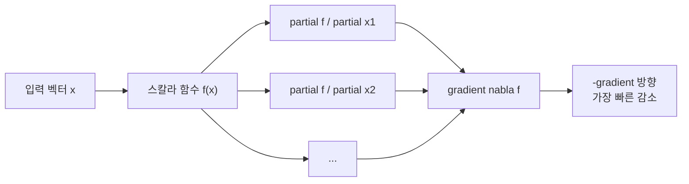

# 편미분과 그래디언트 (Partial Derivatives and Gradient)

- Level: Intermediate
- Prerequisites: [Math/Calculus/Differentiation.md](Differentiation.md), [Math/Linear-Algebra/Vectors.md](../Linear-Algebra/Vectors.md)
- Status: Draft
- Reviewed-by: -
- Depth: Deep-dive (자기완결)

---

## 개념 (Concept)

편미분은 여러 변수 함수에서 한 변수만 변화시키고 나머지를 고정해 구한 변화율이다. 그래디언트는 모든 편미분을 모은 벡터로, 함수가 가장 빠르게 증가하는 방향을 가리킨다. 머신러닝 최적화의 핵심 도구다.

## 직관 (Intuition)

다변수 함수는 "여러 손잡이를 가진 장치"다. 편미분은 "한 손잡이만 돌리면 출력이 얼마나 변하나"를 본다. 그래디언트는 그 손잡이들의 민감도를 한데 모은 화살표로, "어느 방향으로 가야 가장 가파르게 오르는가"를 알려 준다. 경사하강은 그 반대 방향으로 내려간다.



## 이론 (Theory)

$f:\mathbb{R}^n\to\mathbb{R}$의 편미분과 그래디언트:

$$\frac{\partial f}{\partial x_i}=\lim_{h\to 0}\frac{f(\dots,x_i+h,\dots)-f(\dots,x_i,\dots)}{h},\qquad \nabla f=\Big(\frac{\partial f}{\partial x_1},\dots,\frac{\partial f}{\partial x_n}\Big)$$

방향 $u$(단위 벡터)로의 변화율은 방향 도함수 $D_u f=\nabla f\cdot u$이고, $\nabla f$ 방향에서 최대가 된다. 그래디언트는 등고선(level set)에 수직이다. 이차 정보는 헤시안 행렬 $H_{ij}=\partial^2 f/\partial x_i\partial x_j$로 담기며, 극값 판정과 곡률 분석에 쓰인다.

### 그래디언트가 가장 가파른 방향인 이유

방향 도함수는

$$
D_u f=\nabla f\cdot u=\|\nabla f\|\|u\|\cos\theta
$$

이다. $u$가 단위벡터이면 $\|u\|=1$이고, 값은 $\theta=0$일 때 최대가 된다. 즉 $\nabla f$와 같은 방향으로 움직일 때 함수값이 가장 빨리 증가하고, $-\nabla f$ 방향은 가장 빠른 감소 방향이다.

### 손계산 예제

$f(x,y)=x^2y+y^3$이면

$$
\frac{\partial f}{\partial x}=2xy,\qquad
\frac{\partial f}{\partial y}=x^2+3y^2
$$

이고 $(1,1)$에서 $\nabla f=(2,4)$다. 단위 방향 $u=(1,0)$으로의 방향 도함수는 $(2,4)\cdot(1,0)=2$다. 방향을 $u=\frac{1}{\sqrt5}(1,2)$로 잡으면 그래디언트 방향과 같아 변화율은 $\sqrt{20}$으로 최대가 된다.

### 야코비안과 헤시안

출력이 스칼라가 아니라 벡터 함수 $\mathbf{f}:\mathbb{R}^n\to\mathbb{R}^m$이면 모든 편미분을 모은 행렬

$$
J_{ij}=\frac{\partial f_i}{\partial x_j}
$$

을 야코비안이라 한다. 스칼라 함수의 gradient는 야코비안의 특수한 형태로 볼 수 있고, Hessian은 gradient를 한 번 더 미분한 행렬이다. 딥러닝의 역전파는 거대한 야코비안을 직접 만들지 않고, 필요한 벡터-야코비안 곱을 효율적으로 계산한다.

## 구현 (Implementation)

```python
def numerical_gradient(f, x, h=1e-5):
    grad = [0.0] * len(x)
    for i in range(len(x)):
        xp, xm = list(x), list(x)
        xp[i] += h; xm[i] -= h
        grad[i] = (f(xp) - f(xm)) / (2 * h)   # 중앙 차분 편미분
    return grad

print(numerical_gradient(lambda v: v[0]**2 * v[1] + v[1]**3, [1.0, 1.0]))
```

## 복잡도 (Complexity)

수치 그래디언트는 변수 $n$개마다 함수를 2번 평가해 `O(n)`번의 평가가 필요하다. 신경망에서는 역전파(자동 미분)가 순전파와 같은 차수의 비용으로 전체 그래디언트를 구해, 수치 미분보다 훨씬 효율적이다. 헤시안은 $n^2$ 항이라 큰 차원에서는 직접 계산을 피한다.

## 응용 (Applications)

- 경사하강·역전파 등 머신러닝 최적화
- 물리의 장(전위, 온도)의 변화 분석
- 영상 처리의 에지 검출(밝기 그래디언트)
- 등고선·표면의 법선 계산

## 흔한 오해 (Common Misunderstandings)

- 그래디언트는 "가장 가파른 증가" 방향이지 "목표를 향한" 방향이 아니다.
- 편미분이 모두 0(임계점)이라고 극값은 아니다(안장점 가능, 헤시안으로 판정).
- 그래디언트는 등고선을 따라가는 방향이 아니라 수직 방향이다.
- 미분 가능성은 모든 편미분 존재보다 강한 조건이다.
- 방향 도함수 공식 $D_u f=\nabla f\cdot u$에서는 $u$가 단위벡터여야 변화율 해석이 깔끔하다.
- 그래디언트의 크기는 좌표 스케일에 의존한다. 특징 스케일링이 최적화에 영향을 주는 이유다.

## TMI

- "gradient descent"의 음의 그래디언트 아이디어는 1847년 코시까지 거슬러 올라간다.
- 자동 미분은 수치 미분과 기호 미분의 장점을 합친 제3의 방법으로, 딥러닝 프레임워크의 심장이다.
- 영상의 그래디언트 크기는 소벨 필터 등으로 근사돼 에지 맵을 만든다.

## 연습 / 확인 문제 (Exercises)

- $f(x,y)=x^2y+y^3$의 그래디언트를 구하라.
- 점 $(1,1)$에서 방향 $u=(1,0)$로의 방향 도함수를 계산하라.
- 그래디언트가 등고선에 수직임을 간단한 2변수 예로 확인하라.
- $f(x,y)=x^2-y^2$의 원점에서 gradient와 Hessian을 구하고 안장점임을 설명하라.
- 입력 스케일을 $x'=10x$로 바꾸면 gradient 성분 해석이 어떻게 달라지는지 생각해 보라.

## 이어서 읽기 (Reading Path)

- 이전: [미분](Differentiation.md)
- 다음: [연쇄 법칙](Chain-Rule.md), [Math/Optimization/Gradient-Descent.md](../Optimization/Gradient-Descent.md)

## 참조 (References)

- [Math/Calculus/Chain-Rule.md](Chain-Rule.md)
- [Math/Optimization/Gradient-Descent.md](../Optimization/Gradient-Descent.md)
- [Reference/Books.md](../../Reference/Books.md)
