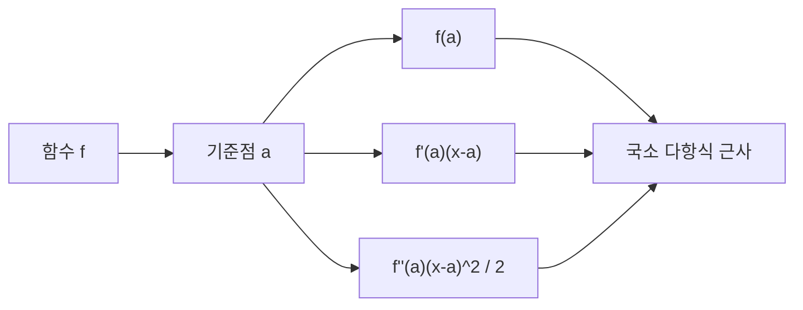

# 테일러 전개 (Taylor Series)

- Level: Intermediate
- Prerequisites: [Math/Calculus/Differentiation.md](Differentiation.md), [Math/Calculus/Limits.md](Limits.md)
- Status: Draft
- Reviewed-by: -
- Depth: Deep-dive (자기완결)

---

## 개념 (Concept)

테일러 전개는 매끄러운 함수를 한 점 주변에서 다항식(멱급수)으로 근사하는 방법이다. 도함수 정보를 모아 함수를 국소적으로 재구성하며, 수치해석·최적화·물리 근사의 기본 도구다.

## 직관 (Intuition)

복잡한 함수도 한 점 근처만 보면 "직선 + 약간의 곡률 + ..."로 점점 정밀하게 흉내 낼 수 있다. 1차 항은 접선, 2차 항은 곡률을 더한다. 차수를 높일수록 근사가 좋아진다. 많은 알고리즘이 어려운 함수를 이렇게 다항식으로 바꿔 다룬다.



## 이론 (Theory)

$a$ 근방에서 무한히 미분 가능한 $f$의 테일러 급수:

$$f(x)=\sum_{n=0}^{\infty}\frac{f^{(n)}(a)}{n!}(x-a)^n$$

$a=0$이면 매클로린 급수다. 예: $e^x=\sum x^n/n!$, $\sin x=x-\frac{x^3}{3!}+\cdots$. 유한 차수로 자르면 나머지항(라그랑주 형)이 오차를 지배한다.

$$R_n(x)=\frac{f^{(n+1)}(\xi)}{(n+1)!}(x-a)^{n+1}$$

수렴 반경 안에서만 급수가 함수와 일치한다. 1차 테일러는 선형 근사, 2차는 최적화의 뉴턴법·곡률 분석의 기반이다.

### 1차와 2차 근사의 의미

$a$ 근처에서

$$
f(x)\approx f(a)+f'(a)(x-a)
$$

는 접선 근사다. 여기에 곡률을 더하면

$$
f(x)\approx f(a)+f'(a)(x-a)+\frac12 f''(a)(x-a)^2
$$

가 된다. 최적화에서 gradient descent는 1차 정보를, Newton 방법은 2차 정보를 사용한다고 볼 수 있다.

다변수에서는

$$
f(\mathbf{x}+\Delta)\approx f(\mathbf{x})+\nabla f(\mathbf{x})^\top\Delta+\frac12\Delta^\top H(\mathbf{x})\Delta
$$

로 일반화된다. 여기서 $H$는 Hessian이다.

### 오차항을 읽는 법

라그랑주 나머지항은 다음 항이 얼마나 클 수 있는지 알려 준다. 예를 들어 $e^x$를 0 주변에서 $n$차로 근사할 때 $|x|\le r$이면 $f^{(n+1)}(\xi)=e^\xi\le e^r$로 묶어 오차 상한을 잡을 수 있다. 실제 수치 라이브러리는 테일러만 무작정 쓰지 않고, 입력 범위를 줄인 뒤 다항식 근사를 적용한다.

### 수렴과 해석성

무한히 미분 가능하다는 것과 테일러 급수가 함수와 같다는 것은 다르다. 테일러 급수가 수렴해도 그 합이 원래 함수가 아닐 수 있다. 따라서 "공식처럼 전개 가능하다"는 사실과 "그 전개가 관심 구간에서 유효하다"는 사실을 나누어 확인해야 한다.

## 구현 (Implementation)

```python
from math import factorial

def taylor_exp(x, terms=10):       # e^x의 매클로린 근사
    return sum(x ** n / factorial(n) for n in range(terms))

# 1차 테일러: 선형 근사 f(a) + f'(a)(x-a)
def linear_approx(f, df, a, x):
    return f(a) + df(a) * (x - a)
```

호너 방식은 다항식 평가를 안정적이고 간결하게 만든다.

```python
def eval_poly_horner(coeffs, x):
    value = 0.0
    for c in reversed(coeffs):
        value = value * x + c
    return value

# 1 + x + x^2/2 + x^3/6
print(eval_poly_horner([1.0, 1.0, 0.5, 1/6], 0.1))
```

## 복잡도 (Complexity)

$k$차 테일러 다항식 평가는 호너 방식으로 `O(k)`다. 차수를 높이면 근사가 좋아지지만 항 계산과 고계도함수 비용이 늘고, 수렴 반경 밖에서는 오히려 발산한다. 실무에서는 필요한 정확도에 맞춰 최소 차수를 고른다.

고계도함수를 직접 구하는 비용이 크면 자동 미분, 재귀 관계, 또는 미리 설계된 근사 다항식을 사용한다. 특히 벡터·행렬 함수에서는 Hessian까지도 비용과 메모리가 빠르게 커진다.

## 응용 (Applications)

- 함수의 수치 계산(`exp`, `sin` 등 라이브러리 내부)
- 최적화의 뉴턴법·이차 근사
- 물리의 소진동·섭동 근사
- 오차 분석과 수치 미분/적분 유도

## 흔한 오해 (Common Misunderstandings)

- 모든 매끄러운 함수가 테일러 급수로 자기 자신과 같아지지는 않는다(비해석적 예 존재).
- 수렴 반경 밖에서는 급수가 발산하거나 함수와 달라진다.
- 차수를 무작정 높인다고 모든 구간에서 좋아지지 않는다(룽게 현상과 유사한 문제).
- 1차 근사는 작은 변화에서만 신뢰할 수 있다.
- 테일러 전개 기준점이 바뀌면 같은 함수라도 근사가 잘 되는 구간이 달라진다.
- 큰 입력에서 테일러 다항식을 직접 평가하면 항들이 커져 수치 오차가 커질 수 있다. 영역 축소가 필요한 이유다.

## TMI

- $f(x)=e^{-1/x^2}$($x\ne 0$, $f(0)=0$)은 0에서 모든 도함수가 0이라 테일러 급수가 0인데 함수는 0이 아니다 — 매끄럽지만 비해석적인 고전 예.
- 컴퓨터의 초월함수 계산은 테일러/체비쇼프 근사와 영역 축소를 조합한다.
- 오일러 공식 $e^{ix}=\cos x+i\sin x$도 테일러 급수를 나란히 두면 자연스럽게 보인다.

## 연습 / 확인 문제 (Exercises)

- $\cos x$의 4차 매클로린 다항식을 구하라.
- $\ln(1+x)$의 테일러 급수와 그 수렴 반경을 구하라.
- 1차 테일러로 $\sqrt{4.1}$을 근사하고 오차를 평가하라.
- $e^x$의 3차 매클로린 근사 오차를 $|x|\le0.1$에서 상계하라.
- 2차 테일러 근사가 Newton 방법의 업데이트와 어떻게 연결되는지 1변수 함수에서 유도하라.

## 이어서 읽기 (Reading Path)

- 이전: [미분](Differentiation.md)
- 다음: [Math/Optimization/Convex-Optimization.md](../Optimization/Convex-Optimization.md), [Math/Numerical-Methods/Root-Finding.md](../Numerical-Methods/Root-Finding.md)

## 참조 (References)

- [Math/Calculus/Differentiation.md](Differentiation.md)
- [Math/Numerical-Methods/Root-Finding.md](../Numerical-Methods/Root-Finding.md)
- [Reference/Books.md](../../Reference/Books.md)
