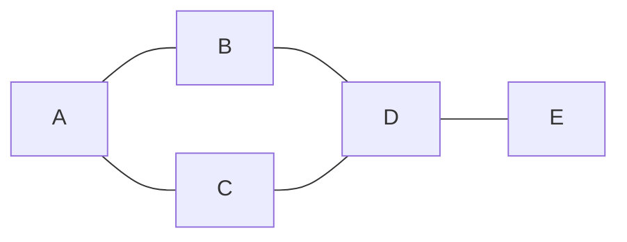

# 그래프 이론 기초 (Graph Theory)

- Level: Beginner
- Prerequisites: [Math/Discrete/Logic.md](Logic.md)
- Status: Draft
- Reviewed-by: -

---

## 개념 (Concept)

그래프는 대상들(정점, vertex)과 그들 사이의 관계(간선, edge)로 이루어진 구조다. 정점 집합 $V$와 간선 집합 $E$에 대해 $G = (V, E)$로 적는다. "무엇이 무엇과 연결되어 있는가"를 다루는 거의 모든 문제는 그래프로 모델링할 수 있다.

## 직관 (Intuition)

지하철 노선도(역=정점, 구간=간선), 친구 관계(사람=정점, 친구=간선), 작업 의존성(작업=정점, 선행 관계=간선)은 모두 그래프다. 그래프 이론은 이런 "연결의 구조"만 떼어내어 거리, 연결성, 순환 같은 공통 질문을 다룬다.



## 이론 (Theory)

기본 분류와 용어:

| 개념 | 설명 |
|---|---|
| 무방향 / 방향 그래프 | 간선에 방향이 없으면 무방향, 있으면 방향(directed) |
| 가중치 그래프 | 각 간선에 비용·거리 같은 값 $w(e)$가 붙음 |
| 차수(degree) | 한 정점에 연결된 간선 수 $\deg(v)$ |
| 경로(path) | 정점들을 간선으로 이어 이동한 열 |
| 사이클(cycle) | 시작과 끝이 같은 경로 |
| 연결 그래프 | 모든 정점 쌍 사이에 경로가 존재 |

무방향 그래프에서는 **악수 정리(handshaking lemma)** 가 성립한다.

$$\sum_{v \in V} \deg(v) = 2\,|E|$$

각 간선이 두 정점의 차수에 1씩 기여하기 때문이다. 따라서 차수가 홀수인 정점의 개수는 항상 짝수다.

**트리(tree)** 는 연결되어 있으면서 사이클이 없는 그래프다. 정점이 $|V|$개인 트리는 항상 간선이 정확히 $|E| = |V| - 1$개다. **이분 그래프(bipartite)** 는 정점을 두 집합으로 나눠 같은 집합 안에는 간선이 없게 만들 수 있는 그래프이며, 홀수 길이 사이클이 없는 것과 동치다.

## 구현 (Implementation)

그래프는 보통 인접 리스트로 표현한다. 자세한 표현 비교는 [그래프 표현](../../Data-Structures/Graph-Representation.md)을 본다.

```python
# 무방향 그래프의 인접 리스트
graph = {
    "A": ["B", "C"],
    "B": ["A", "D"],
    "C": ["A", "D"],
    "D": ["B", "C", "E"],
    "E": ["D"],
}

def degree(graph, v):
    return len(graph[v])

print(degree(graph, "D"))                     # 3
print(sum(degree(graph, v) for v in graph))   # 10 = 2 * 간선 수(5)
```

## 복잡도 (Complexity)

`V`는 정점 수, `E`는 간선 수다.

| 표현 | 공간 | 간선 존재 확인 | 이웃 순회 |
|---|---|---|---|
| 인접 리스트 | `O(V + E)` | `O(deg(v))` | `O(deg(v))` |
| 인접 행렬 | `O(V^2)` | `O(1)` | `O(V)` |

희소 그래프(간선이 적음)는 인접 리스트, 밀집 그래프나 빈번한 간선 확인은 인접 행렬이 유리하다.

## 응용 (Applications)

- 최단 경로, 네트워크 라우팅
- 작업 스케줄링과 의존성 해결(위상 정렬)
- 소셜 네트워크 분석, 추천
- 컴파일러의 제어 흐름 그래프, 의존성 그래프

## 흔한 오해 (Common Misunderstandings)

- 트리는 그래프의 특수한 경우다. "연결 + 비순환"이면 트리이고, 이때 간선 수는 정점 수보다 정확히 하나 적다.
- 방향 그래프의 사이클과 무방향 그래프의 사이클은 정의가 다르다. 무방향에서는 같은 간선을 되밟는 것을 사이클로 치지 않는다.
- 차수가 큰 정점이 항상 "중요한" 정점은 아니다. 중심성은 차수 외에도 여러 척도로 정의된다.
- 인접 행렬이 항상 빠른 것은 아니다. 정점이 많고 간선이 적으면 $O(V^2)$ 공간이 큰 낭비가 된다.

## TMI

- 그래프 이론은 1736년 오일러가 "쾨니히스베르크의 다리" 문제(7개 다리를 한 번씩만 건너 모두 지날 수 있는가)를 푼 데서 시작했다고 본다. 답은 "불가능"이며, 이는 오일러 경로 존재 조건으로 일반화된다.
- 4색 정리(어떤 평면 지도도 인접 영역을 4색으로 구분 가능)는 1976년 컴퓨터의 도움을 받아 증명된 최초의 주요 정리 중 하나다.
- "그래프(graph)"라는 단어는 통계의 막대그래프와 무관하다. 이 그래프는 정점-간선 구조를 뜻한다.

## 연습 / 확인 문제 (Exercises)

- 정점 6개에서 차수가 각각 1, 1, 2, 2, 3, 3인 무방향 그래프가 존재할 수 있는지 악수 정리로 판정하라.
- 인접 리스트로 표현된 그래프에서 간선 수를 세는 함수를 작성하라(무방향 기준).
- 트리의 간선 수가 항상 `|V| - 1`임을 귀납법으로 설명하라.

## 이어서 읽기 (Reading Path)

- 이전: [수학적 귀납법](Induction.md)
- 다음: [그래프 표현](../../Data-Structures/Graph-Representation.md), [BFS / DFS](../../Algorithms/BFS-DFS.md)
- 관련: [그래프 이론 복습](../../AI/PGMs/Graph-Review.md)

## 참조 (References)

- [Math/Discrete/Logic.md](Logic.md)
- [Data-Structures/Graph-Representation.md](../../Data-Structures/Graph-Representation.md)
- [Reference/Books.md](../../Reference/Books.md)
- [Reference/Courses.md](../../Reference/Courses.md)
