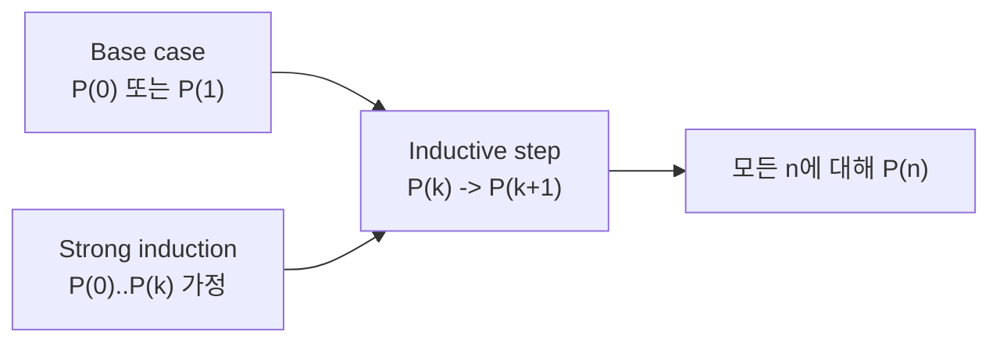

# 수학적 귀납법 (Mathematical Induction)

- Level: Beginner
- Prerequisites: [Math/Discrete/Logic.md](Logic.md)
- Status: Draft
- Reviewed-by: -
- Depth: Deep-dive (자기완결)

---

## 개념 (Concept)

수학적 귀납법은 "모든 자연수 $n$에 대해 명제 $P(n)$이 참이다"를 증명하는 방법이다. 무한히 많은 경우를 일일이 확인하는 대신, 두 단계만 보인다.

1. **기초 단계(base case)**: $P(1)$이 참이다.
2. **귀납 단계(inductive step)**: 임의의 $k$에 대해 $P(k)$가 참이면 $P(k+1)$도 참이다.

이 둘이 성립하면 $P(1)$에서 시작해 $P(2), P(3), \dots$가 줄줄이 따라오므로, 모든 자연수에서 참이 된다.

## 직관 (Intuition)

도미노가 일렬로 서 있다고 하자. (1) 첫 번째 도미노를 쓰러뜨릴 수 있고(기초 단계), (2) $k$번째가 쓰러지면 $k+1$번째도 반드시 쓰러진다(귀납 단계)면, 결국 모든 도미노가 쓰러진다. 귀납법은 "무한히 많은 명제"를 도미노 한 줄로 바꿔 두 조건만 확인하는 기법이다.



## 이론 (Theory)

약한 귀납법(weak induction)의 형식은 다음과 같다.

$$\Big(P(1) \,\wedge\, \forall k\,\big(P(k) \Rightarrow P(k+1)\big)\Big) \;\Rightarrow\; \forall n \ge 1\; P(n)$$

**예시.** $P(n):\ \sum_{i=1}^{n} i = \dfrac{n(n+1)}{2}$ 를 증명한다.

- 기초: $n=1$일 때 좌변 $=1$, 우변 $=\frac{1\cdot 2}{2}=1$. 성립.
- 귀납: $P(k)$가 참이라 가정하면

$$\sum_{i=1}^{k+1} i = \left(\sum_{i=1}^{k} i\right) + (k+1) = \frac{k(k+1)}{2} + (k+1) = \frac{(k+1)(k+2)}{2}$$

이는 $P(k+1)$의 형태이므로 성립한다. 따라서 모든 $n\ge 1$에서 참이다.

**강한 귀납법(strong induction)** 은 귀납 단계에서 $P(k)$ 하나가 아니라 $P(1), \dots, P(k)$ 전부를 가정한다. 점화식이 여러 이전 항에 의존할 때(예: 피보나치, 소인수분해의 존재성) 유용하다. 약한 귀납법과 증명력은 같다.

### 귀납 증명의 작성 순서

좋은 귀납 증명은 다음 틀을 분명히 적는다.

1. 명제 $P(n)$을 정확히 정의한다.
2. 시작 인덱스와 기초 단계를 확인한다.
3. 귀납 가정이 무엇인지 선언한다.
4. 귀납 가정만으로 $P(k+1)$ 또는 다음 필요한 범위를 증명한다.
5. 따라서 모든 허용된 $n$에서 성립한다고 결론낸다.

많은 오류는 $P(n)$의 범위를 흐리거나, $P(k)$를 가정한 뒤 실제로는 더 강한 사실을 몰래 쓰는 데서 나온다.

### 강한 귀납이 자연스러운 예

"모든 정수 $n\ge2$는 소수들의 곱으로 표현된다"를 보이려면 $n$이 소수이면 끝이고, 합성수이면 $n=ab$이며 $2\le a,b<n$이다. 이때 $a$와 $b$에 대한 명제가 필요하므로 $P(k)$ 하나보다 $P(2),\dots,P(k)$ 전체를 가정하는 강한 귀납이 자연스럽다.

### 구조적 귀납법

리스트, 트리, AST처럼 재귀적으로 정의된 대상에는 자연수 대신 구조를 대상으로 귀납한다. 예를 들어 이진 트리의 성질을 보일 때는 빈 트리 또는 leaf를 기초 단계로 두고, 왼쪽/오른쪽 부분트리에서 성질이 참이라고 가정한 뒤 부모 트리에서도 참임을 보인다.

## 구현 (Implementation)

귀납적으로 정의된 명제는 보통 재귀 함수와 1:1로 대응한다. 위 합 공식에 대응하는 재귀는 다음과 같다.

```python
def triangular(n):
    # 1 + 2 + ... + n
    if n == 0:          # 기초 단계
        return 0
    return n + triangular(n - 1)   # 귀납 단계
```

`triangular(n) == n * (n + 1) // 2`임을 귀납법으로 증명할 수 있다. 기초 단계는 `triangular(0) == 0`, 귀납 단계는 `triangular(k+1) == (k+1) + triangular(k)`가 가정에 의해 $\frac{(k+1)(k+2)}{2}$가 됨을 보이는 것이다.

반복문 불변식도 귀납법의 코드 버전이다.

```python
def prefix_sum(values):
    total = 0
    for i, x in enumerate(values):
        # 불변식: 반복 시작 시 total == sum(values[:i])
        total += x
    return total
```

반복 횟수에 대해 기초 단계와 유지 단계를 보이면, 루프 종료 시 전체 합이 맞다는 결론이 나온다.

## 복잡도 (Complexity)

귀납법 자체는 증명 기법이라 실행 복잡도가 없다. 다만 귀납적으로 정의된 재귀의 비용은 점화식으로 분석한다.

| 대상 | 시간 | 보조 공간 |
|---|---|---|
| 위 `triangular(n)` | `O(n)` | `O(n)` (호출 스택) |
| 닫힌 공식 `n(n+1)/2` | `O(1)` | `O(1)` |

귀납법으로 닫힌 공식을 증명해 두면, $O(n)$ 재귀를 $O(1)$ 계산으로 바꿀 수 있다.

## 응용 (Applications)

- 알고리즘의 정당성 증명(루프 불변식, 재귀 정확성)
- 점화식의 닫힌 형태 유도와 검증
- 자료구조 불변식 증명(예: 힙 성질, 트리 높이 한계)
- 부등식, 정수론 명제(나눗셈 가능성 등) 증명

## 흔한 오해 (Common Misunderstandings)

- 기초 단계를 빼먹으면 안 된다. 귀납 단계만으로는 출발점이 없어 아무것도 증명하지 못한다.
- 귀납 단계에서 증명하는 것은 "$P(k+1)$이 참"이 아니라 "$P(k)$가 참이면 $P(k+1)$도 참"이라는 **함의**다.
- 강한 귀납법이 약한 귀납법보다 더 강력한 것은 아니다. 표현이 편할 뿐 증명할 수 있는 명제의 범위는 같다.
- 가정 $P(k)$를 "증명"으로 착각하면 안 된다. 그것은 증명이 아니라 가정이다.
- 시작점이 $0$인지 $1$인지, 또는 어떤 $n_0$인지 명확히 해야 한다. 시작점이 틀리면 전체 증명이 어긋난다.
- 귀납 단계가 모든 $k$에서 성립해야 한다. 특정 구간에서만 되는 변형은 별도 기초 단계를 더 필요로 한다.

## TMI

- 귀납법의 초기 형태는 16세기 Maurolico, 17세기 Pascal의 증명에서 보이고, "mathematical induction"이라는 이름은 19세기에 정착했다.
- Fermat의 무한강하법(infinite descent)은 "더 작은 반례가 끝없이 존재할 수 없다"는 형태의 귀납법 변형이다.
- "모든 말은 같은 색이다" 같은 유명한 가짜 증명은 귀납 단계가 $n=1 \to 2$ 경계에서 깨지는 것을 이용한 함정이다. 귀납 단계는 **모든** $k$에서 성립해야 한다.
- 컴퓨터 과학에서는 구조적 귀납법(structural induction)으로 트리·리스트 같은 재귀적 자료구조에 대한 명제를 증명한다.

## 연습 / 확인 문제 (Exercises)

- $\sum_{i=1}^{n} (2i-1) = n^2$ 임을 귀납법으로 증명하라.
- 모든 $n \ge 1$에 대해 $n^3 - n$ 이 $6$의 배수임을 보여라.
- "모든 말은 같은 색이다" 증명에서 귀납 단계가 정확히 어디서 깨지는지 설명하라.
- 강한 귀납법으로 모든 $n\ge2$가 소수들의 곱으로 표현됨을 증명하라.
- `prefix_sum`의 루프 불변식을 기초 단계, 유지 단계, 종료 단계로 나누어 증명하라.

## 이어서 읽기 (Reading Path)

- 이전: [명제 논리와 술어 논리](Logic.md)
- 다음: [재귀와 점화식](Recurrences.md), [그래프 이론 기초](Graph-Theory.md)
- 관련: [정수론 기초](Number-Theory-Basics.md)

## 참조 (References)

- [Math/Discrete/Logic.md](Logic.md)
- [Reference/Books.md](../../Reference/Books.md)
- [Reference/Courses.md](../../Reference/Courses.md)
