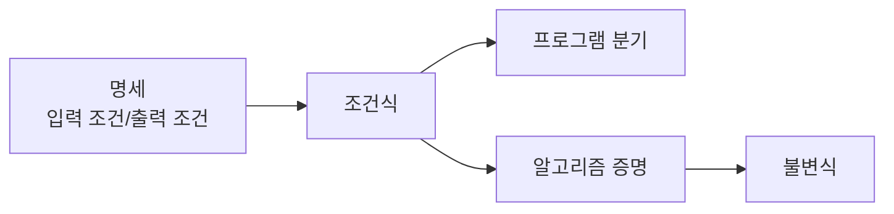

# 명제 논리와 술어 논리 (Logic)

- Level: Beginner
- Prerequisites: 고등학교 수학
- Status: Draft
- Reviewed-by: -
- Depth: Deep-dive (자기완결)

---

## 개념 (Concept)

논리는 참과 거짓을 다루는 규칙 체계다. 명제 논리는 참/거짓이 정해지는 문장과 논리 연결사를 다루고, 술어 논리는 변수, 대상, 수량자를 추가해 더 복잡한 문장을 표현한다.

## 직관 (Intuition)

컴퓨터 프로그램은 조건을 판단하고, 알고리즘은 증명을 통해 옳음을 보인다. 논리는 이 판단과 증명의 공통 언어다.

- 조건문: `if x > 0 and y > 0`
- 불변식: 반복문이 실행되는 동안 계속 참이어야 하는 성질
- 명세: 함수가 만족해야 하는 입력/출력 조건
- 증명: 알고리즘이 항상 맞는 결과를 낸다는 설명



## 이론 (Theory)

명제는 참 또는 거짓으로 판단할 수 있는 문장이다.

| 기호 | 이름 | 의미 |
|---|---|---|
| `¬P` | 부정 | P가 아니다 |
| `P ∧ Q` | 논리곱 | P이고 Q다 |
| `P ∨ Q` | 논리합 | P이거나 Q다 |
| `P -> Q` | 함의 | P이면 Q다 |
| `P <-> Q` | 동치 | P와 Q의 참값이 같다 |

함의 `P -> Q`는 P가 거짓일 때 항상 참으로 본다. 이는 처음에는 어색하지만, "전제가 만족되는 모든 경우에 결론이 참인가"를 검사하는 규칙으로 이해하면 된다.

진리표로 보면 함의는 다음처럼 동작한다.

| P | Q | P -> Q |
|---|---|---|
| T | T | T |
| T | F | F |
| F | T | T |
| F | F | T |

`P -> Q`가 틀리는 유일한 경우는 P가 참인데 Q가 거짓인 경우다. 그래서 "전제가 성립한 모든 케이스에서 결론이 성립하는가"를 검사하는 도구로 쓴다.

드모르간 법칙은 조건문을 변형할 때 자주 쓰인다.

```text
not (P and Q) == (not P) or (not Q)
not (P or Q)  == (not P) and (not Q)
```

술어 논리는 변수와 수량자를 사용한다.

| 기호 | 이름 | 의미 |
|---|---|---|
| `∀x P(x)` | 전칭 | 모든 x에 대해 P(x)가 참 |
| `∃x P(x)` | 존재 | 어떤 x가 있어 P(x)가 참 |

수량자의 부정은 방향이 바뀐다.

```text
not (for all x, P(x)) == exists x such that not P(x)
not (exists x such that P(x)) == for all x, not P(x)
```

### 수량자 순서

`∀x ∃y P(x, y)`와 `∃y ∀x P(x, y)`는 다르다. 전자는 "각 x마다 알맞은 y가 있다"이고, 후자는 "모든 x에 통하는 하나의 y가 있다"다. 알고리즘 명세에서 수량자 순서를 바꾸면 요구사항이 완전히 달라질 수 있다.

## 구현 (Implementation)

조건문은 논리식을 코드로 옮긴 형태다.

```python
def is_valid_age(age):
    return 0 <= age and age <= 150

def is_outside_range(x, low, high):
    return x < low or x > high
```

드모르간 법칙을 사용하면 복잡한 조건을 읽기 쉽게 바꿀 수 있다.

```python
def can_enter(user):
    return user["is_active"] and not user["is_blocked"]

def cannot_enter(user):
    return (not user["is_active"]) or user["is_blocked"]
```

수량자 검사를 코드로 옮기면 `all`과 `any`가 된다.

```python
def all_non_negative(values):
    return all(x >= 0 for x in values)

def has_negative(values):
    return any(x < 0 for x in values)
```

`not all_non_negative(values)`는 `has_negative(values)`와 같다. 이것이 `¬∀x P(x) == ∃x ¬P(x)`의 코드 버전이다.

## 복잡도 (Complexity)

| 연산 | 시간 | 공간 |
|---|---|---|
| 고정된 개수의 논리 연산 | O(1) | O(1) |
| 길이 n 목록의 모든 원소 검사 | O(n) | O(1) |
| 길이 n 목록에서 하나라도 만족하는지 검사 | 최악 O(n) | O(1) |

`all`과 `any`는 조건을 만족하거나 실패하는 순간 멈출 수 있지만, 최악의 경우 전체를 확인한다.

워크드 예제: `[1, 2, -3, 4]`에서 `all(x >= 0)`은 세 번째 원소 `-3`에서 즉시 거짓을 반환한다. 최선은 `O(1)`일 수 있지만, `[1,2,3,4]`처럼 모두 조건을 만족하면 끝까지 봐야 하므로 최악은 `O(n)`이다.

## 응용 (Applications)

- 조건문 설계
- 반복문 불변식과 알고리즘 증명
- 데이터베이스 질의 조건
- 타입 시스템과 명세 검증
- 계산 이론의 형식 언어와 증명

## 흔한 오해 (Common Misunderstandings)

- `P -> Q`는 `Q -> P`와 다르다.
- `P or Q`는 보통 둘 중 하나만 참이라는 뜻이 아니라 둘 다 참인 경우도 포함한다.
- "모든 x에 대해 참"의 반례는 단 하나의 x만 있으면 된다.
- 복잡한 조건문은 코드 스타일 문제가 아니라 정확성 문제로 이어질 수 있다.

## TMI

- Boolean이라는 이름은 George Boole에서 왔다. 오늘날의 `true`/`false` 연산은 19세기 논리 대수의 아이디어와 이어져 있다.
- 컴퓨터 회로의 AND, OR, NOT 게이트는 논리 연산을 물리적인 전기 신호로 구현한 것으로 볼 수 있다.
- 수학 논리에서는 빈 집합의 모든 원소가 조건 P를 만족한다는 명제가 참이다. 이를 vacuous truth라고 부르며, 처음 배우면 꽤 이상하게 느껴진다.
- Python의 `and`와 `or`는 항상 `True`/`False`만 반환하지 않는다. `a or b`는 실제로 선택된 피연산자 값을 반환할 수 있어서 기본값 처리에 자주 쓰인다.

## 연습 / 확인 문제 (Exercises)

- `not (a < 10 and b != 0)`을 드모르간 법칙으로 바꾸라.
- "모든 학생이 한 과목 이상 통과했다"의 부정을 자연어로 써 보라.
- 숫자 목록의 모든 값이 0 이상인지 검사하는 함수를 작성하라.

## 이어서 읽기 (Reading Path)

- 이전: [배열과 문자열](../../Programming/Arrays-and-Strings.md)
- 다음: [배열](../../Data-Structures/Array.md)
- 관련: [집합론](Set-Theory.md)

## 참조 (References)

- [Math/Discrete/](./)
- [Algorithms/](../../Algorithms/)
- [Reference/Books.md](../../Reference/Books.md)
- [Reference/Courses.md](../../Reference/Courses.md)
