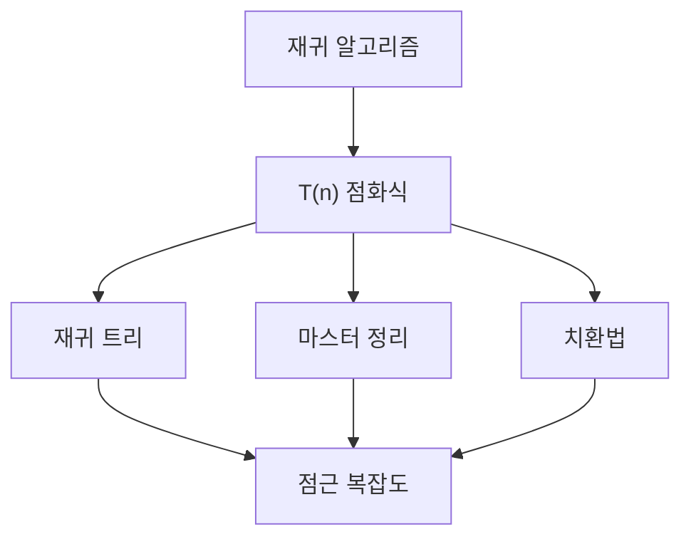

# 재귀와 점화식 (Recurrences)

- Level: Intermediate
- Prerequisites: [Math/Discrete/Induction.md](Induction.md), [Math/Discrete/Combinatorics.md](Combinatorics.md)
- Status: Draft
- Reviewed-by: -
- Depth: Deep-dive (자기완결)

---

## 개념 (Concept)

점화식은 수열의 항을 이전 항들로 정의하는 식이다. 재귀 알고리즘의 비용을 분석하거나 조합적 수열을 표현할 때 쓰이며, 닫힌 형식(closed form)으로 풀거나 점근적 크기를 추정한다.

## 직관 (Intuition)

분할 정복 알고리즘은 "문제를 쪼개 풀고 합친다". 그 비용은 자연스럽게 "쪼갠 문제 비용 + 합치는 비용"이라는 재귀식으로 나온다. 점화식을 풀면 이 재귀적 묘사를 $n$에 대한 직접적인 크기($\Theta(n\log n)$ 등)로 바꿀 수 있다.



## 이론 (Theory)

**선형 동차 점화식** $a_n=c_1 a_{n-1}+c_2 a_{n-2}$는 특성방정식 $x^2=c_1 x+c_2$의 근으로 닫힌 형식을 얻는다. 예: 피보나치 $F_n=F_{n-1}+F_{n-2}$는 $\varphi=\frac{1+\sqrt5}{2}$로 표현된다.

**분할 정복 점화식** $T(n)=a\,T(n/b)+f(n)$은 **마스터 정리**로 점근을 판정한다. $n^{\log_b a}$와 $f(n)$의 크기를 비교해

$$T(n)=\begin{cases}\Theta(n^{\log_b a}) & f(n)=O(n^{\log_b a-\epsilon})\\ \Theta(n^{\log_b a}\log n) & f(n)=\Theta(n^{\log_b a})\\ \Theta(f(n)) & f(n)=\Omega(n^{\log_b a+\epsilon})\end{cases}$$

그 밖에 치환법(substitution)과 재귀 트리(recursion tree)로 직접 합을 추정한다.

### 재귀 트리로 읽기

$T(n)=2T(n/2)+n$은 각 레벨에서 문제 수가 2배, 각 문제 크기는 절반이 된다. 한 레벨의 총 결합 비용은

$$
2^i\cdot\frac{n}{2^i}=n
$$

이고 깊이는 $\log_2 n$이므로 전체는 $\Theta(n\log n)$이다. 병합 정렬의 비용이 바로 이 구조다.

### 치환법의 역할

치환법은 답을 추측한 뒤 귀납법으로 증명한다. 예를 들어 $T(n)\le cn\log n$을 보이고 싶다면 점화식에 대입해 오른쪽이 다시 $cn\log n$ 이하가 되도록 상수와 기초 조건을 조정한다. 마스터 정리가 적용되지 않는 점화식에서도 쓸 수 있다.

### 마스터 정리 적용 전 확인

마스터 정리는 강력하지만 형태가 맞아야 한다.

| 확인 | 이유 |
|---|---|
| 하위 문제가 모두 같은 크기 $n/b$인가? | 불균등 분할은 일반형 필요 |
| $a,b$가 상수인가? | 입력에 따라 변하면 직접 분석 필요 |
| $f(n)$이 비교 가능한 매끄러운 함수인가? | regularity 조건 문제가 생길 수 있음 |
| 바닥/천장 처리가 점근에 영향 없는가? | 보통 무시 가능하지만 기초 조건 필요 |

## 구현 (Implementation)

```python
# 재귀 트리/치환 대신 직접 메모이제이션으로 점화식 평가
def solve(n, memo={0: 0, 1: 1}):
    if n in memo:
        return memo[n]
    memo[n] = solve(n - 1, memo) + solve(n - 2, memo)  # a_n = a_{n-1}+a_{n-2}
    return memo[n]
```

분할 정복 호출 수를 실제로 세어 점화식을 확인할 수 있다.

```python
def merge_sort_work(n):
    if n <= 1:
        return 1
    return merge_sort_work(n // 2) + merge_sort_work(n - n // 2) + n

for n in [8, 16, 32]:
    print(n, merge_sort_work(n))
```

## 복잡도 (Complexity)

마스터 정리는 $T(n)=2T(n/2)+\Theta(n)$ → $\Theta(n\log n)$(병합 정렬), $T(n)=2T(n/2)+\Theta(1)$ → $\Theta(n)$처럼 즉시 결과를 준다. 메모이제이션으로 점화식을 평가하면 서로 다른 부분문제 수에 비례하는 시간이 든다(피보나치는 `O(n)`).

닫힌 형식을 구하는 것과 Big-O를 구하는 것은 목표가 다르다. 알고리즘 분석에서는 상수와 낮은 차수 항을 버린 점근이 충분한 경우가 많지만, 정확한 카운팅이나 조합 문제에서는 닫힌 형식이 중요할 수 있다.

## 응용 (Applications)

- 분할 정복 알고리즘 비용 분석(정렬, FFT)
- 동적 계획법 점화식 설계
- 조합 수열(카탈란 수, 피보나치)
- 평균 시간 복잡도 추정

## 흔한 오해 (Common Misunderstandings)

- 마스터 정리는 모든 점화식에 적용되지 않는다(예: $f(n)$이 다항-로그 사이에 끼는 경우).
- 점화식을 그대로 재귀로 구현하면 지수 시간이 될 수 있다(중복 계산). 메모이제이션이 필요하다.
- 특성방정식 근이 중복되면 닫힌 형식 형태가 달라진다($n\,r^n$ 항).
- 점근적 크기와 정확한 닫힌 형식은 다른 목표다.
- $T(n)$의 의미를 먼저 정해야 한다. 시간, 비교 횟수, 메모리, 호출 수 중 무엇인지에 따라 점화식이 달라진다.
- 기초 조건은 점근에는 작아 보이지만 실제 재귀 종료와 귀납 증명에는 필수다.

## TMI

- 피보나치 수열의 닫힌 형식(비네 공식)에 무리수 $\sqrt5$가 들어가지만 결과는 항상 정수다.
- 마스터 정리의 "아카라-바지-정리(Akra-Bazzi)"라는 더 일반적인 버전이 불균등 분할도 다룬다.
- 카탈란 수는 괄호 짝, 이진 트리 수 등 수십 가지 조합 문제에서 같은 점화식으로 등장한다.

## 연습 / 확인 문제 (Exercises)

- $T(n)=3T(n/2)+n$의 점근을 마스터 정리로 구하라.
- 피보나치를 단순 재귀로 구현했을 때 호출 수가 지수적임을 보여라.
- $a_n=2a_{n-1}+1,\ a_0=0$의 닫힌 형식을 구하라.
- $T(n)=T(n/2)+T(n/4)+n$이 마스터 정리에 바로 맞지 않는 이유를 설명하라.
- $T(n)=2T(n/2)+1$을 재귀 트리로 풀어 $\Theta(n)$임을 보여라.

## 이어서 읽기 (Reading Path)

- 이전: [수학적 귀납법](Induction.md)
- 다음: [Algorithms/Divide-and-Conquer.md](../../Algorithms/Divide-and-Conquer.md), [Algorithms/DP-Basics.md](../../Algorithms/DP-Basics.md)

## 참조 (References)

- [Algorithms/Complexity.md](../../Algorithms/Complexity.md)
- [Algorithms/Divide-and-Conquer.md](../../Algorithms/Divide-and-Conquer.md)
- [Reference/Books.md](../../Reference/Books.md)
