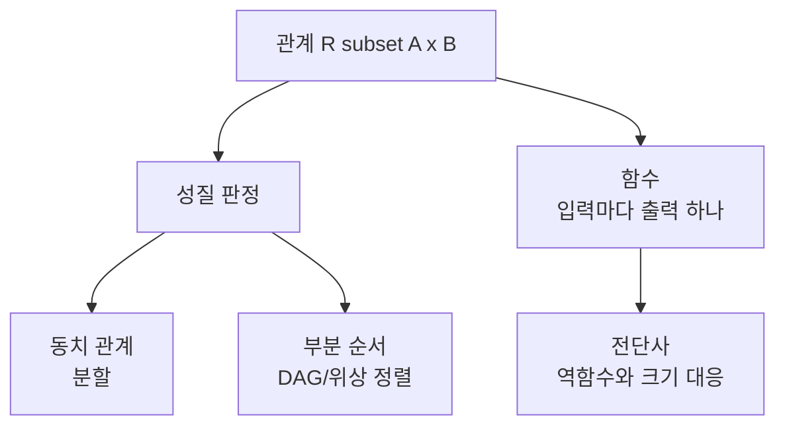

# 관계와 함수 (Relations and Functions)

- Level: Beginner
- Prerequisites: [Math/Discrete/Set-Theory.md](Set-Theory.md)
- Status: Draft
- Reviewed-by: -
- Depth: Deep-dive (자기완결)

---

## 개념 (Concept)

관계는 두 집합의 원소 사이 연관을 곱집합의 부분집합으로 형식화한 것이다. 함수는 각 입력에 정확히 하나의 출력을 대응시키는 특별한 관계다. 동치 관계, 순서 관계, 단사·전사·전단사 같은 성질이 핵심이다.

## 직관 (Intuition)

"~보다 작다", "~와 친구다", "~의 부모다"처럼 세상의 많은 개념이 두 대상 사이의 관계다. 이를 순서쌍의 집합으로 보면 수학적으로 다룰 수 있다. 함수는 그중 "입력 하나에 답 하나"라는 제약을 가진 관계로, 계산·매핑·변환의 기본 모형이다.



## 이론 (Theory)

$A$ 위의 관계 $R\subseteq A\times A$의 주요 성질:

- **반사적**: 모든 $a$에 대해 $aRa$.
- **대칭적**: $aRb \Rightarrow bRa$.
- **추이적**: $aRb \wedge bRc \Rightarrow aRc$.

세 성질을 모두 가지면 **동치 관계**이며, 집합을 동치류로 분할한다. 반사·반대칭·추이적이면 **부분 순서**다.

함수 $f:A\to B$는 모든 $a\in A$에 유일한 $f(a)$를 준다.

- **단사(injective)**: $f(a)=f(a')\Rightarrow a=a'$.
- **전사(surjective)**: 모든 $b\in B$에 대해 $f(a)=b$인 $a$ 존재.
- **전단사(bijective)**: 단사이며 전사 → 역함수 존재.

합성 $g\circ f$와 역함수가 정의되며, 전단사는 두 집합의 크기가 같음을 보이는 도구다.

### 동치 관계는 분할과 같다

동치 관계가 있으면 각 원소 $a$에 대해

$$
[a]=\{x\in A:xRa\}
$$

라는 동치류가 생긴다. 동치류들은 서로 겹치지 않고 전체 집합을 덮는다. 반대로 어떤 집합을 겹치지 않는 묶음들로 분할하면 "같은 묶음에 속한다"는 동치 관계가 된다.

예를 들어 정수를 3으로 나눈 나머지가 같다는 관계는 동치 관계이고, 동치류는 $[0]$, $[1]$, $[2]$ 세 개다. 모듈러 산술은 이 동치류 위에서 계산하는 언어다.

### 부분 순서와 Hasse diagram

부분 순서는 모든 원소 쌍이 비교 가능할 필요가 없다. 집합 포함 관계 $\subseteq$는 부분 순서지만, $\{1\}$과 $\{2\}$는 어느 쪽도 다른 쪽의 부분집합이 아니다. 모든 쌍이 비교 가능하면 전순서(total order)다.

부분 순서는 방향 그래프로 그릴 수 있고, 사이클이 없는 의존성 구조와 연결된다. 작업 선행 관계가 부분 순서이면 위상 정렬로 실행 가능한 순서를 만들 수 있다.

### 함수 성질 판정 절차

유한 집합 함수 $f:A\to B$는 다음 순서로 점검한다.

| 질문 | 판정 |
|---|---|
| 모든 입력이 정확히 하나의 출력으로 가는가? | 아니면 함수가 아님 |
| 서로 다른 입력이 같은 출력으로 모이지 않는가? | 단사 |
| $B$의 모든 원소가 적어도 한 번 나오나? | 전사 |
| 단사와 전사를 모두 만족하나? | 전단사 |

## 구현 (Implementation)

```python
# 관계를 순서쌍 집합으로 표현
R = {(1, 1), (2, 2), (1, 2), (2, 1)}

def is_symmetric(R):
    return all((b, a) in R for (a, b) in R)

def is_transitive(R):
    return all((a, c) in R
               for (a, b) in R for (b2, c) in R if b == b2)
```

함수의 단사·전사를 유한 집합에서 검사할 수 있다.

```python
def is_function(mapping, domain):
    return set(mapping.keys()) == set(domain)

def is_injective(mapping):
    values = list(mapping.values())
    return len(values) == len(set(values))

def is_surjective(mapping, codomain):
    return set(mapping.values()) == set(codomain)
```

## 복잡도 (Complexity)

$n$개 원소 위 관계는 순서쌍이 최대 $n^2$개라 성질 검사는 보통 `O(n^2)`~`O(n^3)`(추이성)이다. 동치류 분할은 union-find로 거의 선형에 처리할 수 있다. 함수의 단사/전사 검사는 정의역 크기에 선형이다.

관계를 인접 행렬로 저장하면 반사성·대칭성 검사는 `O(n^2)`, 추이성은 단순 구현 기준 `O(n^3)`이다. 그래프 도달가능성으로 보면 Warshall 알고리즘과도 연결된다.

## 응용 (Applications)

- 데이터베이스의 관계 모델과 동치/순서 질의
- 타입 변환·매핑, 해시 함수
- union-find로 연결 요소·동치류 관리
- 위상 정렬의 기반인 부분 순서

## 흔한 오해 (Common Misunderstandings)

- 모든 관계가 함수는 아니다. 한 입력에 여러 출력이면 함수가 아니다.
- 대칭과 반대칭은 반대가 아니다. 둘 다 만족하는 관계도 있다.
- 전사와 단사는 독립적 성질이다(둘 다, 하나만, 둘 다 아님 가능).
- 역함수는 전단사일 때만 (전역적으로) 존재한다.
- 부분 순서는 정렬 순서처럼 일렬로 비교되는 관계만 뜻하지 않는다. 비교 불가능한 원소가 있을 수 있다.
- 함수의 전사성은 codomain을 무엇으로 정했는지에 의존한다. 같은 mapping도 codomain이 달라지면 전사 여부가 바뀐다.

## TMI

- 동치 관계와 분할이 일대일 대응한다는 사실은 "같다고 볼 것"을 정의하는 수학의 핵심 도구다.
- 함수의 현대적 정의(순서쌍 집합)는 19세기 이후 정착됐고, 그 전에는 "공식"으로 좁게 여겨졌다.
- 관계형 데이터베이스의 "relation"이라는 이름이 바로 이 수학적 관계에서 왔다.

## 연습 / 확인 문제 (Exercises)

- "모드 $n$ 합동" 관계가 동치 관계임을 세 성질로 보여라.
- 단사이지만 전사가 아닌 함수, 전사이지만 단사가 아닌 함수를 각각 들어라.
- 부분 순서와 전순서의 차이를 예로 설명하라.
- $\{1,2,3\}$ 위 관계 $\{(1,1),(2,2),(3,3),(1,2),(2,1)\}$가 동치 관계인지 판정하고 동치류를 구하라.
- 작업 의존성 관계가 추이적이지 않아도 위상 정렬 입력으로 쓸 수 있는 이유를 그래프 관점에서 설명하라.

## 이어서 읽기 (Reading Path)

- 이전: [집합론](Set-Theory.md)
- 다음: [조합론](Combinatorics.md), [그래프 이론](Graph-Theory.md)

## 참조 (References)

- [Math/Discrete/Set-Theory.md](Set-Theory.md)
- [Data-Structures/Union-Find.md](../../Data-Structures/Union-Find.md)
- [Reference/Books.md](../../Reference/Books.md)
