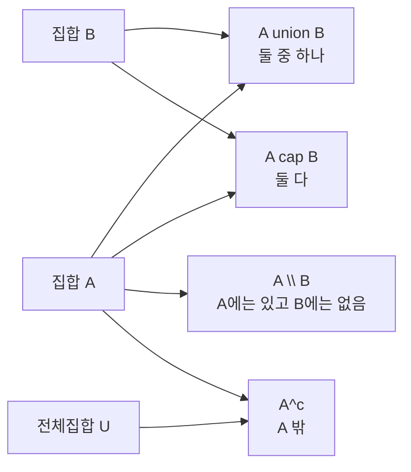

# 집합론 (Set Theory)

- Level: Beginner
- Prerequisites: [Math/Discrete/Logic.md](Logic.md)
- Status: Draft
- Reviewed-by: -
- Depth: Deep-dive (자기완결)

---

## 개념 (Concept)

집합은 잘 정의된 대상들의 모임이다. 집합론은 원소, 부분집합, 합·교·차·여집합 같은 연산과 그 관계를 다루며, 수학과 컴퓨터 과학에서 자료·관계·함수를 정의하는 기본 언어를 제공한다.

## 직관 (Intuition)

"어떤 것들의 묶음"이라는 단순한 개념이 놀랄 만큼 강력하다. 데이터베이스의 테이블, 타입, 그래프의 정점 집합, 사건의 표본 공간이 모두 집합으로 표현된다. 집합 연산은 "둘 다에 속하는 것", "둘 중 하나라도 속하는 것"처럼 일상적 질의를 정확히 형식화한다.



## 이론 (Theory)

원소 관계 $x\in A$, 부분집합 $A\subseteq B$로 시작한다. 기본 연산:

$$A\cup B,\quad A\cap B,\quad A\setminus B,\quad A^c$$

곱집합 $A\times B=\{(a,b): a\in A,\ b\in B\}$, 멱집합 $\mathcal{P}(A)$는 $A$의 모든 부분집합의 집합으로 $|\mathcal{P}(A)|=2^{|A|}$다. 드모르간 법칙 $(A\cup B)^c=A^c\cap B^c$가 성립한다.

집합의 크기(cardinality)는 유한·무한을 구분한다. 칸토어의 대각선 논법은 $|\mathbb{N}|<|\mathbb{R}|$, 즉 무한에도 등급이 있음을 보인다. 소박한 집합론은 러셀의 역설("자기 자신을 원소로 갖지 않는 집합들의 집합")에 부딪혀, 공리적 집합론(ZFC)으로 정교화됐다.

### 부분집합과 원소를 구분하기

$x\in A$는 $x$가 $A$의 원소라는 뜻이고, $B\subseteq A$는 $B$의 모든 원소가 $A$에도 들어 있다는 뜻이다. 예를 들어 $A=\{1,2,\{3\}\}$라면 $\{3\}\in A$는 참이지만 $3\in A$는 거짓이다. 반대로 $\{1,2\}\subseteq A$는 참이다.

이 구분은 타입 시스템이나 JSON 같은 중첩 구조를 읽을 때도 중요하다. 값 하나와 값들의 컬렉션은 서로 다른 수준의 대상이다.

### 멱집합과 부분집합 열거

$|A|=n$이면 각 원소에 대해 "고른다/고르지 않는다" 두 선택이 있으므로 부분집합 수는 $2^n$이다. $A=\{a,b,c\}$이면 멱집합은

$$
\mathcal{P}(A)=\{\emptyset,\{a\},\{b\},\{c\},\{a,b\},\{a,c\},\{b,c\},\{a,b,c\}\}
$$

로 8개다. 알고리즘에서 부분집합 DP나 bitmask DP가 $2^n$ 상태를 갖는 이유가 바로 이 구조다.

### 드모르간 법칙을 조건문으로 읽기

전체집합 $U$ 안에서

$$
(A\cap B)^c=A^c\cup B^c
$$

는 "둘 다 만족하지 않는 경우"가 "A를 만족하지 않거나 B를 만족하지 않는 경우"와 같다는 뜻이다. 코드에서는 `not (p and q)`를 `(not p) or (not q)`로 바꾸는 규칙이다.

## 구현 (Implementation)

```python
A = {1, 2, 3}
B = {2, 3, 4}
print(A | B)        # 합집합 {1,2,3,4}
print(A & B)        # 교집합 {2,3}
print(A - B)        # 차집합 {1}
print(A <= B)       # 부분집합 여부 -> False

def power_set(s):
    s = list(s)
    result = [[]]
    for x in s:                       # 원소를 하나씩 추가
        result += [subset + [x] for subset in result]
    return result                     # 2^n 개의 부분집합
```

부분집합을 비트마스크로 표현하면 알고리즘 상태로 쓰기 쉽다.

```python
items = ["a", "b", "c"]
for mask in range(1 << len(items)):
    subset = [items[i] for i in range(len(items)) if mask & (1 << i)]
    print(mask, subset)
```

## 복잡도 (Complexity)

해시 집합에서 원소 포함 검사·삽입은 평균 `O(1)`이고, 합·교·차는 두 집합 크기에 선형이다. 멱집합은 원소 수 $n$에 대해 $2^n$개를 생성하므로 지수 비용이며, 작은 $n$에서만 실용적이다.

교집합은 보통 더 작은 집합을 순회하며 큰 집합 membership을 검사하면 `O(min(|A|, |B|))` 평균 시간에 가깝다. 실제 구현에서는 해시 품질, 정렬 여부, 메모리 배치가 성능에 영향을 준다.

## 응용 (Applications)

- 관계형 데이터베이스의 연산(합집합, 교집합, 곱집합)
- 타입 시스템·정적 분석의 집합 기반 도메인
- 확률의 표본 공간과 사건
- 그래프·관계·함수의 형식적 정의 기반

## 흔한 오해 (Common Misunderstandings)

- 집합은 중복과 순서를 갖지 않는다. 중복/순서가 필요하면 multiset·튜플·리스트다.
- 공집합은 모든 집합의 부분집합이다.
- "모든 집합의 집합"은 존재하지 않는다(역설을 피하기 위한 제약).
- 무한 집합이라고 다 같은 크기가 아니다($\mathbb{N}$과 $\mathbb{R}$).
- $\emptyset$과 $\{\emptyset\}$는 다르다. 후자는 공집합을 원소로 하나 가진 집합이다.
- $A\subseteq B$와 $A\in B$를 혼동하면 중첩 집합에서 증명이 쉽게 깨진다.

## TMI

- 칸토어의 무한 등급 발견은 당대에 격렬한 논쟁을 일으켰지만 현대 수학의 토대가 됐다.
- 러셀의 역설은 "이발사 역설"로 흔히 비유된다.
- 거의 모든 현대 수학은 ZFC 공리계 위에 세워질 수 있다는 점에서 집합론은 수학의 공통어다.

## 연습 / 확인 문제 (Exercises)

- $|A|=3$일 때 멱집합의 크기를 구하고 모든 부분집합을 나열하라.
- 드모르간 법칙 $(A\cap B)^c=A^c\cup B^c$를 벤 다이어그램으로 보여라.
- $A\times B$와 $B\times A$가 일반적으로 다른 이유를 예로 설명하라.
- $\emptyset$, $\{\emptyset\}$, $\{\emptyset,\{\emptyset\}\}$의 원소 수와 부분집합 관계를 각각 판정하라.
- 비트마스크 `0b10110`이 어떤 부분집합을 뜻하는지 원소 인덱스 관점에서 설명하라.

## 이어서 읽기 (Reading Path)

- 이전: [명제 논리와 술어 논리](Logic.md)
- 다음: [관계와 함수](Relations-and-Functions.md), [수학적 귀납법](Induction.md)

## 참조 (References)

- [Math/Discrete/Logic.md](Logic.md)
- [Math/Discrete/Relations-and-Functions.md](Relations-and-Functions.md)
- [Reference/Books.md](../../Reference/Books.md)
