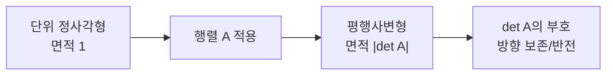

# 행렬식 (Determinant)

- Level: Intermediate
- Prerequisites: [Math/Linear-Algebra/Matrices.md](Matrices.md), [Math/Linear-Algebra/Linear-Systems.md](Linear-Systems.md)
- Status: Draft
- Reviewed-by: -
- Depth: Deep-dive (자기완결)

---

## 개념 (Concept)

행렬식은 정사각 행렬에 대응하는 스칼라로, 선형 변환이 부피를 얼마나 늘리거나 줄이는지를 나타낸다. 0이면 변환이 차원을 무너뜨려 역행렬이 없음을 뜻한다.

## 직관 (Intuition)

행렬을 "공간을 늘리고 비트는 변환"으로 보면, 행렬식은 그 변환이 단위 부피(정사각형/정육면체)를 몇 배로 만드는가다. 부호는 방향(반전 여부)을 담는다. 행렬식이 0이라는 것은 변환이 공간을 더 낮은 차원으로 납작하게 눌러, 정보를 잃고 되돌릴 수 없다는 신호다.



## 이론 (Theory)

$2\times2$ 행렬 $\begin{pmatrix}a&b\\c&d\end{pmatrix}$의 행렬식은 $ad-bc$다. 일반적으로 라플라스 전개(여인수)나 치환의 부호 합(라이프니츠 공식)으로 정의된다.

핵심 성질:
- $\det(AB)=\det(A)\det(B)$, $\det(A^\top)=\det(A)$.
- 행 교환은 부호를 바꾸고, 한 행에 스칼라를 곱하면 그만큼 곱해진다.
- $A$가 가역 $\iff \det(A)\ne 0$, 이때 $\det(A^{-1})=1/\det(A)$.
- 고윳값의 곱이 행렬식과 같다.

기하적으로 $|\det|$는 열벡터가 만드는 평행육면체의 부피다. 크라메르 공식은 행렬식으로 선형 시스템 해를 표현한다(이론적, 비효율적).

### 행 연산으로 추적하기

행렬식 계산은 소거 과정에서 값이 어떻게 바뀌는지 추적하면 이해하기 쉽다.

| 행 연산 | 행렬식 변화 |
|---|---|
| 두 행 교환 | 부호가 바뀜 |
| 한 행에 $c$를 곱함 | 행렬식도 $c$배 |
| 한 행에 다른 행의 배수를 더함 | 행렬식 변화 없음 |

따라서 소거로 상삼각행렬 $U$를 만들면 $\det(U)$는 대각 원소의 곱이고, 중간에 행 교환을 몇 번 했는지만 부호로 반영하면 된다.

예를 들어

$$
A=\begin{pmatrix}2&1\\4&3\end{pmatrix}
\quad\Rightarrow\quad
R_2\leftarrow R_2-2R_1
\quad
\begin{pmatrix}2&1\\0&1\end{pmatrix}
$$

세 번째 종류의 행 연산이므로 행렬식은 변하지 않는다. 상삼각행렬의 대각 곱은 $2\cdot1=2$이므로 $\det(A)=2$다. 직접 계산해도 $2\cdot3-1\cdot4=2$다.

### 행렬식과 수치 안정성

큰 행렬의 행렬식은 크기가 지수적으로 커지거나 작아질 수 있다. 확률 모델의 로그가능도, 정규분포 정규화 상수, Gaussian process에서는 보통 $\log|\det(A)|$를 저장한다. 부호와 로그 절댓값을 나누어 다루면 오버플로와 언더플로를 피할 수 있다.

## 구현 (Implementation)

```python
import numpy as np

A = np.array([[2.0, 1.0],
              [4.0, 3.0]])

print(np.linalg.det(A))       # 2.0

sign, log_abs_det = np.linalg.slogdet(A)
print(sign, log_abs_det)      # 부호와 log(|det(A)|)
print(sign * np.exp(log_abs_det))
```

학습 목적의 직접 구현은 가능하지만, 실무에서는 피벗팅과 오차 제어가 들어간 라이브러리 구현을 사용한다.

## 복잡도 (Complexity)

여인수 전개로 직접 계산하면 `O(n!)`로 폭발한다. 실무에서는 LU 분해로 삼각화한 뒤 대각 원소를 곱해 `O(n^3)`에 구한다. 큰 행렬에서는 행렬식 자체가 오버플로/언더플로하기 쉬워, 로그 행렬식(log-determinant)을 쓰는 경우가 많다.

## 응용 (Applications)

- 역행렬 존재·선형 독립 판정
- 변수 변환의 야코비안(다변수 적분)
- 고윳값·특성다항식 $\det(A-\lambda I)=0$
- 다변량 정규분포의 정규화 상수(공분산 행렬식)

## 흔한 오해 (Common Misunderstandings)

- 행렬식이 작다고 "거의 특이"인 것은 아니다(스케일에 민감). 조건수가 더 신뢰할 척도다.
- 행렬식은 정사각 행렬에만 정의된다.
- $\det(A+B)\ne\det(A)+\det(B)$ 일반적으로.
- 큰 행렬에서 행렬식을 그대로 다루면 수치적으로 위험하다(로그 사용).
- 행렬식이 0이 아니라는 사실은 역행렬 존재만 말해 준다. 실제로 역문제가 안정적인지는 특이값 분포를 봐야 한다.
- 기하학적 부피 해석은 절댓값이고, 부호는 좌표계 방향이 뒤집혔는지를 나타낸다.

## TMI

- 행렬식은 행렬 개념보다 먼저 등장했다 — 선형 시스템 풀이(크라메르, 18세기)에서 비롯됐다.
- 다변량 가우시안의 밀도에 공분산 행렬식이 정규화 상수로 들어가, ML에서 log-det이 자주 등장한다.
- 야코비안 행렬식이 0이면 그 점에서 변수 변환이 국소적으로 가역이 아니다.

## 연습 / 확인 문제 (Exercises)

- $3\times3$ 행렬의 행렬식을 여인수 전개로 구하라.
- 두 행을 교환하면 부호가 바뀜을 $2\times2$로 확인하라.
- $\det(A)=0$인 행렬을 만들고 열벡터가 선형 종속임을 보여라.
- 소거 과정에서 행 교환이 한 번 필요한 행렬을 골라 행렬식 부호 변화를 추적하라.
- 대각 원소가 모두 0.1인 $n\times n$ 대각행렬의 행렬식과 log-det이 $n$에 따라 어떻게 변하는지 계산하라.

## 이어서 읽기 (Reading Path)

- 이전: [행렬](Matrices.md)
- 다음: [고윳값과 고유벡터](Eigenvalues.md), [Math/Calculus/Multivariable-Integration.md](../Calculus/Multivariable-Integration.md)

## 참조 (References)

- [Math/Linear-Algebra/Eigenvalues.md](Eigenvalues.md)
- [Math/Linear-Algebra/Linear-Systems.md](Linear-Systems.md)
- [Reference/Books.md](../../Reference/Books.md)
