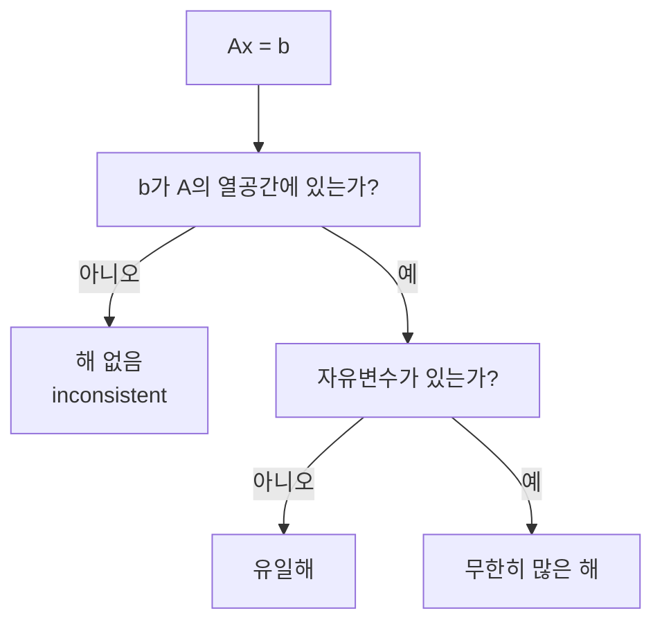

# 선형 연립방정식 (Linear Systems)

- Level: Intermediate
- Prerequisites: [Math/Linear-Algebra/Matrices.md](Matrices.md), [Math/Linear-Algebra/Vectors.md](Vectors.md)
- Status: Draft
- Reviewed-by: -
- Depth: Deep-dive (자기완결)

---

## 개념 (Concept)

선형 연립방정식은 여러 선형 방정식을 동시에 만족하는 미지수 벡터를 찾는 문제다. 행렬로는 $A\mathbf{x}=\mathbf{b}$로 쓰며, 데이터 적합·최적화·과학 계산에서 반복해서 등장한다.

## 직관 (Intuition)

2차원에서 방정식 하나는 직선을 나타낸다. 두 직선이 한 점에서 만나면 해가 하나, 평행하면 해가 없고, 같은 직선이면 해가 무한히 많다. 고차원에서도 핵심은 $\mathbf{b}$가 $A$의 열벡터 조합으로 만들어지는지, 그리고 그 조합이 유일한지 묻는 것이다.



## 이론 (Theory)

$A\in\mathbb{R}^{m\times n}$의 열벡터를 $\mathbf{a}_1,\dots,\mathbf{a}_n$이라 하면

$$
A\mathbf{x}=x_1\mathbf{a}_1+\cdots+x_n\mathbf{a}_n=\mathbf{b}
$$

이다. 따라서 해가 존재할 조건은 $\mathbf{b}$가 $A$의 열공간(column space)에 속하는 것이다. 랭크(rank)는 독립인 열 또는 행의 최대 개수이며 해의 구조를 결정한다.

| 조건 | 해의 모습 |
|---|---|
| $\operatorname{rank}(A)<\operatorname{rank}([A\mid\mathbf{b}])$ | 해 없음 |
| 두 랭크가 같고 $\operatorname{rank}(A)=n$ | 유일한 해 |
| 두 랭크가 같고 $\operatorname{rank}(A)<n$ | 무한히 많은 해 |

가우스 소거법은 행 연산으로 확대 행렬을 행 사다리꼴로 바꾼다. 정사각 정칙 행렬이면 이론적으로 $\mathbf{x}=A^{-1}\mathbf{b}$지만, 수치 계산에서는 역행렬을 직접 만들기보다 LU·QR·Cholesky 분해로 `solve`하는 편이 더 빠르고 안정적이다.

### 행 사다리꼴에서 읽는 정보

확대 행렬 $[A\mid\mathbf{b}]$를 소거한 뒤 다음 세 가지를 확인한다.

| 관찰 | 의미 |
|---|---|
| $[0\ 0\ \cdots\ 0\mid c]$, $c\ne0$ 행이 있음 | $0=c$ 모순이므로 해 없음 |
| 모든 변수 열에 피벗이 있음 | 자유변수가 없으므로 유일해 |
| 모순은 없지만 피벗 없는 변수 열이 있음 | 자유변수 때문에 무한히 많은 해 |

예를 들어

$$
\begin{aligned}
x+y&=3\\
2x+2y&=6
\end{aligned}
\quad\Rightarrow\quad
\left[\begin{array}{cc|c}
1&1&3\\
2&2&6
\end{array}\right]
\sim
\left[\begin{array}{cc|c}
1&1&3\\
0&0&0
\end{array}\right]
$$

두 번째 변수에 피벗이 없으므로 $y=t$, $x=3-t$인 무한해다. 반대로 오른쪽 값이 $6$이 아니라 $7$이면 마지막 행이 $[0\ 0\mid1]$이 되어 해가 없다.

### 조건수와 잔차

계산된 $\hat{\mathbf{x}}$가 좋은지 보려면 잔차 $\mathbf{r}=A\hat{\mathbf{x}}-\mathbf{b}$를 먼저 본다. 하지만 조건수 $\kappa(A)$가 크면 작은 잔차가 작은 해 오차를 보장하지 못한다. 직관적으로 거의 평행한 두 직선을 교차시키는 문제는 입력을 조금만 흔들어도 교점이 멀리 움직인다.

## 구현 (Implementation)

```python
import numpy as np

A = np.array([[2.0, 1.0],
              [1.0, 3.0]])
b = np.array([5.0, 7.0])

x = np.linalg.solve(A, b)
print(x)                 # [1.6 1.8]
print(np.allclose(A @ x, b))  # True

# 방정식이 과잉 결정된 경우에는 최소제곱해를 구한다.
A_tall = np.array([[1.0, 1.0], [1.0, 2.0], [1.0, 3.0]])
b_noisy = np.array([1.0, 2.1, 2.9])
x_ls, *_ = np.linalg.lstsq(A_tall, b_noisy, rcond=None)
```

잔차와 조건수를 함께 확인하면 "풀렸다"와 "믿을 만하다"를 구분할 수 있다.

```python
residual_norm = np.linalg.norm(A @ x - b)
condition = np.linalg.cond(A)
print(residual_norm, condition)

if condition > 1e10:
    print("해가 입력 오차에 민감할 수 있음")
```

## 복잡도 (Complexity)

조밀한 $n\times n$ 시스템을 가우스 소거 또는 LU 분해로 푸는 시간은 `O(n^3)`, 행렬 저장 공간은 `O(n^2)`다. 삼각 시스템 대입은 `O(n^2)`다. 희소 행렬은 0이 아닌 원소 구조를 이용하는 반복법으로 훨씬 큰 문제를 다룰 수 있다.

같은 $A$로 여러 오른쪽 항 $\mathbf{b}_1,\dots,\mathbf{b}_k$를 풀 때는 분해 비용 `O(n^3)`을 한 번 내고, 각 오른쪽 항마다 대입 비용 `O(n^2)`만 추가하는 구조가 된다. 그래서 반복 시뮬레이션이나 배치 추정에서는 "행렬을 한 번 factorize하고 여러 번 solve"하는 방식이 중요하다.

## 응용 (Applications)

- 선형 회귀와 최소제곱 추정
- 회로, 구조역학, 유체·열 시뮬레이션
- 그래픽스 좌표 변환과 보정
- 최적화 알고리즘의 뉴턴 방향 계산

## 흔한 오해 (Common Misunderstandings)

- 방정식 수와 미지수 수가 같다고 해가 반드시 하나인 것은 아니다. 방정식의 독립성을 봐야 한다.
- `inv(A) @ b`는 `solve(A, b)`보다 일반적으로 좋은 풀이가 아니다.
- 계산 결과가 나왔다는 사실만으로 정확한 해라는 뜻은 아니다. 잔차와 조건수를 확인해야 한다.
- 작은 잔차 $\|A\mathbf{x}-\mathbf{b}\|$와 작은 해 오차는 조건이 나쁜 문제에서 다를 수 있다.
- 과잉결정 시스템은 보통 정확한 해가 없지만, 최소제곱해는 항상 "가장 가까운" 설명을 준다.
- 희소 행렬을 조밀 행렬로 바꾸면 수학은 같아도 메모리와 실행 시간이 완전히 달라질 수 있다.

## TMI

- 같은 $A$에 여러 $\mathbf{b}$를 풀 때는 $A$를 한 번 분해하고 재사용하면 비용을 줄일 수 있다.
- 희소 행렬에서는 소거 과정에서 원래 0이던 위치가 0이 아니게 되는 fill-in이 성능을 좌우한다.
- 조건수가 크면 입력의 작은 오차가 해에서 크게 증폭될 수 있다.

## 연습 / 확인 문제 (Exercises)

- 해가 없음·하나·무한히 많음인 $2\times2$ 시스템을 각각 만들어라.
- `np.linalg.solve`의 결과에 대해 잔차 노름을 계산하라.
- 역행렬을 직접 계산하는 방식과 `solve`의 실행 시간·오차를 큰 행렬에서 비교하라.
- 확대 행렬 소거 결과에서 피벗 열과 자유변수를 표시하라.
- 거의 평행한 두 직선으로 이루어진 시스템을 만들고, 오른쪽 항을 작게 바꿨을 때 해가 얼마나 움직이는지 관찰하라.

## 이어서 읽기 (Reading Path)

- 이전: [행렬 연산](Matrices.md)
- 다음: [직교성과 최소제곱](Orthogonality.md)
- 관련: [선형 회귀](../../AI/Machine-Learning/Linear-Regression.md)

## 참조 (References)

- [Math/Linear-Algebra/Matrices.md](Matrices.md)
- [Math/Linear-Algebra/Vectors.md](Vectors.md)
- [Reference/Books.md](../../Reference/Books.md)
- [Reference/Courses.md](../../Reference/Courses.md)
