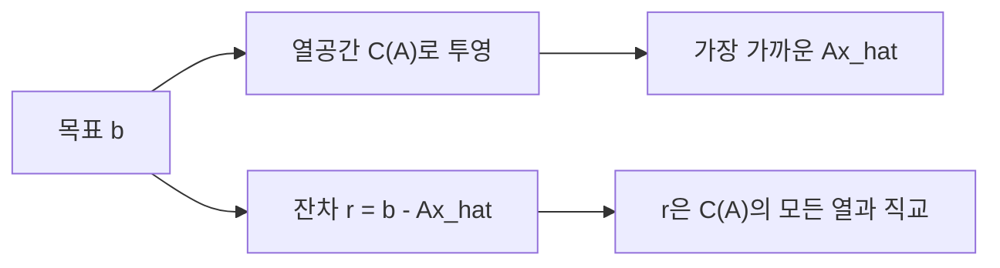

# 직교성과 최소제곱 (Orthogonality and Least Squares)

- Level: Intermediate
- Prerequisites: [Math/Linear-Algebra/Linear-Systems.md](Linear-Systems.md), [Math/Linear-Algebra/Vectors.md](Vectors.md)
- Status: Draft
- Reviewed-by: -
- Depth: Deep-dive (자기완결)

---

## 개념 (Concept)

두 벡터의 내적이 0이면 서로 직교한다고 한다. 직교 기저에서는 좌표 성분이 서로 간섭하지 않아 길이, 투영, 연립방정식 계산이 단순해진다. 최소제곱법은 정확한 해가 없는 $A\mathbf{x}=\mathbf{b}$에서 잔차 길이를 가장 작게 만드는 해를 찾으며, 이는 $\mathbf{b}$를 $A$의 열공간에 직교 투영하는 문제다.

## 직관 (Intuition)

점에서 직선까지 가장 짧은 길이는 직선에 수직인 선분이다. 마찬가지로 $A\mathbf{x}$가 만들 수 있는 모든 벡터 중 $\mathbf{b}$와 가장 가까운 점을 고르면, 남은 잔차 $\mathbf{r}=\mathbf{b}-A\hat{\mathbf{x}}$는 열공간 전체에 수직이다.



## 이론 (Theory)

직교 벡터는 $\mathbf{u}^\top\mathbf{v}=0$을 만족한다. 열이 서로 정규직교인 행렬 $Q$는

$$
Q^\top Q=I, \qquad \|Q\mathbf{x}\|_2=\|\mathbf{x}\|_2
$$

를 만족해 길이와 각도를 보존한다. 정규직교 열 $Q$가 생성하는 공간으로의 투영은

$$
\operatorname{proj}(\mathbf{b})=QQ^\top\mathbf{b}
$$

이다. 최소제곱 목적은

$$
\hat{\mathbf{x}}=\arg\min_{\mathbf{x}}\|A\mathbf{x}-\mathbf{b}\|_2^2
$$

이고, 최적점의 잔차가 열공간에 직교하므로 정규방정식 $A^\top A\hat{\mathbf{x}}=A^\top\mathbf{b}$를 얻는다. 하지만 $A^\top A$는 조건수를 제곱하므로 실수 계산에서는 보통 QR이나 SVD를 사용한다.

### 직교 투영의 손계산

$\mathbf{x}=(2,1)$을 $\mathbf{u}=(1,1)$ 방향으로 투영해 보자.

$$
\operatorname{proj}_{\mathbf{u}}(\mathbf{x})
=\frac{\mathbf{x}\cdot\mathbf{u}}{\mathbf{u}\cdot\mathbf{u}}\mathbf{u}
=\frac{3}{2}(1,1)
=(1.5,1.5)
$$

잔차는 $(2,1)-(1.5,1.5)=(0.5,-0.5)$이고, $(0.5,-0.5)\cdot(1,1)=0$이다. 최소제곱도 같은 구조다. $A$의 열들이 만드는 부분공간에 $\mathbf{b}$를 투영하고, 남은 잔차가 그 공간과 직교한다.

### Gram-Schmidt와 QR

독립 벡터 $\mathbf{a}_1,\dots,\mathbf{a}_n$에서 정규직교 벡터 $\mathbf{q}_1,\dots,\mathbf{q}_n$를 만드는 절차가 Gram-Schmidt다. 각 새 벡터에서 이전 $\mathbf{q}$ 방향 성분을 빼고 정규화한다.

$$
\mathbf{u}_k=\mathbf{a}_k-\sum_{i<k}(\mathbf{a}_k^\top\mathbf{q}_i)\mathbf{q}_i,\qquad
\mathbf{q}_k=\frac{\mathbf{u}_k}{\|\mathbf{u}_k\|}
$$

행렬 관점에서는 $A=QR$ 분해가 된다. $Q$는 길이를 보존하는 정규직교 열을 갖고, $R$은 상삼각행렬이다. 최소제곱은 $A\mathbf{x}\approx\mathbf{b}$를 $QR\mathbf{x}\approx\mathbf{b}$로 바꾼 뒤 $R\mathbf{x}=Q^\top\mathbf{b}$를 푸는 형태가 된다.

## 구현 (Implementation)

```python
import numpy as np

A = np.array([[1.0, 1.0],
              [1.0, 2.0],
              [1.0, 3.0]])
b = np.array([1.0, 2.0, 2.0])

x, *_ = np.linalg.lstsq(A, b, rcond=None)
residual = b - A @ x
print(x)
print(A.T @ residual)  # 0에 가까움: 잔차가 열공간에 직교

Q, R = np.linalg.qr(A)
print(np.allclose(Q.T @ Q, np.eye(Q.shape[1])))
```

직접 투영을 계산하면 최소제곱의 기하학이 더 잘 보인다.

```python
u = np.array([1.0, 1.0])
x = np.array([2.0, 1.0])
projection = (x @ u) / (u @ u) * u
residual = x - projection
print(projection)          # [1.5 1.5]
print(residual @ u)        # 0.0
```

## 복잡도 (Complexity)

$A$가 $m\times n$이고 $m\ge n$일 때 조밀한 QR 분해는 대략 `O(mn^2)`, 저장 공간은 `O(mn)`이다. 정규방정식은 계산량이 적을 수 있지만 수치 안정성이 나빠질 수 있다.

정규방정식은 $A^\top A$를 만들 때 조건수가 대략 제곱되므로, 입력 열들이 거의 선형종속이면 오차가 크게 증폭될 수 있다. QR은 계산량이 조금 더 들더라도 이 문제를 완화한다.

## 응용 (Applications)

- 선형 회귀와 곡선 적합
- 신호를 기저 성분으로 분해하고 잡음 제거
- QR 분해를 이용한 안정적인 연립방정식 풀이
- Gram–Schmidt를 통한 직교 기저 구성

## 흔한 오해 (Common Misunderstandings)

- 직교는 좌표축에 수직이라는 뜻에 한정되지 않는다. 선택한 내적에서 두 벡터의 내적이 0이라는 뜻이다.
- 최소제곱해가 모든 방정식을 정확히 만족하는 것은 아니다. 잔차의 제곱합을 최소화한다.
- 정규방정식이 수학적으로 맞아도 수치적으로 가장 좋은 구현은 아닐 수 있다.
- 직교 행렬의 열과 행은 정규화까지 되어 있어야 $Q^\top Q=I$가 된다.
- 직교와 독립은 다르다. 0이 아닌 직교 벡터들은 독립이지만, 독립 벡터들이 반드시 직교하지는 않는다.
- 잔차가 $\mathbf{b}$에 직교하는 것이 아니라 $A$의 열공간에 직교한다는 점을 구분해야 한다.

## TMI

- 고전적 Gram–Schmidt는 부동소수점 오차에 민감해 수정 Gram–Schmidt나 Householder QR이 더 자주 쓰인다.
- 회전과 반사는 직교 행렬로 나타나며 길이와 각도를 보존한다.
- 회귀의 잔차가 설계 행렬 열에 직교한다는 성질은 정규방정식의 기하학적 의미다.

## 연습 / 확인 문제 (Exercises)

- 벡터 $(3,4)$를 $(1,0)$ 방향으로 투영하라.
- 서로 독립이지만 직교하지 않는 두 벡터를 Gram–Schmidt로 직교화하라.
- 최소제곱 예제에서 $A^\top\mathbf{r}$이 0에 가까운지 확인하고 의미를 설명하라.
- 정규방정식과 QR 기반 최소제곱을 거의 공선적인 열을 가진 행렬에서 비교하라.
- $Q^\top Q=I$이면 $\|Qx\|=\|x\|$가 되는 이유를 전개해 보라.

## 이어서 읽기 (Reading Path)

- 이전: [선형 연립방정식](Linear-Systems.md)
- 다음: [특이값 분해](SVD.md)
- 관련: [선형 회귀](../../AI/Machine-Learning/Linear-Regression.md)

## 참조 (References)

- [Math/Linear-Algebra/Linear-Systems.md](Linear-Systems.md)
- [Math/Linear-Algebra/Vectors.md](Vectors.md)
- [Reference/Books.md](../../Reference/Books.md)
- [Reference/Courses.md](../../Reference/Courses.md)
