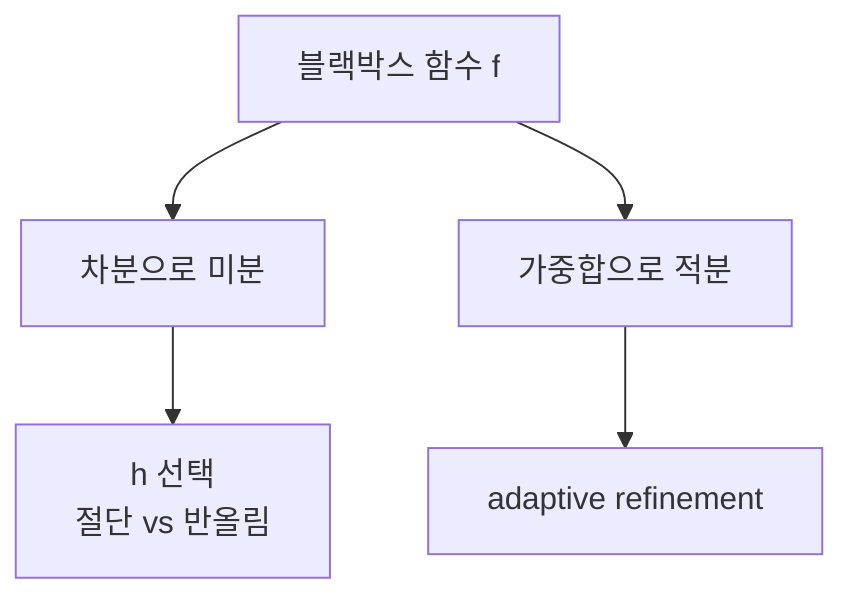

# 수치 미분과 적분 (Numerical Differentiation and Integration)

- Level: Intermediate
- Prerequisites: [Math/Calculus/Integration.md](../Calculus/Integration.md), [Math/Numerical-Methods/Floating-Point.md](Floating-Point.md)
- Status: Draft
- Reviewed-by: -
- Depth: Deep-dive (자기완결)

---

## 개념 (Concept)

수치 미분은 도함수를 차분으로, 수치 적분(quadrature)은 정적분을 가중합으로 근사한다. 닫힌 형식이 없거나 함수가 표/블랙박스로만 주어질 때 도함수·적분을 추정한다.

## 직관 (Intuition)

미분은 "기울기"이므로 가까운 두 점의 차이로 근사한다. 적분은 "넓이"이므로 잘게 쪼갠 조각의 넓이를 더한다. 단순하지만, 미분은 작은 분모 때문에 반올림 오차에 취약하고, 적분은 분할을 똑똑하게 하면 적은 평가로도 정밀해진다.



## 이론 (Theory)

**수치 미분**: 중앙 차분이 전·후방보다 정확하다.

$$f'(x)\approx\frac{f(x+h)-f(x-h)}{2h}+O(h^2)$$

$h$를 줄이면 절단 오차는 줄지만 반올림 오차는 커져, 최적 $h$는 둘의 균형에서 결정된다($\approx\sqrt\varepsilon$).

**수치 적분(quadrature)**: 보간 다항식을 적분해 공식을 얻는다.
- 사다리꼴: 오차 $O(h^2)$.
- 심프슨: 오차 $O(h^4)$.
- 가우스 구적: $n$개 점으로 차수 $2n-1$ 다항식을 정확히 적분.

적응적(adaptive) 방법은 곡률이 큰 구간에 점을 더 둔다.

### 전방, 후방, 중앙 차분

테일러 전개로 보면

$$
\frac{f(x+h)-f(x)}{h}=f'(x)+O(h)
$$

이고 중앙 차분은 홀수 오차항이 상쇄되어

$$
\frac{f(x+h)-f(x-h)}{2h}=f'(x)+O(h^2)
$$

가 된다. 같은 $h$라면 중앙 차분이 보통 더 정확하지만 함수 평가가 두 번 필요하다.

### Richardson 외삽

오차가 $D(h)=D^\*+Ch^2+O(h^4)$ 형태라면

$$
\frac{4D(h/2)-D(h)}{3}
$$

로 $O(h^2)$ 오차를 제거해 더 높은 차수 근사를 만들 수 있다. 수치 미분과 적분 공식의 차수 향상에 자주 쓰인다.

### 적응적 적분의 판단

구간 전체에 Simpson 공식을 한 번 적용한 값과, 구간을 반으로 나누어 두 번 적용한 값을 비교하면 국소 오차를 추정할 수 있다. 차이가 크면 그 구간만 더 쪼갠다. 불연속, sharp peak, 특이점이 있는 함수에서는 이런 국소 refinement가 중요하다.

## 구현 (Implementation)

```python
def central_diff(f, x, h=1e-5):
    return (f(x + h) - f(x - h)) / (2 * h)     # O(h^2)

def simpson(f, a, b, n=1000):                  # n은 짝수
    if n % 2:
        raise ValueError("n must be even")
    h = (b - a) / n
    s = f(a) + f(b)
    for i in range(1, n):
        s += (4 if i % 2 else 2) * f(a + i * h)
    return s * h / 3
```

함수 평가 횟수를 기록하면 비용과 정확도 균형을 비교하기 쉽다.

```python
def richardson_derivative(f, x, h=1e-3):
    d1 = central_diff(f, x, h)
    d2 = central_diff(f, x, h / 2)
    return (4 * d2 - d1) / 3
```

## 복잡도 (Complexity)

수치 미분은 함수 평가 몇 번으로 `O(1)`이지만 정확도가 $h$에 민감하다. 합성 적분은 분할 $n$에 비례해 `O(n)` 평가가 들고, 같은 정확도를 심프슨/가우스 구적이 사다리꼴보다 훨씬 적은 점으로 달성한다. 고차원은 차원의 저주로 몬테카를로가 유리하다.

adaptive quadrature는 최악 비용을 함수의 난이도에 따라 쓰므로 단순한 `n`으로만 설명하기 어렵다. 매끄러운 구간에는 적은 점, 어려운 구간에는 많은 점을 배분하는 것이 핵심이다.

## 응용 (Applications)

- 그래디언트가 없는 함수의 민감도/도함수 추정(유한차분)
- 확률밀도의 적분, 기댓값·정규화 상수
- 물리 시뮬레이션의 수치 적분
- 자동 미분 검증용 기준값

## 흔한 오해 (Common Misunderstandings)

- 수치 미분에서 $h$를 0에 한없이 가깝게 두면 오히려 부정확해진다(상쇄 오차).
- 자동 미분(역전파)은 수치 미분과 달리 반올림 누적 없이 정확한 도함수를 준다.
- 사다리꼴이 항상 충분하지 않다. 매끄러운 함수엔 심프슨/가우스가 훨씬 효율적.
- 불연속·특이점이 있으면 표준 구적의 차수가 무너진다.
- 수치 미분은 noisy 함수에 매우 취약하다. 작은 $h$는 노이즈까지 크게 증폭한다.
- 고차 공식은 매끄러운 함수에서는 좋지만, 함수 평가 오차나 불연속이 있으면 기대 차수가 나오지 않을 수 있다.

## TMI

- 가우스 구적의 점과 가중치는 직교다항식(르장드르)의 근에서 나온다 — 우아한 이론적 결과다.
- 리처드슨 외삽은 서로 다른 $h$의 근사를 결합해 차수를 끌어올리는 영리한 기법이다.
- 딥러닝의 그래디언트 체크는 수치 미분으로 역전파 구현을 검증한다.

## 연습 / 확인 문제 (Exercises)

- 전방 차분과 중앙 차분의 오차 차수를 테일러 전개로 유도하라.
- $\int_0^\pi \sin x\,dx$를 사다리꼴과 심프슨으로 근사해 정확값 2와 비교하라.
- 수치 미분에서 $h$를 줄여 가며 오차가 다시 커지는 지점을 관찰하라.
- Richardson 외삽을 중앙 차분에 적용해 오차가 어떻게 줄어드는지 실험하라.
- 불연속 함수의 적분에서 구간을 불연속점 기준으로 나누면 결과가 어떻게 개선되는지 확인하라.

## 이어서 읽기 (Reading Path)

- 이전: [보간법](Interpolation.md)
- 다음: [상미분 방정식 수치 해법](ODE-Solvers.md)

## 참조 (References)

- [Math/Calculus/Integration.md](../Calculus/Integration.md)
- [Math/Numerical-Methods/Floating-Point.md](Floating-Point.md)
- [Reference/Books.md](../../Reference/Books.md)
