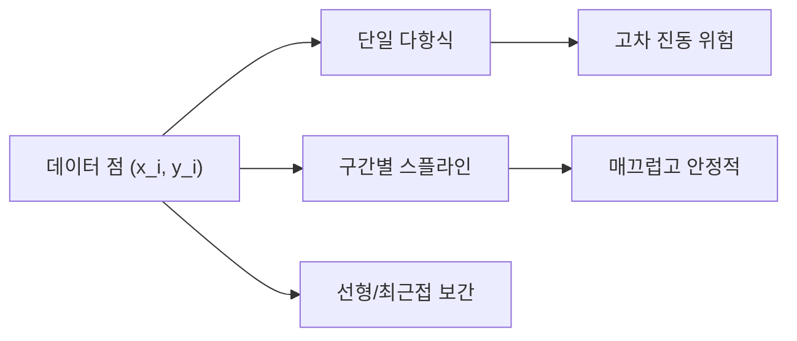

# 보간법 (Interpolation)

- Level: Intermediate
- Prerequisites: [Math/Linear-Algebra/Linear-Systems.md](../Linear-Algebra/Linear-Systems.md), [Math/Calculus/Taylor-Series.md](../Calculus/Taylor-Series.md)
- Status: Draft
- Reviewed-by: -
- Depth: Deep-dive (자기완결)

---

## 개념 (Concept)

보간법은 주어진 데이터 점들을 지나는 함수를 구해, 그 사이 값을 추정하는 방법이다. 다항식 보간, 구간 다항식(스플라인), 라그랑주·뉴턴 형식이 대표적이다.

## 직관 (Intuition)

측정은 띄엄띄엄 이뤄지지만, 그 사이 값이 필요할 때가 많다. 보간은 "점들을 매끄럽게 잇는 곡선"을 만들어 빈 곳을 메운다. 단, 너무 높은 차수의 다항식 하나로 모든 점을 이으면 양 끝에서 출렁이므로(룽게 현상), 구간별 저차 다항식을 잇는 스플라인이 실용적이다.



## 이론 (Theory)

$n+1$개 점을 지나는 차수 $n$ 다항식은 유일하다.

**라그랑주 형식**:

$$P(x)=\sum_{i=0}^{n} y_i\,\ell_i(x),\qquad \ell_i(x)=\prod_{j\ne i}\frac{x-x_j}{x_i-x_j}$$

**뉴턴 형식**은 분할차분(divided difference)으로 점 추가가 쉽다. **스플라인**은 구간마다 저차(보통 3차) 다항식을 쓰되 경계에서 값·1·2계 도함수를 연속으로 맞춰 매끄럽게 잇는다. 보간 오차는 $f$의 고계도함수와 점 분포에 의존하며, 체비쇼프 점은 룽게 현상을 억제한다.

### 보간 오차

$n+1$개 서로 다른 점 $x_0,\dots,x_n$을 지나는 다항식 $P_n$에 대해 충분히 매끄러운 $f$의 오차는

$$
f(x)-P_n(x)=\frac{f^{(n+1)}(\xi)}{(n+1)!}\prod_{i=0}^{n}(x-x_i)
$$

꼴이다. 즉 함수의 고계도함수와 노드 배치가 함께 오차를 결정한다. 등간격 노드는 끝점 근처 곱 항이 커져 고차에서 진동이 심해질 수 있다.

### 보간과 회귀의 차이

| 방법 | 데이터 점 통과 | 노이즈 처리 |
|---|---|---|
| 보간 | 모든 점을 정확히 통과 | 노이즈도 그대로 따라감 |
| 회귀/피팅 | 오차를 허용 | 노이즈를 평균화할 수 있음 |
| smoothing spline | 정확 통과보다 매끄러움 우선 | regularization 사용 |

측정 노이즈가 큰 데이터에는 보간보다 피팅이 더 적합하다.

### 외삽 위험

보간은 관측 구간 내부를 추정하는 문제다. 구간 밖 외삽은 모델 가정에 크게 의존하고 오차가 빠르게 커질 수 있다. 특히 고차 다항식은 관측 구간 밖에서 폭주하기 쉽다.

## 구현 (Implementation)

```python
def lagrange(xs, ys, x):
    total = 0.0
    n = len(xs)
    for i in range(n):
        term = ys[i]
        for j in range(n):
            if j != i:
                term *= (x - xs[j]) / (xs[i] - xs[j])   # 기저 다항식
        total += term
    return total
```

선형 보간은 단순하지만 단조성과 국소성을 유지해 실무에서 자주 쓰인다.

```python
def linear_interp(x0, y0, x1, y1, x):
    t = (x - x0) / (x1 - x0)
    return (1 - t) * y0 + t * y1
```

## 복잡도 (Complexity)

라그랑주 한 점 평가는 `O(n^2)`, 뉴턴 형식은 분할차분 표를 `O(n^2)`에 만든 뒤 평가가 `O(n)`이다. 3차 스플라인은 삼중대각 선형계를 `O(n)`에 풀어 계수를 구한다. 고차 단일 다항식은 수치적으로 불안정해, 실무는 스플라인이나 조각별 보간을 선호한다.

보간점을 찾기 위해 정렬된 `x_i`에서 구간 검색이 필요하다. 이진 탐색을 쓰면 평가 전 구간 찾기가 `O(log n)`, 균등 격자는 인덱스 계산으로 `O(1)`에 가깝게 처리할 수 있다.

## 응용 (Applications)

- 그래픽스의 곡선·애니메이션(베지어/스플라인)
- 신호·이미지의 리샘플링과 업스케일
- 표 데이터 사이값 추정, 룩업 테이블
- 수치 적분·미분 공식 유도의 기반

## 흔한 오해 (Common Misunderstandings)

- 차수를 높인다고 보간이 좋아지지 않는다(룽게 현상).
- 보간(주어진 점을 정확히 통과)과 근사/피팅(오차 허용)은 다르다.
- 등간격 점이 항상 최선은 아니다. 체비쇼프 점이 오차를 줄인다.
- 외삽(extrapolation)은 보간보다 훨씬 위험하다.
- 입력 점의 $x_i$가 중복되면 일반적인 다항식 보간이 정의되지 않는다. 같은 위치의 다른 값은 노이즈나 다가함수 문제다.
- 스플라인은 "그럴듯한 곡선"을 주지만 실제 물리 법칙이나 단조성을 자동 보장하지는 않는다.

## TMI

- 룽게 현상은 $1/(1+25x^2)$를 등간격 고차 다항식으로 보간하면 양 끝이 폭주하는 유명한 예다.
- 베지어 곡선은 폰트·벡터 그래픽의 표준이며 보간/근사의 사촌 격이다.
- "스플라인"이라는 이름은 제도공이 곡선을 그릴 때 쓰던 휘는 자(spline)에서 왔다.

## 연습 / 확인 문제 (Exercises)

- 세 점을 지나는 2차 라그랑주 다항식을 직접 구하라.
- 등간격 점으로 룽게 함수를 고차 보간해 끝단 진동을 관찰하라.
- 3차 자연 스플라인의 경계 조건이 무엇을 의미하는지 설명하라.
- noisy 데이터에 보간과 선형 회귀를 각각 적용했을 때 차이를 비교하라.
- 체비쇼프 노드와 등간격 노드에서 같은 함수의 최대 보간 오차를 실험하라.

## 이어서 읽기 (Reading Path)

- 이전: [선형 방정식 수치 풀이](Numerical-Linear-Systems.md)
- 다음: [수치 미분과 적분](Differentiation-Integration.md)

## 참조 (References)

- [Math/Calculus/Taylor-Series.md](../Calculus/Taylor-Series.md)
- [Reference/Books.md](../../Reference/Books.md)
