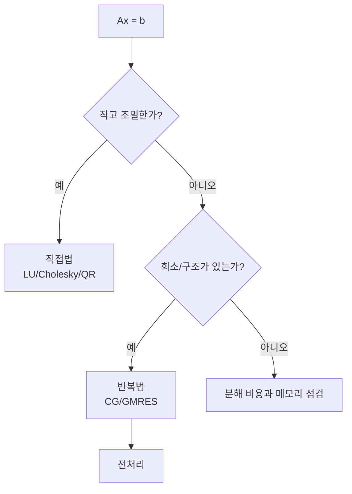

# 선형 방정식 수치 풀이 (Numerical Linear Systems)

- Level: Advanced
- Prerequisites: [Math/Linear-Algebra/Linear-Systems.md](../Linear-Algebra/Linear-Systems.md), [Math/Numerical-Methods/Floating-Point.md](Floating-Point.md)
- Status: Draft
- Reviewed-by: -
- Depth: Deep-dive (자기완결)

---

## 개념 (Concept)

$Ax=b$를 컴퓨터로 푸는 방법이다. 가우스 소거와 LU 분해 같은 직접법, 그리고 큰 희소 행렬을 위한 반복법(야코비, 가우스-자이델, 공액기울기)으로 나뉜다. 조건수가 정확도를 좌우한다.

## 직관 (Intuition)

선형 시스템은 과학·공학·머신러닝 어디에나 나온다. 작은 문제는 소거로 단번에 풀지만, 변수가 수백만 개인 희소 시스템은 직접법이 비현실적이라 "근사해를 반복 개선"하는 방식을 쓴다. 또한 행렬이 "거의 특이"하면 작은 입력 오차가 해를 크게 흔드는데, 이를 조건수로 가늠한다.



## 이론 (Theory)

**LU 분해**: $A=LU$(하삼각 × 상삼각)로 분해하면 $Ly=b$, $Ux=y$를 전·후진 대입으로 푼다. 수치 안정성을 위해 부분 피벗팅을 쓴다. 대칭 양의 정부호 행렬은 콜레스키 $A=LL^\top$가 더 싸다.

**반복법**: $x^{(k+1)}=x^{(k)}+M^{-1}(b-Ax^{(k)})$ 꼴로 잔차를 줄인다. 공액기울기(CG)는 대칭 양정부호 희소계에서 효율적이다.

**조건수** $\kappa(A)=\lVert A\rVert\,\lVert A^{-1}\rVert$가 크면 ill-conditioned이며, 상대 오차가 $\kappa$배까지 증폭될 수 있다.

### 잔차와 해 오차

계산한 해 $\hat{x}$에 대해 잔차는

$$
r=b-A\hat{x}
$$

이다. 잔차가 작다는 것은 방정식을 잘 만족한다는 뜻이지만, 조건수가 크면 실제 해 오차 $\|\hat{x}-x\|$는 클 수 있다. 따라서 선형 시스템 풀이에서는 보통 잔차, 상대 잔차, 조건수 추정을 함께 본다.

### pivoting과 scaling

가우스 소거에서 작은 pivot으로 나누면 반올림 오차가 크게 증폭될 수 있다. 부분 피벗팅은 현재 열에서 절댓값이 큰 pivot 행을 골라 안정성을 높인다. 행/열 스케일이 크게 다르면 먼저 scaling을 적용해 조건을 개선할 수도 있다.

### 전처리

반복법은 $Ax=b$ 대신 풀기 쉬운 $M^{-1}Ax=M^{-1}b$를 푼다. $M$은 $A$를 닮았지만 풀기 쉬워야 한다. 좋은 전처리는 condition number나 고유값 분포를 개선해 반복 횟수를 줄인다.

## 구현 (Implementation)

```python
def lu_solve(A, b):
    import numpy as np
    from scipy.linalg import lu_factor, lu_solve
    lu, piv = lu_factor(A)          # 부분 피벗 LU
    return lu_solve((lu, piv), b)   # 전진/후진 대입

# 개념용 가우스-자이델 (희소계 반복법)
def gauss_seidel(A, b, x, iters=100):
    n = len(b)
    for _ in range(iters):
        for i in range(n):
            s = sum(A[i][j]*x[j] for j in range(n) if j != i)
            x[i] = (b[i] - s) / A[i][i]
    return x
```

해를 얻은 뒤에는 잔차를 확인한다.

```python
import numpy as np

A = np.array([[2.0, 1.0], [1.0, 3.0]])
b = np.array([5.0, 7.0])
x = np.linalg.solve(A, b)
relative_residual = np.linalg.norm(b - A @ x) / np.linalg.norm(b)
print(relative_residual, np.linalg.cond(A))
```

## 복잡도 (Complexity)

조밀 행렬의 가우스 소거/LU는 `O(n^3)`, 이후 각 우변 풀이는 `O(n^2)`다. 희소·구조화 행렬은 반복법으로 반복당 `O(nnz)`(0이 아닌 원소 수)에 처리해 훨씬 싸다. CG는 이론상 $n$ 반복 안에 수렴하지만, 좋은 전처리(preconditioning)로 실제 반복 수를 크게 줄인다.

분해는 여러 오른쪽 항을 풀 때 재사용할 수 있다. 같은 $A$로 $k$개의 $b$를 풀면 분해 `O(n^3)` 한 번과 대입 `O(kn^2)`가 기본 구조다.

## 응용 (Applications)

- 최소제곱·회귀의 정규방정식 풀이
- 유한요소·유한차분 등 PDE 이산화 시스템
- 그래프 라플라시안, 추천의 행렬 계산
- 최적화 내부의 선형 부분문제

## 흔한 오해 (Common Misunderstandings)

- $A^{-1}$를 명시적으로 구해 곱하지 마라. LU로 직접 푸는 것이 더 빠르고 안정적이다.
- 피벗팅 없는 가우스 소거는 작은 피벗에서 수치적으로 불안정하다.
- 조건수가 크면 알고리즘이 좋아도 해가 부정확할 수 있다(문제 자체의 한계).
- 반복법이 항상 수렴하지는 않는다(대각 우세·양정부호 등 조건 필요).
- 작은 잔차가 항상 작은 해 오차를 의미하지 않는다. 조건수가 큰 문제에서는 둘이 분리된다.
- Cholesky는 모든 대칭 행렬이 아니라 대칭 양의 정부호 행렬에 쓰는 분해다.

## TMI

- 힐베르트 행렬은 악명 높게 조건수가 커, 수치 불안정성의 교과서적 예다.
- 공액기울기법(1952)은 대규모 과학 계산을 가능케 한 핵심 알고리즘으로 꼽힌다.
- BLAS/LAPACK은 수십 년간 최적화된 선형대수 커널로, 거의 모든 수치 소프트웨어의 기반이다.

## 연습 / 확인 문제 (Exercises)

- $2\times2$ 시스템을 LU 분해로 풀어라.
- 대각 우세 행렬에서 가우스-자이델의 수렴을 관찰하라.
- 조건수가 큰 행렬에서 입력을 살짝 바꿨을 때 해가 얼마나 변하는지 실험하라.
- 같은 $A$에 여러 $b$를 풀 때 LU 분해 재사용이 왜 유리한지 비용으로 설명하라.
- 잔차가 작은데 해 오차가 큰 예를 Hilbert 행렬로 실험하라.

## 이어서 읽기 (Reading Path)

- 이전: [Math/Linear-Algebra/Linear-Systems.md](../Linear-Algebra/Linear-Systems.md)
- 다음: [보간법](Interpolation.md), [Math/Linear-Algebra/SVD.md](../Linear-Algebra/SVD.md)

## 참조 (References)

- [Math/Linear-Algebra/Linear-Systems.md](../Linear-Algebra/Linear-Systems.md)
- [Math/Numerical-Methods/Floating-Point.md](Floating-Point.md)
- [Reference/Books.md](../../Reference/Books.md)
