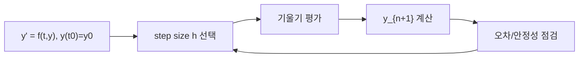

# 상미분 방정식 수치 해법 (ODE Solvers)

- Level: Advanced
- Prerequisites: [Math/Numerical-Methods/Differentiation-Integration.md](Differentiation-Integration.md), [Math/Calculus/Taylor-Series.md](../Calculus/Taylor-Series.md)
- Status: Draft
- Reviewed-by: -
- Depth: Deep-dive (자기완결)

---

## 개념 (Concept)

ODE 솔버는 초기값 문제 $y'=f(t,y),\ y(t_0)=y_0$를 시간 방향으로 한 스텝씩 전진시켜 푸는 방법이다. 오일러법, 룽게-쿠타(RK4), 그리고 뻣뻣한(stiff) 문제용 음함수 방법이 있다.

## 직관 (Intuition)

미분 방정식은 "지금의 변화율"을 알려 준다. 그러면 "현재 위치에서 그 방향으로 조금 가고, 다시 변화율을 보고 또 가는" 식으로 미래를 따라갈 수 있다. 한 번에 크게 가면 오차가 쌓이고, 잘게 가면 정확하지만 느리다. 더 똑똑한 방법(RK4)은 구간 안에서 기울기를 여러 번 평가해 정확도를 끌어올린다.



## 이론 (Theory)

**전방 오일러**: $y_{n+1}=y_n+h\,f(t_n,y_n)$. 국소 오차 $O(h^2)$, 전역 $O(h)$. 단순하지만 부정확·불안정.

**룽게-쿠타 4차(RK4)**: 구간 내 네 기울기의 가중 평균.

$$y_{n+1}=y_n+\frac{h}{6}(k_1+2k_2+2k_3+k_4)$$

전역 오차 $O(h^4)$로 비용 대비 정확도가 좋아 표준이다.

**뻣뻣한 문제**: 빠른·느린 시간 스케일이 공존하면 명시적 방법은 아주 작은 $h$를 강요받는다. 후방 오일러 같은 음함수(implicit) 방법이 안정적이다. 적응적 스텝(RKF45)은 오차를 추정해 $h$를 자동 조절한다.

### local error와 global error

한 스텝에서 생기는 오차가 local truncation error이고, 여러 스텝을 거치며 누적된 최종 오차가 global error다. 오일러법은 local error가 $O(h^2)$지만 스텝 수가 $1/h$개라 global error는 $O(h)$가 된다. RK4는 global error가 $O(h^4)$다.

### 안정성 예제

테스트 방정식 $y'=\lambda y$에서 전방 오일러는

$$
y_{n+1}=(1+h\lambda)y_n
$$

이다. 실제 해가 감소하려면 $\lambda<0$일 때 수치해도 폭주하지 않아야 한다. 안정하려면 대략 $|1+h\lambda|<1$이 필요하다. $\lambda=-1000$이면 $h$를 매우 작게 잡아야 해서 stiff 문제가 된다.

### adaptive step size

실무 솔버는 보통 한 스텝에서 낮은 차수와 높은 차수 근사를 동시에 계산해 오차를 추정한다. 오차가 허용치보다 크면 step을 버리고 $h$를 줄이며, 작으면 $h$를 키운다. 이 방식은 급격한 변화가 있는 구간에서 자동으로 촘촘해진다.

## 구현 (Implementation)

```python
def rk4_step(f, t, y, h):
    k1 = f(t, y)
    k2 = f(t + h/2, y + h/2 * k1)
    k3 = f(t + h/2, y + h/2 * k2)
    k4 = f(t + h,   y + h   * k3)
    return y + h/6 * (k1 + 2*k2 + 2*k3 + k4)   # 네 기울기 가중 평균
```

간단한 고정 스텝 적분 루프:

```python
def solve_fixed_step(f, t0, y0, tf, h):
    t, y = t0, y0
    out = [(t, y)]
    while t < tf:
        h_step = min(h, tf - t)
        y = rk4_step(f, t, y, h_step)
        t += h_step
        out.append((t, y))
    return out
```

## 복잡도 (Complexity)

스텝 수 $N=(t_f-t_0)/h$에 대해 비용은 `O(N × 스텝당 f 평가 수)`다. 오일러는 스텝당 1회, RK4는 4회 평가하지만 훨씬 큰 $h$를 허용해 총 비용이 작다. 뻣뻣한 문제의 음함수 방법은 각 스텝에서 비선형 방정식을 풀어야 해 스텝당 비용이 크지만 안정성으로 보상된다.

상태 차원이 `d`이면 함수 평가 비용이 보통 `O(d)` 이상이고, implicit 방법은 Jacobian 계산과 선형 시스템 풀이가 들어가 `O(d^3)`까지 커질 수 있다. 희소 구조와 전처리가 중요하다.

## 응용 (Applications)

- 물리 시뮬레이션(궤도, 진자, 회로)
- 인구·전염병·화학 반응 동역학
- 신경망의 연속 모델(Neural ODE)
- 제어 시스템·로보틱스의 상태 적분

## 흔한 오해 (Common Misunderstandings)

- 오일러법은 교육용일 뿐, 실무에서는 정확도·안정성 때문에 거의 RK4 이상을 쓴다.
- 스텝을 줄인다고 항상 안전하지 않다(뻣뻣한 문제는 명시적 방법 자체가 부적합).
- 높은 차수 방법이 항상 빠르지 않다(스텝당 평가 비용 증가).
- 에너지 보존이 중요한 문제는 일반 RK보다 심플렉틱 적분기가 낫다.
- solver tolerance는 실제 모델링 오차까지 없애 주지 않는다. 수치 오차와 모델 오차를 구분해야 한다.
- 불연속 이벤트가 있으면 step을 그 지점에서 끊어야 한다. 그냥 지나치면 큰 오차가 생길 수 있다.

## TMI

- 룽게-쿠타는 1900년경 독일 수학자 두 사람의 이름에서 왔고, RK4는 100년 넘게 표준으로 군림한다.
- "stiff" 방정식이라는 용어는 명시적 솔버가 비현실적으로 작은 스텝을 강요받는 현상에서 나왔다.
- Neural ODE(2018)는 ResNet의 층을 연속 시간 ODE로 재해석해 딥러닝과 수치해석을 잇는다.

## 연습 / 확인 문제 (Exercises)

- $y'=y,\ y(0)=1$을 오일러와 RK4로 풀어 $e^t$와 비교하라.
- 같은 $h$에서 두 방법의 전역 오차 차수를 관찰하라.
- 뻣뻣한 예 $y'=-1000y$에서 명시적 방법의 스텝 제한을 설명하라.
- $y'=-y$에 대해 전방 오일러가 안정하려면 $h$가 어느 범위에 있어야 하는지 유도하라.
- 이벤트가 있는 ODE 예제를 만들고, 이벤트 시점에서 step을 끊는 것과 끊지 않는 것의 차이를 비교하라.

## 이어서 읽기 (Reading Path)

- 이전: [수치 미분과 적분](Differentiation-Integration.md)
- 다음: [Math/Numerical-Methods/](README.md), [Math/Optimization/Gradient-Descent.md](../Optimization/Gradient-Descent.md)

## 참조 (References)

- [Math/Numerical-Methods/Differentiation-Integration.md](Differentiation-Integration.md)
- [Reference/Books.md](../../Reference/Books.md)
