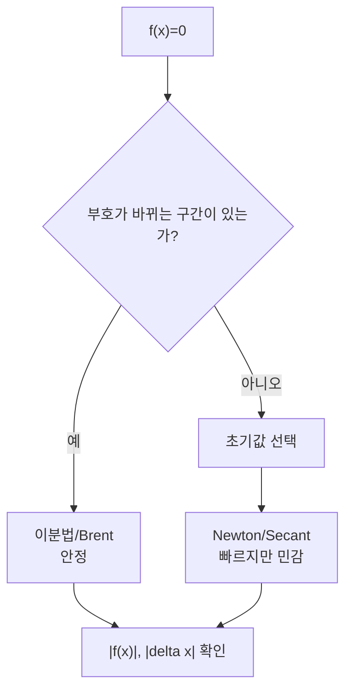

# 방정식의 수치 해법 (Root Finding)

- Level: Intermediate
- Prerequisites: [Math/Calculus/Differentiation.md](../Calculus/Differentiation.md), [Math/Calculus/Taylor-Series.md](../Calculus/Taylor-Series.md)
- Status: Draft
- Reviewed-by: -
- Depth: Deep-dive (자기완결)

---

## 개념 (Concept)

근 찾기는 $f(x)=0$의 해를 수치적으로 구하는 방법이다. 이분법, 뉴턴-랩슨, 할선법 등이 있으며, 닫힌 형식 해가 없는 방정식을 반복법으로 푼다.

## 직관 (Intuition)

대부분의 방정식은 손으로 풀리지 않는다. 그래서 "추측 → 보정 → 더 나은 추측"을 반복해 근에 다가간다. 이분법은 부호가 바뀌는 구간을 절반씩 좁히고, 뉴턴법은 접선이 축과 만나는 점으로 점프한다. 속도와 안정성 사이의 트레이드오프가 방법 선택을 가른다.



## 이론 (Theory)

**이분법**: $f(a)f(b)<0$이면 중간값 정리로 근이 존재. 구간을 반씩 줄여 선형(1차) 수렴, 항상 수렴.

**뉴턴-랩슨**: 접선 근사로

$$x_{n+1}=x_n-\frac{f(x_n)}{f'(x_n)}$$

근 근처에서 이차(quadratic) 수렴하지만, 초기값이 나쁘거나 $f'\approx 0$이면 발산할 수 있다.

**할선법**: 도함수 대신 차분으로 기울기를 근사. 수렴 차수 $\approx 1.618$(황금비), 도함수 불필요. 수렴 판정은 $|x_{n+1}-x_n|$ 또는 $|f(x_n)|$이 허용오차보다 작을 때다.

### 수렴 기준을 둘 다 보는 이유

$|f(x)|$가 작으면 함수값 기준으로는 근에 가까워 보인다. 하지만 함수가 평평하면 $x$ 위치는 많이 틀릴 수 있다. 반대로 $|\Delta x|$가 작아도 잘못된 고정점에 정체될 수 있다. 실무에서는 보통 다음을 함께 본다.

| 기준 | 의미 |
|---|---|
| $|f(x_n)| < \epsilon_f$ | 방정식 잔차가 작음 |
| $|x_{n+1}-x_n| < \epsilon_x$ | 반복이 안정됨 |
| 반복 횟수 제한 | 무한 루프 방지 |
| bracket 유지 | 해가 구간 안에 있음을 보장 |

### 뉴턴법 실패 모드

뉴턴법은 근처에서는 매우 빠르지만 다음 상황에 취약하다.

- $f'(x)$가 0에 가까워 step이 폭발한다.
- 초기값이 나빠 다른 근으로 가거나 발산한다.
- 중근에서는 수렴 차수가 떨어진다.
- 함수가 불연속이거나 noisy하면 접선 정보가 의미 없어질 수 있다.

그래서 라이브러리에서는 pure Newton보다 bracket을 유지하는 Brent류 방법을 자주 기본값으로 쓴다.

## 구현 (Implementation)

```python
def newton(f, df, x0, tol=1e-10, max_iter=100):
    x = x0
    for _ in range(max_iter):
        fx = f(x)
        if abs(fx) < tol:
            return x
        if abs(df(x)) < 1e-14:
            raise RuntimeError("도함수가 너무 작음")
        x = x - fx / df(x)          # 접선이 x축과 만나는 점
    raise RuntimeError("수렴 실패")

def bisection(f, a, b, tol=1e-10):
    while b - a > tol:
        m = (a + b) / 2
        if f(a) * f(m) <= 0: b = m   # 부호 바뀌는 쪽 유지
        else: a = m
    return (a + b) / 2
```

이분법은 반복 횟수를 미리 계산할 수 있다.

```python
import math

def bisection_iterations(a, b, tol):
    return math.ceil(math.log2((b - a) / tol))

print(bisection_iterations(0, 2, 1e-10))
```

## 복잡도 (Complexity)

이분법은 정확도 $\epsilon$까지 `O(log((b-a)/ε))` 반복(반복당 1회 평가). 뉴턴법은 이차 수렴이라 오차 자릿수가 매 반복 약 2배로 늘어 훨씬 적은 반복으로 끝나지만, 반복당 $f$와 $f'$를 평가하고 수렴 보장이 없다. 실무에서는 이분법으로 가두고 뉴턴/할선으로 가속하는 혼합법(Brent)을 쓴다.

## 응용 (Applications)

- 비선형 방정식·시스템 풀이
- 최적화(그래디언트=0 지점 찾기)
- 내부수익률(IRR), 임계값 계산
- 역함수 평가, 보정·캘리브레이션

## 흔한 오해 (Common Misunderstandings)

- 뉴턴법은 빠르지만 항상 수렴하지는 않는다(초기값·중근·변곡 주의).
- 이분법은 느리지만 부호 조건만 맞으면 반드시 수렴한다.
- 중근에서는 뉴턴법의 이차 수렴이 1차로 떨어진다.
- 수렴 판정은 $|f(x)|$와 $|\Delta x|$ 중 무엇을 쓰느냐에 따라 다르게 동작한다.
- 부호 변화가 없다고 근이 없는 것은 아니다. 예를 들어 $(x-1)^2=0$은 중근이라 부호가 바뀌지 않는다.
- 근을 하나 찾는 것과 모든 근을 찾는 것은 다른 문제다. 구간 분할, 다항식 구조, 그래프 분석이 필요할 수 있다.

## TMI

- 뉴턴-랩슨은 컴퓨터의 나눗셈·제곱근 하드웨어 구현에도 쓰인다(역수의 근 찾기).
- 전설적인 "fast inverse square root"(Quake III)는 뉴턴법 한 스텝으로 $1/\sqrt x$를 근사했다.
- Brent의 방법은 안정성과 속도를 겸비해 많은 수치 라이브러리의 기본 근 찾기다.

## 연습 / 확인 문제 (Exercises)

- $x^2-2=0$을 뉴턴법으로 풀어 $\sqrt2$를 근사하고 수렴 속도를 관찰하라.
- 같은 방정식을 이분법으로 풀고 반복 횟수를 비교하라.
- 뉴턴법이 발산하는 초기값의 예를 들어라.
- $(x-1)^2=0$에 대해 이분법의 부호 조건이 왜 실패하는지 설명하라.
- $|f(x)|$는 작지만 실제 근 위치 오차가 큰 평평한 함수 예제를 만들어라.

## 이어서 읽기 (Reading Path)

- 이전: [테일러 전개](../Calculus/Taylor-Series.md)
- 다음: [선형 방정식 수치 풀이](Numerical-Linear-Systems.md), [Math/Optimization/Gradient-Descent.md](../Optimization/Gradient-Descent.md)

## 참조 (References)

- [Math/Calculus/Taylor-Series.md](../Calculus/Taylor-Series.md)
- [Reference/Books.md](../../Reference/Books.md)
