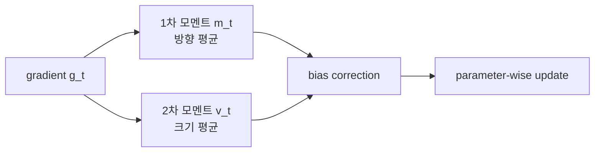

# 적응형 최적화 방법 (Adaptive Optimization Methods)

- Level: Intermediate
- Prerequisites: [Math/Optimization/SGD.md](SGD.md)
- Status: Draft
- Reviewed-by: -
- Depth: Deep-dive (자기완결)

---

## 개념 (Concept)

적응형 최적화 방법은 파라미터별 gradient의 과거 크기와 방향을 이용해 유효 학습률을 자동 조절한다. AdaGrad, RMSProp, Adam이 대표적이며, 서로 다른 스케일과 희소한 gradient를 가진 문제에서 빠른 초기 학습을 돕는다.

## 직관 (Intuition)

자주 크고 거친 gradient가 나타나는 방향에는 작은 걸음을, 드물고 작은 gradient가 나타나는 방향에는 상대적으로 큰 걸음을 준다. Adam은 여기에 momentum처럼 gradient의 평균 방향까지 추적해 속도와 스케일을 함께 보정한다.



## 이론 (Theory)

Adam은 gradient $g_t$의 1차·2차 모멘트 이동 평균을 계산한다.

$$
m_t=\beta_1m_{t-1}+(1-\beta_1)g_t,
\qquad v_t=\beta_2v_{t-1}+(1-\beta_2)g_t^2
$$

초기값 0의 편향을 보정해

$$
\hat m_t=\frac{m_t}{1-\beta_1^t},\quad
\hat v_t=\frac{v_t}{1-\beta_2^t},\quad
\theta_{t+1}=\theta_t-\eta\frac{\hat m_t}{\sqrt{\hat v_t}+\varepsilon}
$$

로 갱신한다. 모든 연산은 성분별이다. RMSProp은 주로 제곱 gradient 평균을, AdaGrad는 누적 제곱합을 사용한다. AdamW는 weight decay를 gradient 기반 update와 분리해 L2 규제와의 혼동을 줄인다.

### Adam update를 성분별로 읽기

각 파라미터 성분 $j$에 대해 Adam은

$$
\Delta\theta_{t,j}
=-\eta\frac{\hat m_{t,j}}{\sqrt{\hat v_{t,j}}+\varepsilon}
$$

를 적용한다. $\hat v_{t,j}$가 큰 성분은 최근 gradient 제곱이 컸다는 뜻이므로 유효 step이 작아진다. $\hat m_{t,j}$는 momentum처럼 일관된 방향을 누적한다.

### 편향 보정이 필요한 이유

$m_0=v_0=0$에서 시작하면 초기 이동 평균은 실제 평균보다 0 쪽으로 치우친다. 예를 들어 $\beta_1=0.9$이면 첫 스텝 $m_1=0.1g_1$이다. 이를 $1-\beta_1^t$로 나누면 초기 step이 지나치게 작아지는 문제를 줄인다.

### AdamW와 weight decay

Adam에 L2 penalty를 loss에 더하면 그 gradient도 adaptive scaling을 받는다. AdamW는 weight decay를

$$
\theta\leftarrow(1-\eta\lambda)\theta
$$

처럼 gradient update와 분리한다. 그래서 "가중치를 직접 줄이는 효과"가 optimizer의 2차 모멘트 추정에 섞이지 않는다.

## 구현 (Implementation)

```python
import math


def adam_1d(grad, x=0.0, lr=0.1, steps=100,
            beta1=0.9, beta2=0.999, eps=1e-8):
    m = v = 0.0
    for t in range(1, steps + 1):
        g = grad(x)
        m = beta1 * m + (1 - beta1) * g
        v = beta2 * v + (1 - beta2) * g * g
        m_hat = m / (1 - beta1 ** t)
        v_hat = v / (1 - beta2 ** t)
        x -= lr * m_hat / (math.sqrt(v_hat) + eps)
    return x


print(adam_1d(lambda x: 2 * (x - 3)))
```

AdamW 형태의 decoupled weight decay는 update 뒤 별도로 적용할 수 있다.

```python
def adamw_decay_step(x, update, lr, weight_decay):
    x = x - lr * update
    x = x * (1 - lr * weight_decay)
    return x
```

## 복잡도 (Complexity)

파라미터 수가 $d$면 한 스텝의 gradient 외 update 비용은 `O(d)`이고, 1차·2차 모멘트를 저장해 추가 공간 `O(d)`가 필요하다. SGD보다 optimizer state 메모리가 약 두 배 더 든다.

mixed precision 학습에서는 optimizer state를 FP32로 보관하는 경우가 많아, 실제 메모리 비용은 모델 가중치의 단순 2배보다 커질 수 있다. 대규모 모델에서는 optimizer state sharding이 중요한 이유다.

## 응용 (Applications)

- Transformer와 대규모 신경망 학습
- 희소 임베딩과 불균일한 특징 스케일
- 빠른 baseline과 hyperparameter 탐색
- 비정상적·noisy gradient가 있는 온라인 학습

## 흔한 오해 (Common Misunderstandings)

- Adam이 모든 문제에서 SGD보다 좋은 최종 일반화를 보장하지 않는다.
- 적응형이라는 말이 학습률 선택이 불필요하다는 뜻은 아니다.
- Adam의 `epsilon`은 단순 반올림 장식이 아니라 수치 안정성과 update 크기에 영향을 줄 수 있다.
- L2 penalty를 Adam에 더하는 것과 decoupled weight decay는 일반적으로 같은 update가 아니다.
- `beta2`가 너무 크면 gradient scale 변화에 둔하게 반응할 수 있고, 너무 작으면 update가 거칠어진다.
- Adam의 빠른 초기 수렴이 항상 더 좋은 최종 검증 성능으로 이어지지는 않는다.

## TMI

- AdaGrad는 누적 제곱합이 계속 커져 학습률이 지나치게 작아질 수 있고, RMSProp은 지수 이동 평균으로 이를 완화한다.
- optimizer state는 mixed precision 대규모 모델에서 모델 가중치보다 더 많은 메모리를 차지할 수 있다.
- AMSGrad는 Adam의 수렴 반례를 보완하려고 2차 모멘트 상한을 단조롭게 유지한다.

## 연습 / 확인 문제 (Exercises)

- 편향 보정을 제거했을 때 초기 update가 어떻게 달라지는지 비교하라.
- SGD와 Adam으로 같은 이차함수를 최적화해 경로를 비교하라.
- AdamW와 L2 penalty update의 차이를 식으로 정리하라.
- $\beta_1=0.9$일 때 $m_1$과 bias-corrected $\hat m_1$을 직접 계산하라.
- 희소 gradient가 있는 2차원 예제에서 AdaGrad가 성분별 학습률을 어떻게 다르게 만드는지 관찰하라.

## 이어서 읽기 (Reading Path)

- 이전: [확률적 경사 하강법](SGD.md)
- 다음: [라그랑주 승수법](Lagrangian.md)

## 참조 (References)

- [Math/Optimization/SGD.md](SGD.md)
- [Reference/Books.md](../../Reference/Books.md)
- [Reference/Papers.md](../../Reference/Papers.md)
- [Reference/Courses.md](../../Reference/Courses.md)
