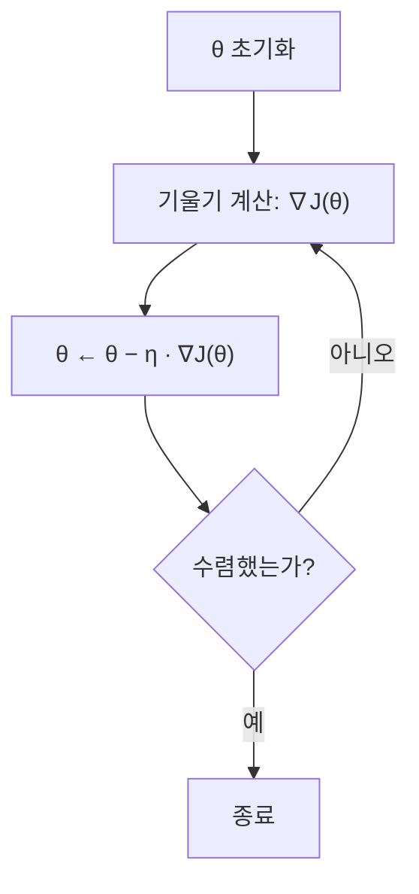

# 경사 하강법 (Gradient Descent)

- Level: Intermediate
- Prerequisites: [Math/Calculus/](../Calculus/), [Math/Linear-Algebra/](../Linear-Algebra/)
- Status: Draft
- Reviewed-by: -

---

## 개념 (Concept)

경사 하강법은 함수 $J(\theta)$를 최소로 만드는 $\theta$를 찾는 반복 알고리즘이다. 현재 위치에서 기울기(gradient)를 구하고, 기울기가 가리키는 방향의 **반대**로 조금씩 이동한다. 기울기는 함수가 가장 가파르게 증가하는 방향이므로, 그 반대는 가장 가파르게 감소하는 방향이다.

머신러닝에서 "학습"은 대부분 손실 함수 $J(\theta)$를 최소화하는 문제이고, 경사 하강법은 그 표준 도구다.

## 직관 (Intuition)

안개 낀 산에서 골짜기로 내려간다고 하자. 전체 지형은 안 보이지만, 발밑의 기울기는 느낄 수 있다. 가장 가파르게 내려가는 방향으로 한 걸음 딛고, 다시 발밑 기울기를 보고 또 한 걸음 딛는다. 이걸 반복하면 골짜기에 가까워진다.

한 걸음의 크기가 학습률 $\eta$다. 너무 작으면 더디고, 너무 크면 골짜기를 건너뛰어 발산한다.

전체 반복 흐름은 다음과 같다.



## 이론 (Theory)

목적은 $J(\theta)$를 최소화하는 것이다. 갱신 규칙은 다음과 같다.

$$\theta_{t+1} = \theta_t - \eta\, \nabla_\theta J(\theta_t)$$

여기서 $\eta > 0$는 학습률, $\nabla_\theta J$는 $\theta$에 대한 기울기 벡터다.

예를 들어 선형 회귀의 평균제곱오차(MSE)는

$$J(\theta) = \frac{1}{2m}\sum_{i=1}^{m}\left(h_\theta(x_i) - y_i\right)^2, \qquad h_\theta(x) = \theta^\top x$$

이고, 기울기는

$$\nabla_\theta J(\theta) = \frac{1}{m}\sum_{i=1}^{m}\left(h_\theta(x_i) - y_i\right) x_i$$

가 된다.

한 스텝에 사용하는 데이터 양에 따라 변형이 나뉜다.

| 방법 | 한 스텝 데이터 | 갱신 규칙 |
|---|---|---|
| 배치 GD | 전체 $m$개 | $\theta \leftarrow \theta - \eta\,\nabla_\theta J(\theta)$ |
| 확률적 GD (SGD) | 1개 | $\theta \leftarrow \theta - \eta\,\nabla_\theta J_i(\theta)$ |
| 미니배치 GD | $b$개 ($1 < b < m$) | $\theta \leftarrow \theta - \eta\,\nabla_\theta J_{\mathcal{B}}(\theta)$ |

$J$가 볼록(convex)이고 기울기가 $L$-매끄러우며 최솟값이 존재하면, 적절한 초기점과 $\eta \le 1/L$ 같은 충분히 작은 고정 학습률에서 함수값 차이 $J(\theta_t) - J^\*$가 대표적으로 $O(1/t)$ 수준으로 줄어든다. 강볼록(strongly convex) 조건이 추가되면 더 빠른 선형 수렴률을 얻을 수 있다.

비볼록 함수에서는 전역 최솟값을 일반적으로 보장하지 않는다. 보통은 기울기 크기가 작은 정지점(stationary point)을 찾는 것으로 해석하며, 그 지점은 지역 최소, 안장점, 아주 평평한 구간일 수 있다.

## 구현 (Implementation)

1차원 함수 $f(x) = (x-3)^2$를 최소화한다. 도함수는 $f'(x) = 2(x-3)$이고, 최솟값은 $x = 3$이다.

```python
def gradient_descent(grad, x0, lr=0.1, steps=50):
    x = x0
    for _ in range(steps):
        x = x - lr * grad(x)
    return x


# f(x) = (x - 3)^2,  f'(x) = 2(x - 3)
minimum = gradient_descent(lambda x: 2 * (x - 3), x0=0.0)
print(round(minimum, 4))  # 3.0 근처로 수렴
```

학습률을 바꿔 보면 동작 차이가 드러난다.

```python
for lr in (0.01, 0.1, 1.1):
    x = gradient_descent(lambda x: 2 * (x - 3), x0=0.0, lr=lr, steps=20)
    print(lr, round(x, 3))
# 0.01 -> 천천히 접근
# 0.1  -> 빠르게 3에 수렴
# 1.1  -> 발산 (값이 점점 커짐)
```

## 복잡도 (Complexity)

`m`은 표본 수, `n`은 특성 수, `T`는 반복 횟수다.

| 방법 | 한 스텝 시간 | 전체 시간 | 보조 공간 |
|---|---|---|---|
| 배치 GD | `O(m·n)` | `O(T·m·n)` | `O(n)` |
| SGD | `O(n)` | `O(T·n)` | `O(n)` |
| 미니배치 GD | `O(b·n)` | `O(T·b·n)` | `O(n)` |

파라미터 저장은 `O(n)`이지만, 학습 데이터 자체는 별도로 `O(m·n)` 공간을 차지한다.

## 응용 (Applications)

- 선형 회귀, 로지스틱 회귀의 파라미터 학습
- 신경망 학습의 역전파와 결합한 가중치 갱신
- 행렬 분해, 추천 시스템의 잠재 요인 학습
- 일반적인 미분 가능한 손실의 수치 최적화

## 흔한 오해 (Common Misunderstandings)

- 학습률이 크면 무조건 빠르다고 오해한다. 너무 크면 최솟값을 건너뛰고 발산한다.
- 경사 하강법이 항상 전역 최솟값을 찾는다고 생각한다. 전역 최적성은 볼록성, 매끄러움, 학습률 같은 조건이 맞을 때 설명할 수 있고, 비볼록에서는 보통 정지점을 찾는 알고리즘으로 본다.
- 기울기가 $0$이면 최솟값이라고 단정한다. 안장점과 극대점에서도 기울기는 $0$이다.
- 특성 스케일이 결과와 무관하다고 본다. 특성 스케일이 크게 다르면 수렴이 느려지므로 보통 표준화/정규화를 먼저 한다.

## TMI

- "경사 하강"의 아이디어는 Cauchy가 1847년에 제시한 것으로 거슬러 올라간다. 딥러닝보다 한 세기 이상 앞선다.
- Adam, RMSProp, Momentum 같은 현대 옵티마이저도 결국 경사 하강법에 보정 항을 더한 변형이다.
- 고차원에서는 지역 최소보다 안장점이 훨씬 흔하다는 연구가 있다. 그래서 "지역 최소에 갇힌다"는 걱정보다 안장점 탈출이 더 현실적인 주제다.
- 실무에서는 고정 학습률 대신 학습률 스케줄링(decay)이나 워밍업(warmup)을 자주 쓴다.

## 연습 / 확인 문제 (Exercises)

- $f(x) = (x-3)^2$에 대해 학습률 `0.01`, `0.1`, `1.1`로 각각 20스텝을 돌려 결과를 비교하고, 발산이 일어나는 경우를 설명하라.
- 선형 회귀 MSE $J(\theta)$에서 $\nabla_\theta J(\theta)$를 직접 유도하라.
- 2차원 함수 $f(x, y) = x^2 + 10y^2$에 경사 하강법을 적용하고, 학습률을 고정했을 때 $y$ 방향이 더 빨리/느리게 수렴하는 이유를 설명하라.

## 이어서 읽기 (Reading Path)

- 이전: 볼록 최적화 기초 (예정 `Convex-Optimization.md`)
- 다음: 확률적 경사 하강법 (예정 `SGD.md`)
- 관련: [Math/Optimization/](./), [AI/Machine-Learning/](../../AI/Machine-Learning/)

## 참조 (References)

- [Math/Calculus/](../Calculus/)
- [Math/Linear-Algebra/](../Linear-Algebra/)
- [Reference/Books.md](../../Reference/Books.md)
- [Reference/Courses.md](../../Reference/Courses.md)
- [Stephen Boyd, Lieven Vandenberghe — Convex Optimization (무료 공개)](https://web.stanford.edu/~boyd/cvxbook/)
- [Goodfellow, Bengio, Courville — Deep Learning Book](https://www.deeplearningbook.org/)
