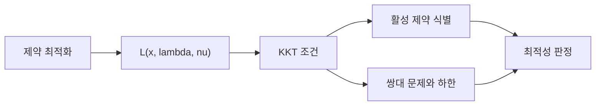

# 라그랑주 승수법과 쌍대성 (Lagrangian and Duality)

- Level: Advanced
- Prerequisites: [Math/Optimization/Convex-Optimization.md](Convex-Optimization.md), [Math/Calculus/Differentiation.md](../Calculus/Differentiation.md)
- Status: Draft
- Reviewed-by: -
- Depth: Deep-dive (자기완결)

---

## 개념 (Concept)

라그랑주 승수법은 등식·부등식 제약이 있는 최적화 문제를 목적 함수와 제약을 결합한 라그랑지안으로 분석한다. 승수는 제약을 조금 완화했을 때 최적값이 얼마나 바뀌는지를 나타내는 shadow price로 해석할 수 있다.

## 직관 (Intuition)

제약 곡선 위에서 목적 함수를 더 줄일 수 없는 점에서는 목적 함수의 등고선과 제약 곡선이 접한다. 따라서 목적 함수 gradient가 제약 gradient의 조합이 된다. 승수는 각 제약의 법선 방향을 얼마나 섞어야 하는지 알려 준다.



## 이론 (Theory)

등식 제약 $h_j(x)=0$, 부등식 제약 $g_i(x)\le0$인 문제의 라그랑지안은

$$
L(x,\lambda,\nu)=f(x)+\sum_i\lambda_i g_i(x)+\sum_j\nu_j h_j(x),
\qquad \lambda_i\ge0
$$

이다. 적절한 정규성 조건 아래 볼록 문제의 최적점은 KKT 조건을 만족한다.

- primal feasibility: $g_i(x)\le0$, $h_j(x)=0$
- dual feasibility: $\lambda_i\ge0$
- complementary slackness: $\lambda_i g_i(x)=0$
- stationarity: $\nabla_x L(x,\lambda,\nu)=0$

쌍대함수 $q(\lambda,\nu)=\inf_xL(x,\lambda,\nu)$는 primal 최적값의 하한을 준다. Slater 조건 같은 조건이 성립하면 강쌍대성으로 primal과 dual 최적값이 같다.

### 등식 제약의 기하학

등식 제약 $h(x)=0$ 위에서 움직일 수 있는 방향은 제약면의 접공간에 놓인다. 최적점에서는 그 접공간 방향으로 목적 함수가 더 내려가면 안 된다. 따라서 $\nabla f(x^\*)$는 접공간에 수직이고, 이는 $\nabla h(x^\*)$의 span에 들어간다.

$$
\nabla f(x^\*)+\nu\nabla h(x^\*)=0
$$

이 식이 등식 제약 라그랑주 승수법의 핵심이다.

### 부등식 제약과 활성 집합

부등식 $g_i(x)\le0$은 두 상태 중 하나다.

| 상태 | 조건 | 승수 |
|---|---|---|
| 활성(active) | $g_i(x^\*)=0$ | $\lambda_i$가 양수일 수 있음 |
| 비활성(inactive) | $g_i(x^\*)<0$ | complementary slackness로 $\lambda_i=0$ |

즉 실제 최적점에서 벽에 닿아 있는 제약만 목적 함수 gradient를 밀어낼 수 있다. 느슨한 제약은 최적성 방정식에 영향을 주지 않는다.

### 약쌍대성과 강쌍대성

최소화 문제에서 dual feasible한 $(\lambda,\nu)$가 주는 $q(\lambda,\nu)$는 항상 primal 최적값 이하의 하한이다. 이것이 약쌍대성이다. 볼록성 및 Slater 조건 등 추가 조건이 있으면 이 하한이 실제 최적값과 같아져 강쌍대성이 성립한다. duality gap은 primal 값과 dual 값의 차이이며, 알고리즘 종료 기준으로도 쓰인다.

## 구현 (Implementation)

$x+y=1$ 아래 $x^2+y^2$를 최소화한다. $L=x^2+y^2+\nu(x+y-1)$의 정지 조건을 풀면 $x=y=1/2$다.

```python
def lagrangian_solution():
    # 2x + nu = 0, 2y + nu = 0, x + y = 1
    x = y = 0.5
    nu = -1.0
    objective = x * x + y * y
    return x, y, nu, objective


print(lagrangian_solution())  # (0.5, 0.5, -1.0, 0.5)
```

복잡한 문제는 symbolic equation보다 constrained optimizer나 convex modeling 도구를 사용한다.

부등식 제약의 complementary slackness를 작은 예로 보면, $x\ge0$ 아래 $(x-2)^2$를 최소화할 때 해는 $x=2$이고 제약은 느슨하므로 승수는 0이다. 반대로 $x\le1$ 아래 $(x-2)^2$를 최소화하면 해는 경계 $x=1$에 붙고 승수가 양수가 된다.

## 복잡도 (Complexity)

라그랑지안은 문제를 표현하는 틀이므로 고정 복잡도가 없다. 선형·이차 볼록 문제는 다항 시간 알고리즘이 알려져 있지만, 일반 비볼록 제약 문제는 전역해 탐색이 매우 어려울 수 있다.

## 응용 (Applications)

- 자원·예산·확률 합 제약이 있는 최적화
- SVM의 margin 최적화와 kernel dual
- equality-constrained least squares
- 정책 최적화, 경제학의 shadow price, 네트워크 flow

## 흔한 오해 (Common Misunderstandings)

- 라그랑주 정지점이 언제나 최솟값은 아니다. 이차 조건과 경계를 확인해야 한다.
- 부등식 승수는 임의 부호가 아니라 최소화 표준형에서 음이 아니어야 한다.
- complementary slackness는 제약이 느슨하면 그 승수가 0임을 뜻한다.
- 강쌍대성은 모든 문제에서 자동으로 성립하지 않는다.
- KKT 조건은 정규성 조건 없이 항상 쓸 수 있는 만능 판정법이 아니다.
- dual 문제를 풀어도 primal 해를 바로 얻는 방법은 문제 구조에 따라 다르다.

## TMI

- 승수의 절댓값이 크면 해당 제약을 조금 바꾸는 것이 최적값에 큰 영향을 준다는 민감도 해석을 준다.
- softmax의 확률 합 1, 최대 엔트로피 문제도 라그랑주 승수로 유도할 수 있다.
- augmented Lagrangian과 ADMM은 제약 문제를 분산·반복 방식으로 푸는 데 널리 쓰인다.

## 연습 / 확인 문제 (Exercises)

- $x+y=4$ 아래 $x^2+y^2$의 최소점을 라그랑주 승수법으로 구하라.
- 활성·비활성 부등식 제약에서 complementary slackness를 설명하라.
- 간단한 선형 프로그램의 primal과 dual을 작성하라.
- $x\le1$ 아래 $(x-2)^2$ 최소화 문제의 KKT 조건을 세우고 승수를 구하라.
- Slater 조건이 왜 강쌍대성을 기대하게 해 주는지 직관적으로 설명하라.

## 이어서 읽기 (Reading Path)

- 이전: [볼록 최적화 기초](Convex-Optimization.md)
- 다음: [선형 프로그래밍](Linear-Programming.md)
- 관련: [경사 하강법](Gradient-Descent.md)

## 참조 (References)

- [Math/Optimization/Convex-Optimization.md](Convex-Optimization.md)
- [Math/Calculus/Differentiation.md](../Calculus/Differentiation.md)
- [Reference/Books.md](../../Reference/Books.md)
- [Reference/Courses.md](../../Reference/Courses.md)
