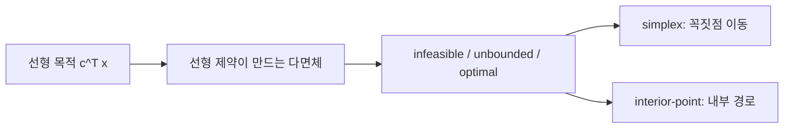

# 선형 프로그래밍 (Linear Programming)

- Level: Intermediate
- Prerequisites: [Math/Linear-Algebra/Linear-Systems.md](../Linear-Algebra/Linear-Systems.md), [Math/Optimization/Convex-Optimization.md](Convex-Optimization.md)
- Status: Draft
- Reviewed-by: -
- Depth: Deep-dive (자기완결)

---

## 개념 (Concept)

선형 프로그래밍(LP)은 선형 목적 함수를 선형 등식·부등식 제약 아래에서 최대화/최소화하는 문제다. 자원 배분, 일정 계획, 흐름 최적화 등 실무 최적화의 기본 모형이다.

## 직관 (Intuition)

"한정된 자원으로 이익을 최대로" 같은 문제는 변수들이 직선 관계로 얽힌다. 제약들은 다차원 공간에서 볼록한 다면체(feasible region)를 만들고, 선형 목적의 최적값은 항상 그 꼭짓점(vertex)에서 나온다. 그래서 모든 점을 뒤지지 않고 꼭짓점만 똑똑하게 옮겨 다니면 된다.



## 이론 (Theory)

표준형:

$$\max\ c^\top x \quad \text{s.t.}\quad Ax\le b,\ x\ge 0$$

가능 영역은 볼록 다면체이고, 목적이 유한하면 최적해가 꼭짓점(기저 가능해)에 존재한다.

**쌍대성(duality)**: 모든 LP에는 쌍대 문제가 있고, 강쌍대성에 의해 최적값이 일치한다. 쌍대 변수는 제약의 그림자 가격(shadow price)으로 해석된다.

**해법**: 심플렉스법은 꼭짓점을 따라 이동하며 개선한다(최악엔 지수, 실전엔 빠름). 내부점법(interior-point)은 다항 시간을 보장한다.

### 표준형 변환

LP는 여러 형태로 쓰이지만 slack variable을 넣어 부등식을 등식으로 바꿀 수 있다.

$$
Ax\le b \quad\Rightarrow\quad Ax+s=b,\quad s\ge0
$$

최대화는 목적 부호를 바꾸어 최소화로 바꿀 수 있고, 자유 변수는 양수 변수 두 개의 차이로 표현할 수 있다. solver마다 요구하는 표준형이 다르므로, 부호와 bound를 정확히 맞추는 것이 중요하다.

### primal-dual 쌍

primal이

$$
\max c^\top x\quad\text{s.t.}\quad Ax\le b,\ x\ge0
$$

이면 대응 dual은

$$
\min b^\top y\quad\text{s.t.}\quad A^\top y\ge c,\ y\ge0
$$

이다. primal의 자원 제약 하나는 dual 변수 하나가 되고, dual 변수는 해당 자원의 한계 가치로 해석된다.

### 상태 판정

LP solver 결과는 최적해뿐 아니라 상태를 확인해야 한다.

| 상태 | 의미 |
|---|---|
| optimal | 유한한 최적해 발견 |
| infeasible | 제약을 모두 만족하는 점이 없음 |
| unbounded | 목적값을 무한히 개선할 수 있음 |
| numerical issue | 스케일링·퇴화·허용오차 문제 가능 |

## 구현 (Implementation)

```python
from scipy.optimize import linprog

# min  -(3x + 2y)   (즉 3x+2y 최대화)
# s.t.  x + y <= 4,  x + 3y <= 6,  x,y >= 0
c = [-3, -2]
A_ub = [[1, 1], [1, 3]]
b_ub = [4, 6]
res = linprog(c, A_ub=A_ub, b_ub=b_ub, bounds=[(0, None), (0, None)])
print(res.x, -res.fun)        # 최적 (x,y)와 목적값
print(res.status, res.message)
```

결과를 사용할 때는 feasibility와 목적값을 직접 재확인하는 습관이 좋다.

```python
import numpy as np

x = res.x
print(np.array(A_ub) @ x <= np.array(b_ub) + 1e-8)
print(np.dot([3, 2], x))
```

## 복잡도 (Complexity)

심플렉스법은 평균적으로 매우 빠르지만 최악의 경우 지수적이다(클리 민티 큐브). 내부점법은 다항 시간이며 대규모 문제에 강하다. 변수·제약 수에 따라 비용이 늘지만, 현대 LP 솔버는 수백만 변수 문제도 실용적으로 푼다.

## 응용 (Applications)

- 생산·운송·인력 배치 등 운영 최적화
- 네트워크 흐름·매칭의 LP 완화
- 포트폴리오·식단 등 자원 배분
- 머신러닝의 일부 제약 최적화(L1, SVM 변형)

## 흔한 오해 (Common Misunderstandings)

- LP의 변수는 연속이다. 정수 제약이 붙으면 ILP가 되어 훨씬 어렵다(NP-난해).
- 최적해는 꼭짓점에 있지만, 무수히 많은 최적해(모서리)일 수도 있다.
- 가능 영역이 비거나(infeasible) 무한(unbounded)일 수 있다.
- 심플렉스가 "느리다"는 최악 사례일 뿐, 실전 성능은 뛰어나다.
- 목적 함수가 선형이므로 최적해가 내부의 고유한 한 점에 생기려면 목적이 가능한 영역 전체에서 평평해야 한다.
- solver가 반환한 숫자는 허용오차 안의 해다. 제약 위반 tolerance를 확인해야 한다.

## TMI

- 단치히(Dantzig)의 심플렉스법(1947)은 20세기 최고의 알고리즘 중 하나로 꼽힌다.
- 카마카르의 내부점법(1984)은 LP가 다항 시간에 풀린다는 것을 실용적으로 입증했다.
- 쌍대성의 "그림자 가격"은 경제학의 한계 가치 개념과 직접 연결된다.

## 연습 / 확인 문제 (Exercises)

- 2변수 LP를 그래프로 그려 가능 영역과 최적 꼭짓점을 찾아라.
- 주어진 LP의 쌍대 문제를 세우고 강쌍대성을 확인하라.
- 가능 영역이 unbounded가 되는 제약 예를 만들어라.
- slack variable을 사용해 $x+y\le4$를 등식과 비음수 제약으로 바꾸어라.
- primal의 각 제약을 자원으로 해석하고 dual 변수의 shadow price 의미를 설명하라.

## 이어서 읽기 (Reading Path)

- 이전: [볼록 최적화](Convex-Optimization.md)
- 다음: [2차 프로그래밍](Quadratic-Programming.md), [라그랑주 승수법](Lagrangian.md)

## 참조 (References)

- [Math/Optimization/Convex-Optimization.md](Convex-Optimization.md)
- [Algorithms/Greedy.md](../../Algorithms/Greedy.md)
- [Reference/Books.md](../../Reference/Books.md)
